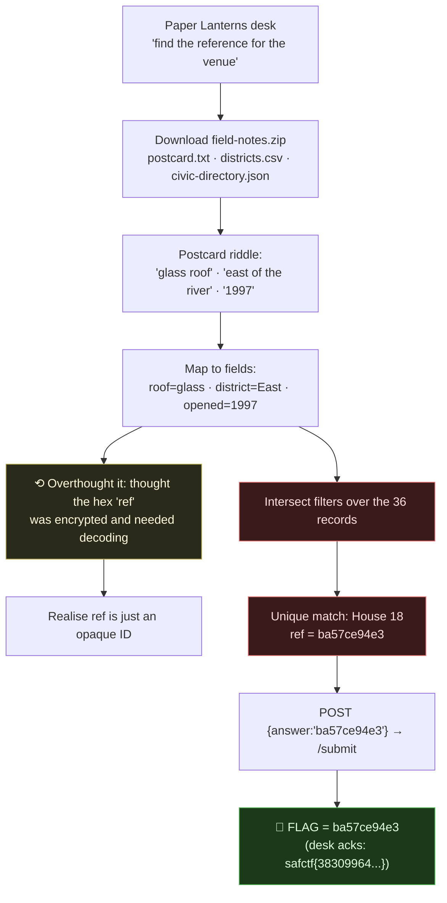
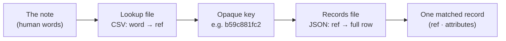

# OSINT DESK (PAPER LANTERNS · LAST TRAM HOME · BLUE MERIDIAN): Correlation + SHA256 Receipts. Writeup & Masterclass

| | |
|---|---|
| **Platform** | pwnzone (hosted CTF event) |
| **Targets** | PAPER LANTERNS / field-notes (8480), LAST TRAM HOME / lastram (8490), BLUE MERIDIAN / bluemeridian (8500) |
| **Service** | Flask on **Werkzeug/3.1.9**, Python 3.11.16, HTTP, TCP (EC2) |
| **IP:Ports** | `54.72.82.22:8480`, `:8490`, `:8500` |
| **Flag** | the recovered value itself (the matched `ref` or the SHA256 receipt). The desk's `safctf{...}` reply is an acknowledgement token, not the flag. |
| **Author** | lacmyst |
| **Date** | 2026-10-02 |
| **Outcome** | Three challenges in one family: correlate a short "note" (riddle) against a few data files to pin **one** record, then either submit its raw `ref` (Paper Lanterns) or build a receipt `SHA256(a\|b\|c)` and POST it (Last Tram, Blue Meridian). No exploit, correlation + hashing. |
| **Honesty note** | I solved the correlations myself; my one detour was **overthinking the hex `ref`** on Paper Lanterns, I assumed it was encrypted and needed decoding. It's just an opaque record ID. I verified the matches and submissions myself. |

All three submit the same way: `POST /submit` with `{"answer":"<recovered value>"}` → `{"message":"safctf{...}","ok":true}`. That `safctf{...}` message is the desk's acknowledgement token, confirmation that the value was correct, not the flag. The flag is the value you recovered and submitted.

| Challenge | Port | Flag (recovered value) | Ack token from `/submit` |
|---|---|---|---|
| Paper Lanterns (field-notes) | 8480 | `ba57ce94e3` *(the matched record `ref`)* | `safctf{38309964a77c499b1ec234c401f68fe1}` |
| Last Tram Home (lastram) | 8490 | `57aa623e8a9afd3082a959b18371e03ea717d6ad03f7e68948162fc507ee914d` *(`SHA256(venue_ref\|event_ref\|UTC_date)`)* | `safctf{a7290ed4a3ba7af7bd4b4c529eb99314}` |
| Blue Meridian (bluemeridian) | 8500 | `a037d4fd49143de5d5abbe38b536198ba777879089dd3b44dec83ac1b962c845` *(`SHA256(voyage_ref\|station_ref\|UTC_time)`, UTC_time = `HH:MMZ`)* | `safctf{756f7d81426571a6d6dac9b1aae5f271}` |

This file has two parts. **Part 1** is the writeup: the three challenges in the order I solved them, wrong turns and all. **Part 2** is the masterclass: the handful of techniques that carry every OSINT/correlation challenge of this shape, pulled out and explained on their own so you can reuse them.

---

# Part 1: The Writeup

## 1. PAPER LANTERNS / field-notes, port 8480

### 1.1 The Short Version

The "Collection desk" says: *"Find the collection reference for the venue pictured in the field notes,"* and offers a `field-notes.zip`. Inside were three files, a **postcard** (the riddle), a **districts.csv** (a lookup table), and a **civic-directory.json** (36 "houses" with attributes). The job is pure **data correlation**: turn the postcard's prose into filters, intersect them, and read off the one matching record's `ref`.

The postcard:
> *"Lunch beneath a glass roof, somewhere east of the river. The brass plaque said 1997."*

Three constraints, **glass roof**, **east** (of the river), **1997**, and exactly one house satisfies all three: **House 18, `ref: ba57ce94e3`**. That `ref` is the flag; submitting it just returned the desk's acknowledgement.

**My one wrong turn:** `ba57ce94e3` looks like 10 hex chars that want decoding. It's just an **opaque ID**, the challenge wants the right record's reference verbatim, not a decode.

### 1.2 Attack Chain



### 1.3 The Dataset

`field-notes.zip` contained:

**`postcard.txt`**, the riddle:
```
Lunch beneath a glass roof, somewhere east of the river. The brass plaque said 1997.
```

**`districts.csv`**, the "river side" lookup (tells you "east" maps to the `East` district):
```
district,river_side
North,north
East,east
South,south
West,west
```

**`civic-directory.json`**, 36 records like:
```json
{ "ref": "ba57ce94e3", "name": "House 18", "district": "East", "opened": 1997, "roof": "glass", "seats": 307 }
```

### 1.4 Correlating (the right way)

Each phrase in the postcard is a filter on a field:

| Postcard phrase | Field | Value |
|---|---|---|
| "beneath a **glass** roof" | `roof` | `glass` |
| "**east** of the river" | `district` (via `districts.csv`: east → East) | `East` |
| "the brass plaque said **1997**" | `opened` | `1997` |

Intersect them over all 36 records:
```bash
python3 -c "
import json
data=json.load(open('civic-directory.json'))
for h in data:
    if h['roof']=='glass' and h['district']=='East' and h['opened']==1997:
        print(h['ref'], h['name'])
"
# ba57ce94e3 House 18
```
**Exactly one** record matches, every other glass-roofed East house opened in a different year. No ambiguity, no decoding.

### 1.5 The Overthinking Detour (and the lesson)

`ba57ce94e3` *looks* like it wants to be decoded, 10 hex characters, the kind of thing that's a hash or ciphertext in other challenges. I tried treating it as hex-encoded data. It's **nothing of the sort**: an **opaque identifier**, a random handle for a database row. The challenge never asks you to transform it; it asks you to find the right one and hand it back.

**Lesson filed:** not every hex string is a puzzle. In an OSINT/correlation challenge, an ID is usually just an ID, the work is the *lookup*, not a *decode*. Check what the challenge is actually asking before reaching for CyberChef.

### 1.6 Submitting It

```bash
curl -s -X POST http://54.72.82.22:8480/submit \
  -H "Content-Type: application/json" --data '{"answer":"ba57ce94e3"}'
# {"message":"safctf{38309964a77c499b1ec234c401f68fe1}","ok":true}
```

> **Flag (recovered value):** `ba57ce94e3`, **Ack token from `/submit`:** `safctf{38309964a77c499b1ec234c401f68fe1}`

---

## 2. LAST TRAM HOME / lastram, port 8490

Format: `SHA256(venue_ref|event_ref|UTC_date)`, lowercase hex.

Note (`studio-post.txt`): *"last frame at **stop 18**, **three hours after UTC**. Wall clock read **21:30 on 18 April 2026**."*

Resolve each component:
- **venue_ref**, `tram.csv` stop `18` → `b59c881fc2`.
- **event_ref**, `programme.json` row with `venue=b59c881fc2` → `2011bf1eeb4b` (`time_utc 2026-04-18T18:30:00Z`).
- **UTC_date**, local 21:30 at **UTC+3** → UTC `18:30` on **2026-04-18** → date = `2026-04-18`.

```bash
python3 -c "import hashlib;print(hashlib.sha256(b'b59c881fc2|2011bf1eeb4b|2026-04-18').hexdigest())"
# 57aa623e8a9afd3082a959b18371e03ea717d6ad03f7e68948162fc507ee914d
```
- **Flag (recovered value):** `57aa623e8a9afd3082a959b18371e03ea717d6ad03f7e68948162fc507ee914d`
- **Ack token from `/submit`:** `safctf{a7290ed4a3ba7af7bd4b4c529eb99314}`
- **Gotcha:** the format is `venue|event|...` but the JSON lists `event` first, hash in **format order**, not JSON order.

---

## 3. BLUE MERIDIAN / bluemeridian, port 8500

Format: `SHA256(voyage_ref|station_ref|UTC_time)`, lowercase hex, `UTC_time = HH:MMZ`.

Note (`pier-note.txt`): *"At the exposure, the gauge was **219 cm**. Clock and **compass** had both been serviced that morning."*
Camera (`camera-metadata.json`): `local_time 2026-06-04T21:00:00`, `utc_offset +02:00`, `compass_degrees 11`, `vessel_mark vessel-3`.

Resolve:
- **UTC_time**, local `21:00` at **UTC+2** → `19:00` → `19:00Z`.
- **station_ref**, `tide-station.csv` where `tide_cm=219` → `5255073ff2`.
- **voyage_ref**, `voyages.json` matching the clues. **Collision trap:** `vessel-3` ∧ `utc_hour=19` gives **two** rows; disambiguate with the gauge (`tide_cm=219`) and compass (`bearing=11`), "serviced that morning" = trust compass + clock → unique voyage.

```bash
python3 -c "
import json,hashlib
v=json.load(open('../resources/bluemeridian/voyages.json'))
x=[r for r in v if r['vessel']=='vessel-3' and r['utc_hour']==19 and r['bearing']==11 and r['tide_cm']==219][0]
print(hashlib.sha256(f\"{x['ref']}|{x['station']}|19:00Z\".encode()).hexdigest())
"
# a037d4fd49143de5d5abbe38b536198ba777879089dd3b44dec83ac1b962c845
```
- **Flag (recovered value):** `a037d4fd49143de5d5abbe38b536198ba777879089dd3b44dec83ac1b962c845`
- **Ack token from `/submit`:** `safctf{756f7d81426571a6d6dac9b1aae5f271}`
- `civic-directory.json` in this folder is an **unused decoy** (left over from field-notes).

---

---

# Part 2: The Masterclass, Every Technique in the Desk

None of these three had a vulnerability to exploit. The whole family is correlation: take a short human note, turn it into a precise query, run that query across a few small data files, and pin exactly one record. Below is each technique I leaned on, pulled out of the three challenges and explained on its own. The same six moves solve any OSINT puzzle built this way, and they are the same moves you make in log triage and threat analysis.

## T1. Reading a clue as a set of predicates

The single skill under everything else: a note written in plain English is really a list of filters, and your job is to translate each phrase into a `field = value` test against the data.

Take the Paper Lanterns postcard apart one clause at a time:

| Postcard phrase | Field it constrains | Value |
|---|---|---|
| "beneath a **glass** roof" | `roof` | `glass` |
| "**east** of the river" | `district` | `East` |
| "the brass plaque said **1997**" | `opened` | `1997` |

Each clause removes rows that do not match. Stack enough of them and the candidate set collapses to one. The trap is reading the note as atmosphere instead of as a query, "lunch beneath a glass roof" is not scene-setting, it is `roof == "glass"`. Train yourself to underline every concrete noun and number, because each one is almost always a column.

## T2. Pivoting and joining across files

The clue rarely names the `ref` you need directly. It names something human (a stop number, a compass of districts, a tide reading), and a lookup file maps that human word onto an opaque key, which a second file then expands into the full record. You are doing a manual SQL join.

The shape repeats across all three:



- Paper Lanterns: `districts.csv` turns the word "east" into the district `East`, then `civic-directory.json` holds the 36 rows you filter.
- Last Tram: `tram.csv` turns "stop 18" into `venue_ref = b59c881fc2`, then `programme.json` gives the matching `event_ref`.
- Blue Meridian: `tide-station.csv` turns "219 cm" into `station_ref = 5255073ff2`, then `voyages.json` holds the voyage rows.

The habit: inventory the files first, decide which one is the lookup (small, two or three columns, one of them a `ref`) and which is the record store (wide rows, lots of attributes), and chain them in that order.

## T3. Breaking collisions with the "trusted instrument" hint

Sometimes your predicates still leave two rows. That is deliberate, and the note usually tells you how to break the tie, you just have to notice which detail it goes out of its way to call reliable.

Blue Meridian is the clean example. Filtering `vessel-3` and `utc_hour = 19` left **two** voyages. The pier note says the clock and compass "had both been serviced that morning", that is the setter handing you the tiebreakers. Trusting the compass (`bearing = 11`) and the gauge (`tide_cm = 219`) picks exactly one row.

```bash
python3 -c "
import json
v=json.load(open('../resources/bluemeridian/voyages.json'))
cands=[r for r in v if r['vessel']=='vessel-3' and r['utc_hour']==19]
print('after primary filter:', len(cands))          # 2  -> collision
uniq=[r for r in cands if r['bearing']==11 and r['tide_cm']==219]
print('after tiebreak:', len(uniq))                 # 1  -> resolved
"
```

The lesson: when a note praises an instrument ("serviced", "calibrated", "freshly checked", "reliable"), that attribute is not flavour, it is the column that resolves the ambiguity. Conversely, a detail the note calls "off" or "unreliable" is one you should *distrust* as a filter.

## T4. Time-zone arithmetic

Two of the three hinge on converting a wall-clock reading into UTC, and getting the direction of the offset wrong silently produces a valid-looking but wrong hash.

The rule is `UTC = local - offset`. A place at UTC+3 is three hours *ahead* of UTC, so you subtract three from the local clock to get UTC.

| Challenge | Local reading | Offset | UTC | Emitted as |
|---|---|---|---|---|
| Last Tram | 21:30 | +3 | 18:30 | `2026-04-18` (date only) |
| Blue Meridian | 21:00 | +2 | 19:00 | `19:00Z` |

Two things to watch: subtracting the offset can roll the **date** backwards across midnight (it did not here, but check every time), and you must emit the exact format the receipt spec asks for, a bare date `YYYY-MM-DD` for Last Tram, a `HH:MMZ` clock for Blue Meridian. The `Z` is literally the character `Z`, meaning "Zulu / UTC".

## T5. Building the SHA256 receipt

Once the components are resolved, the receipt is a single SHA256 over them joined in a fixed pattern. Everything about the string has to be byte-exact, because a hash turns one wrong character into a completely different digest with no hint as to why.

```bash
# Last Tram:  SHA256(venue_ref|event_ref|UTC_date)
python3 -c "import hashlib;print(hashlib.sha256(b'b59c881fc2|2011bf1eeb4b|2026-04-18').hexdigest())"
# 57aa623e8a9afd3082a959b18371e03ea717d6ad03f7e68948162fc507ee914d
```

The rules that bit me (or nearly did):

- **Format order, not file order.** The spec says `venue|event|...`, but `programme.json` lists `event` first. Hash in the order the *format string* gives, never the order the JSON happens to use.
- **Delimiter is a literal pipe, no spaces.** `a|b|c`, not `a | b | c`.
- **Lowercase hex.** `hexdigest()` already gives lowercase; do not upper-case it.
- **No trailing newline.** Hash the bytes of the joined string exactly, nothing appended.

## T6. Knowing when *not* to decode

This is the detour that cost me time on Paper Lanterns, so it earns its own section. `ba57ce94e3` is ten hex characters, and in most CTF categories that screams "decode me", a hash fragment, a key, a ciphertext. Here it was nothing of the sort: an **opaque identifier**, a random handle for a database row. The challenge never wanted me to transform it, only to find the right row and hand its `ref` back verbatim.

The tell is context. In crypto and forensics challenges, a hex blob is usually data to transform. In an OSINT/correlation challenge, a short hex `ref` sitting in a `ref` column is almost always just a primary key. Before reaching for CyberChef, ask what the challenge is actually requesting, "find the reference" means locate it, not decrypt it. Feed opaque IDs forward untouched.

## The reusable checklist

Boiled down, the whole desk is six moves:

1. **Read the note as filters.** Each concrete phrase is a `field = value` predicate (T1).
2. **Join across files.** The CSV maps a human word to a `ref`; the JSON holds the records (T2).
3. **Break collisions** with the attribute the note calls reliable/serviced/calibrated (T3).
4. **Do the time-zone math.** `UTC = local - offset`; emit the exact format requested (T4).
5. **Hash in format-string order**, lowercase hex, `|`-joined, no spaces. IDs are opaque, feed them verbatim (T5, T6).
6. **Submit:** `curl -s -X POST http://TARGET/submit -H 'Content-Type: application/json' --data '{"answer":"<recovered value>"}'`. The `safctf{...}` that comes back is only the desk's acknowledgement; the flag is the value you recovered and submitted.

There is no "fix" section because there is no bug; it is a puzzle. The transferable skill is pivoting and correlating across datasets, which is exactly what real OSINT, log triage and threat analysis are. The habit I am keeping: read the clue literally and correlate, do not manufacture a decode step. A hex ID is a needle to find, not a cipher to break.
