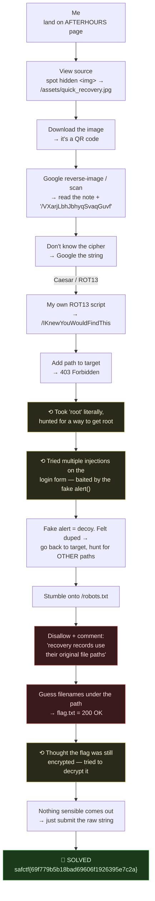

# AFTERHOURS, QR Recovery Records, My Writeup

| | |
|---|---|
| **Platform** | pwnzone (hosted CTF event) |
| **Target** | AFTERHOURS ("music festival" web app) |
| **Service** | Apache/2.4.68 (Debian), HTTP, TCP/8010 (on an AWS EC2 instance) |
| **IP:Port** | `54.72.82.22:8010` |
| **Flag format** | `safctf{...}` |
| **Author** | lacmyst |
| **Date** | 2026-10-02 |
| **Outcome** | Found the flag by pulling a hidden QR out of the page source, reverse-image-searching it, un-rotating the path it hid, and guessing a file inside a `403` directory `robots.txt` pointed me at. A lot of wrong turns on the way. |

---

## 1. The Short Version

I started on the AFTERHOURS landing page and did what I always do first, opened the source. Tucked in there was an `` being pulled from `/assets/quick_recovery.jpg` but hidden from view. I grabbed that file path, downloaded the image, and it was a QR code. I reverse-image-searched / scanned it through Google, which read the QR back to me as a note signed off *"Remember, from the root"* plus a scrambled path `/VXarjLbhJbhyqSvaqGuvf`.

I didn't recognise the cipher by eye, so I fed the string to Google and it came back as a **Caesar / ROT13** job. I ran it through my own Caesar-13 script and got `/IKnewYouWouldFindThis`. Adding that to the target gave me a **`403 Forbidden`**, and that's where I lost some time, I took "root-protected" literally and went hunting for a way to get root, then kept getting baited by the site's fake JavaScript `alert()` popups, more than once. I went back and actually inspected the login page and  I really felt stupid to have tried multiple attempts at finding and injection on the form when I saw that alert message. Feeling duped and beaten i decided to go back to target url and try to find other paths maybe roots was somewhere else. These is when I found `robots.txt`, which was the real redirection all along. Its comment told me the files inside that `403` folder sit at their "original" (guessable) names. I tried filenames against the target directory and `flag.txt` came back. I assumed the flag was *still* encrypted and tried to decrypt the value inside it, when nothing sensible came out, I gave up on that, submitted the raw string, and it solved.

**What I walked away with**

| Flag | Value | How |
|---|---|---|
| Flag | `safctf{69f779b5b18bad69606f1926395e7c2a}` | Hidden QR in page source → ROT13 path → `robots.txt` hint → guessed `flag.txt` in a listing-disabled dir |

The value in the braces is an MD5. I spent time trying to "decrypt" it before realising the whole `safctf{...}` string *was* the flag.

---

## 1.1 Attack Chain (including my wrong turns)



---

## 2. Weaknesses I Used

This was a recon/OSINT box, so the "vulnerabilities" are information-disclosure and weak-access-control mistakes, not injection or memory bugs.

| # | What | Class | Where | Severity |
|---|---|---|---|---|
| 1 | A secret QR is embedded in the page source (just hidden from view) | Information Disclosure via client source (CWE-200) | `/` → hidden `` | Low |
| 2 | `robots.txt` names the secret directory **and** leaks the naming convention in a comment | Information Disclosure (CWE-615 *Info in Comments*) | `/robots.txt` | Medium |
| 3 | Directory listing disabled, but files inside are served to anyone who guesses the name | Forced Browsing / Files Accessible by Name (CWE-425 / CWE-548) | `/IKnewYouWouldFindThis/flag.txt` | Medium |
| 4 | The "secret" path is only **obfuscated** (ROT13), not protected | Security Through Obscurity (CWE-656) | QR note → path | Low |

The `403` on the directory sums up the whole design: it blocks *listing* the folder but never blocks *reading a named file* inside it.

---

## 3. What I Was Given

A target, `54.72.82.22:8010`, Apache on an EC2 instance, and the AFTERHOURS web app sitting on it. Everything else I had to dig out myself. The brief hinted the path would be "root-protected" and framed the goal as "get root"; I took that more literally than I should have (see Section 6).

---

## 4. Landing on the Page & Finding the Hidden Image

I opened the site and went straight to the source. Among the normal markup there was an image reference that the page never actually shows:
```html

```
A hidden `` is a classic "look at me" for a CTF. I pulled the file path onto the target URL and downloaded it:
```bash
curl -s -o quick_recovery.jpg http://54.72.82.22:8010/assets/quick_recovery.jpg
```
Opening it: a QR code. So the page was quietly shipping me a QR I was meant to find by reading the source.

---

## 5. Reading the QR & Breaking the Cipher

### 5.1 Get the message out
I threw the image at Google (reverse image / Lens scans the QR), which read it back in full:

> *"Hey Jerry, I couldnt let the people know our secret if I was compromised. This path should lead you to the right way, Remember, from the root. Stay Cyber Aware and piece everything together.*
> `/VXarjLbhJbhyqSvaqGuvf`"

Two bits stuck out: *"Remember, from the root"* and *"piece everything together."* I clocked the second as "the answer gets assembled from clues," but I didn't yet twig that *"from the root"* was literally naming the cipher.

### 5.2 Identify the cipher
I didn't recognise `/VXarjLbhJbhyqSvaqGuvf` by eye, so I pasted it into Google to ask *what kind of encryption* it was. The answer pointed at a **Caesar cipher, ROT13**. (In hindsight, *"from the root"* → **ROT** was the hint I walked past.)

### 5.3 Decrypt with my own script
I ran it through my own Caesar-13 script rather than a website:
```bash
# my rot13 one-liner equivalent
python3 -c "import codecs; print('/' + codecs.decode('VXarjLbhJbhyqSvaqGuvf','rot13'))"
/IKnewYouWouldFindThis
```
Readable output = right cipher. My next stop was `http://54.72.82.22:8010/IKnewYouWouldFindThis`.

---

## 6. The 403, and the Rabbit Holes I Fell Into

I added the path to the target:
```bash
$ curl -i http://54.72.82.22:8010/IKnewYouWouldFindThis/
HTTP/1.1 403 Forbidden
Server: Apache/2.4.68 (Debian)
```
And here's where I burned time, honestly:

- **I took "root-protected" literally.** The QR note said "from the root" and the brief said "get root," so I started thinking about *actual* root access, as if the `403` meant I needed privileges on the box. That was the wrong model; the `403` just meant directory **listing** was off.
- **I went at the login form and kept getting baited.** I threw multiple injection attempts at the sign-in form, and each time the JavaScript `alert()` popup ("Sign-in was unsuccessful...") made me think I was getting *somewhere*. I wasn't, the form is pure client-side theatre:
  ```html
  <form onsubmit="fakeLogin(event)"> ... </form>
  <script>
  function fakeLogin(e){ e.preventDefault(); alert("Sign-in was unsuccessful. Please try again."); }
  </script>
  ```
  When I finally read that, I felt stupid, there's no backend behind the form at all, so every injection I'd tried was against nothing.

Feeling duped and beaten, I stopped attacking the form and went back to the **target URL to look for other paths**, maybe "root" was somewhere else entirely. Enumerating from scratch is how I landed on `robots.txt` (and, for the record, the JS noise file `ui.js` literally labels itself `// fake noisy widget values (for confusion)`).

---

## 7. `robots.txt`, The Redirection I Actually Needed

```bash
$ curl -s http://54.72.82.22:8010/robots.txt
User-agent: *
Disallow: /IKnewYouWouldFindThis/
# Legacy recovery records use their original file paths.
```
This tied it together. The `Disallow:` confirmed the directory, and the **comment** answered the `403`: the folder won't *list* itself, but the files in it are at their **"original" (ordinary, guessable) names**, and the file I'd started from was literally named `quick_recovery.jpg`. So I didn't need root at all; I needed the right filename.

---

## 8. Guessing the File & Grabbing the Flag

With listing off, I just asked for candidate filenames under the path and watched for a `200`:
```bash
$ T=http://54.72.82.22:8010/IKnewYouWouldFindThis
$ for f in quick_recovery.jpg recovery.txt index.html flag.txt README.txt; do
    echo "$(curl -s -o /dev/null -w '%{http_code} %{size_download}B' "$T/$f")  ->  $f"
  done
404 315B  ->  quick_recovery.jpg
404 315B  ->  recovery.txt
404 315B  ->  index.html
200 40B   ->  flag.txt      <-- hit
404 315B  ->  README.txt
```
`flag.txt` resolved. I read it:
```bash
$ curl -s http://54.72.82.22:8010/IKnewYouWouldFindThis/flag.txt
safctf{69f779b5b18bad69606f1926395e7c2a}
```

---

## 9. The Last Wrong Turn, "Is This Still Encrypted?"

The value looked like a hash, and after a whole trail of decoding I assumed I had *one more* layer to peel. So I tried to decrypt/crack the MD5 looking for readable text. Nothing sensible came out. After enough of that, I stepped back and thought: maybe this *is* the flag. I submitted the whole string:

> **Flag:** `safctf{69f779b5b18bad69606f1926395e7c2a}`

...and it solved. The MD5 was the secret itself (the "our secret" from the QR note), not a hash gating another stage. Lesson filed: once a value is already in the platform's flag format (`safctf{...}`), try submitting it *before* assuming there's another layer.

---

## 10. The Decoys, Named

For the record, everything that wasted my time was intentional bait:

- **The fake login (`/login.html`)**, `fakeLogin()` only fires an `alert()`; it never sends a request, so there's no backend to attack. This is what I kept reacting to.
- **`/js/ui.js`**, self-labelled `// fake noisy widget values (for confusion)`; it only animates a fake latency number.
- **The hidden QR ``**, ironically the *useful* decoy: hidden in source on purpose so I'd find the image. (The trap-version is re-reading it for a "second layer" once you've already solved it.)

The real trail was only ever: **page source → QR → ROT13 → robots.txt → guess `flag.txt`.**

---

## 11. Why It Worked & How I'd Fix It

**Hidden QR in source (weakness 1).** Hiding an element with `display:none` hides it from the eye, not from anyone reading the HTML. *Fix:* don't treat client-side source as private, anything shipped to the browser is readable.

**`robots.txt` leaks (weakness 2).** Listing a secret directory and leaving an operational comment hands an attacker the map. `robots.txt` is a crawler hint, not access control. *Fix:* don't put secrets (or hints) in files you serve to everyone; authenticate the sensitive content itself.

**Listing off, files readable by name (weakness 3).** `Options -Indexes` only hides the index; named files are still served. *Fix:* protect the files themselves (auth / move outside web root), not just the listing.

**ROT13 "protection" (weakness 4).** Obfuscation isn't encryption. *Fix:* know the difference, obscurity is a speed bump, never a lock.

---

## 12. Timeline (how it actually went)

- Landed on AFTERHOURS → viewed source → spotted the hidden `/assets/quick_recovery.jpg` ``.
- Downloaded the image → it's a QR → Google-scanned it → got the full note + `/VXarjLbhJbhyqSvaqGuvf`.
- Didn't know the cipher → Googled the string → Caesar/ROT13 → ran my own ROT13 script → `/IKnewYouWouldFindThis`.
- Added path to target → `403 Forbidden`.
- **Detour:** took "root" literally and looked for real root access; **threw multiple injections at the login form, baited each time by the fake `alert()`**, until I read the JS and realized the form has no backend.
- Felt duped → stopped attacking the form and **went back to the target to enumerate for other paths** → that's how I stumbled onto `robots.txt`.
- `robots.txt` → `Disallow` + comment about "original file paths" → guessed filenames under the path → `flag.txt` = `200`.
- **Detour:** assumed the flag value was still encrypted, tried to decrypt the MD5, got nothing sensible.
- Submitted the raw `safctf{...}` string → **solved.**

---

## 13. References

- Apache HTTP Server `2.4.68`, `Options -Indexes` / directory listing, `403` semantics
- `robots.txt`, Robots Exclusion Standard (a crawler hint, **not** access control)
- Google Lens / reverse image search, reading a QR straight from an image
- ROT13 / Caesar cipher, reversible substitution (encoding, not encryption)
- CWE-200, CWE-615, CWE-425, CWE-548, CWE-656
- hashcat / John / CrackStation, MD5 cracking (what I *tried* before realising the hash was the answer)

---

## 14. Appendix, The Clean Path (what I'd do next time, no detours)

```bash
T=http://54.72.82.22:8010

# 1) the hidden QR is in the page source
curl -s $T/ | grep -i 'img'            # → /assets/quick_recovery.jpg (display:none)
curl -s -o qr.jpg $T/assets/quick_recovery.jpg

# 2) read the QR (Google Lens, or a decoder) → note + /VXarjLbhJbhyqSvaqGuvf
#    hint in the note: "from the root" = ROT

# 3) ROT13 the path
python3 -c "import codecs;print('/'+codecs.decode('VXarjLbhJbhyqSvaqGuvf','rot13'))"
#    → /IKnewYouWouldFindThis

# 4) 403 on the dir — DON'T chase root; read robots.txt
curl -s $T/robots.txt                  # Disallow + 'original file paths' hint

# 5) guess the file, grab the flag, SUBMIT IT AS-IS
curl -s $T/IKnewYouWouldFindThis/flag.txt
#    → safctf{69f779b5b18bad69606f1926395e7c2a}   ← this whole string is the flag
```
Two lessons I'm keeping: **a `403` on a directory means "listing is off," not "I need root"**, read `robots.txt` and guess filenames; and **when a value is already in `safctf{...}` format, submit it before assuming it's another encrypted layer.**
