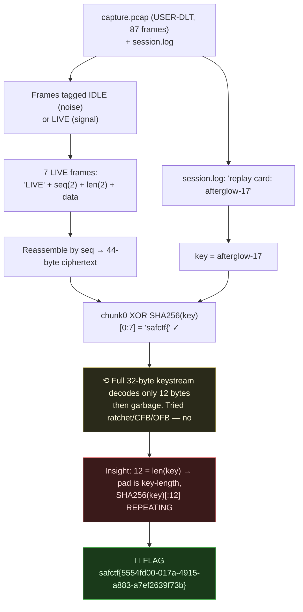
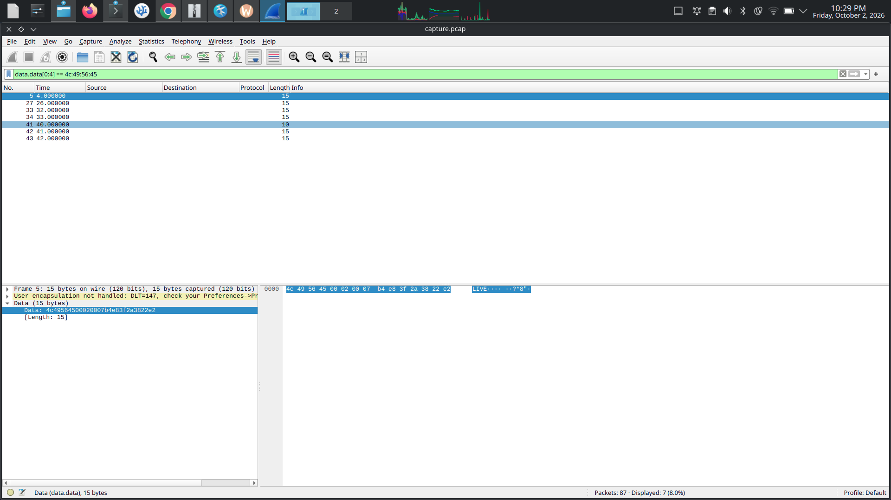

# CAPTURE, Covert-Channel pcap + Keystream, My Writeup

| | |
|---|---|
| **Platform** | pwnzone (hosted CTF event) |
| **Target** | A packet capture + a session log (forensics/crypto) |
| **Artifacts** | `resources/capture.pcap` (USER-DLT, 87 frames), `resources/session.log` |
| **Flag format** | `safctf{...}` |
| **Author** | lacmyst |
| **Date** | 2026-10-02 |
| **Outcome** | Pulled the signal frames out of a noisy covert channel, found the key in the session log, and XOR-decrypted with a repeating 12-byte pad. |
| **Honesty note** | I brought the pcap and drove the recon/triage; the long keystream-cracking iteration was done with Claude. The decisive realisation, *the clean decode dies at byte 12 = the key length, so the pad is 12 bytes and repeats*, we landed on together after I pushed to stop over-filtering and reconsider the whole approach. |

---

## 1. The Short Version

Two files: a `.pcap` and a `session.log`. The capture isn't normal traffic, it's a **USER-DLT** feed of 87 raw frames, one per second, each tagged either **`IDLE`** (filler) or **`LIVE`** (signal). Classic covert channel: hide the real bytes in a stream of noise.

The 7 **LIVE** frames are structured `"LIVE" + seq(2) + len(2) + data`. Reassembled by `seq`, they give **44 bytes of ciphertext**. The `session.log` hands over the key in plain sight, *"replay card: **afterglow-17**"*. Chunk 0 immediately XOR-decrypted to **`safctf{`** against `SHA256("afterglow-17")`, confirming both the key and the scheme.

Then I got stuck: the full `SHA256` keystream only decoded cleanly for **12 bytes** (`safctf{5554f`) and then turned to garbage. I burned a lot of time on per-chunk, ratchet, and feedback keystreams. The breakthrough was noticing **12 = `len("afterglow-17")`**, the keystream is the hash **truncated to the key length and repeated**. A 12-byte repeating pad decrypted all 44 bytes to a clean flag (the body is a UUID, the "dashes" I'd been distrusting were real).

**What I walked away with**

| Flag | Value | How |
|---|---|---|
| Flag | `safctf{5554fd00-017a-4915-a883-a7ef2639f73b}` | LIVE frames → reassemble → XOR with `SHA256("afterglow-17")[:12]` repeating |

---

## 1.1 Attack Chain



---

## 2. Recon, What Is This Capture?

`capinfos` / Wireshark both say it's not TCP/IP, it's a **USER 0 link-layer** feed:
```
File encapsulation: USER 0
Number of packets:  87      duration 86s      (≈1 packet/sec)
```
`tshark -z io,phs` confirms every frame is just `data` (no protocol). So the "payload" of each frame is raw bytes I have to interpret myself, the hallmark of a **custom covert channel**.

Dumping the per-frame bytes, two prefixes jump out:
```
49444c45…  = "IDLE" + 18 random bytes   (80 frames, noise)
4c495645…  = "LIVE" + structured data    (7 frames, signal)
```

---

## 3. Extracting the Signal

In Wireshark, the display filter `data.data[0:4] == 4c:49:56:45` (`"LIVE"`) isolates the 7 signal frames out of the 87, and the Packet Bytes pane shows the structure plainly, e.g. frame 5 = `4c 49 56 45 00 02 00 07 b4 e8 3f 2a 38 22 e2` (`LIVE` + seq `0002` + len `0007` + 7 data bytes):



Each **LIVE** frame parses as `"LIVE"(4) | seq(2) | len(2) | data(len)`:

| seq | len | data (hex) |
|---|---|---|
| 0 | 7 | `ac95e2a67b7d74` |
| 1 | 7 | `76fafbb326bbc4` |
| 2 | 7 | `b4e83f2a3822e2` |
| 3 | 7 | `fabe71ead9e5fd` |
| 4 | 7 | `37282222f8abe1` |
| 5 | 7 | `72e9c7bda33828` |
| 6 | 2 | `6d3e` |

Reassembled by `seq` → **44 bytes** of ciphertext. The 80 IDLE frames are discarded, pure misdirection (same "needle in a haystack of noise" trick as other boxes in this set).

---

## 4. The Key, and Confirming the Scheme

`session.log`:
```
18:44 volunteers crossed the end line
18:48 lights lowered
19:02 replay card: afterglow-17
```
*"replay card: afterglow-17"* is the key material. First test, XOR chunk 0 with `SHA256("afterglow-17")`:
```python
import hashlib
ct0 = bytes.fromhex("ac95e2a67b7d74")
ks  = hashlib.sha256(b"afterglow-17").digest()
print(bytes(ct0[i] ^ ks[i] for i in range(7)))   # b'safctf{'
```
**`safctf{`**, key confirmed, scheme is XOR-with-SHA256-keystream. (A 7-byte match on a known prefix is conclusive.)

---

## 5. The Wall (and the detour)

Extending the same keystream continuously over all 44 bytes:
```
safctf{5554f  <-- 12 clean chars, then garbage
```
It dies at byte 12. I spent real time assuming a fancier construction, per-chunk reset, iterated-hash ratchet, CFB/OFB cipher-feedback, SHAKE, even trying to realign chunks and fold in the IDLE frames. Every one gave `safctf{` (or `safctf{5554f`) and then noise. Frustrating, because a 12-byte agreement **can't** be coincidence, so the key was definitely right, I just had the keystream *shape* wrong.

---

## 6. The Breakthrough, Pad = Key Length

The clean run was exactly **12 bytes**. And `len("afterglow-17") == 12`. That's the tell: the keystream isn't the full 32-byte digest, it's the digest **truncated to the key's length and repeated** as a pad.

```python
import hashlib
pad = hashlib.sha256(b"afterglow-17").digest()[:12]   # 12-byte pad
ct  = bytes.fromhex("ac95e2a67b7d74" "76fafbb326bbc4" "b4e83f2a3822e2"
                    "fabe71ead9e5fd" "37282222f8abe1" "72e9c7bda33828" "6d3e")
flag = bytes(ct[i] ^ pad[i % 12] for i in range(len(ct)))
print(flag.decode())
# safctf{5554fd00-017a-4915-a883-a7ef2639f73b}
```

> **Flag:** `safctf{5554fd00-017a-4915-a883-a7ef2639f73b}`

The body is a **UUID** (`8-4-4-4-12` hex), so the dashes I'd been distrusting were genuine, and the flag is exactly 44 chars, matching the 44 ciphertext bytes perfectly.

---

## 7. Why It Worked & The Weakness

- *What this is:* a **covert channel** (signal hidden among noise frames) plus a **weak stream cipher**, XOR with a short, repeating, key-derived pad. A repeating pad shorter than the message is the classic "many-time pad" weakness; here the hint (`session.log`) hands you the key outright, so it's trivially reversible.
- *Hardening (if this were real):* never use a repeating/truncated keystream, use a full-length stream cipher (ChaCha20) with a per-message nonce, and don't ship the key in a world-readable log next to the data.

---

## 8. Timeline

- `capinfos`/Wireshark → USER-DLT, 87 frames, 1/sec → custom channel, not IP.
- Per-frame bytes → `IDLE` (noise) vs `LIVE` (signal) tags.
- Parsed 7 LIVE frames `"LIVE"|seq|len|data`; reassembled by seq → 44-byte ciphertext.
- `session.log` → key `afterglow-17`; chunk0 XOR `SHA256(key)` → `safctf{` ✓.
- **Detour:** full keystream decoded only 12 bytes; tried ratchet/CFB/OFB/realignment, all failed.
- **Insight:** 12 = `len(key)` → pad = `SHA256(key)[:12]` repeating → full clean flag (a UUID).

---

## 9. References

- Wireshark / `tshark` / `capinfos`, reading non-IP (USER-DLT) captures; `data.data` field; protocol hierarchy
- Covert channels / steganography in packet captures
- XOR stream ciphers and the many-time / repeating-pad weakness
- Python `hashlib` for keystream reconstruction

---

## 10. Appendix, One Script

```python
import hashlib
from scapy.all import rdpcap  # or parse tshark -T fields -e data.data
# ... collect LIVE frames, reassemble by seq into `ct` (44 bytes) ...
pad = hashlib.sha256(b"afterglow-17").digest()[:len(b"afterglow-17")]  # 12-byte pad
print(bytes(c ^ pad[i % len(pad)] for i, c in enumerate(ct)).decode())
# safctf{5554fd00-017a-4915-a883-a7ef2639f73b}
```
Two lessons I'm keeping: **in a noisy capture, find the frame-type marker first** (`IDLE` vs `LIVE`), the signal hides among deliberate noise; and when a keystream decodes cleanly for exactly *N* bytes then breaks, **check whether *N* equals the key length**, a truncated, repeating pad is a common (and weak) construction.
