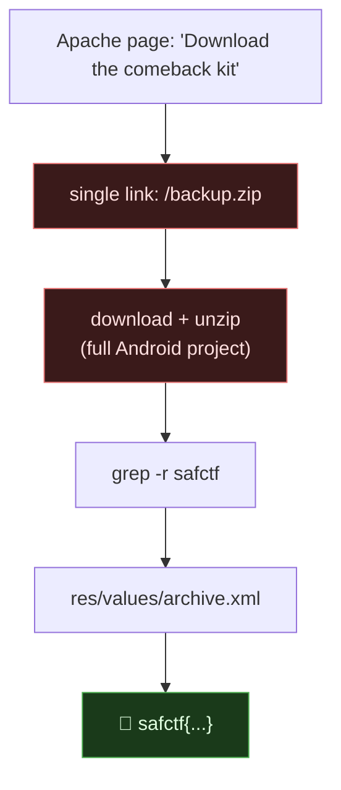

# COMEBACK KIT, Exposed Backup Archive → Source Disclosure, My Writeup

| | |
|---|---|
| **Platform** | pwnzone (hosted CTF event) |
| **Target** | COMEBACK KIT ("backstage download" page) |
| **Service** | **Apache/2.4.68 (Debian)**, static hosting, HTTP, TCP/8130 (EC2) |
| **IP:Port** | `54.72.82.22:8130` |
| **Flag format** | `safctf{...}` |
| **Date** | 2026-10-03 |
| **Outcome** | The download page linked a `/backup.zip`. It was a full Android project backup; the flag sat in plain text inside `app/src/main/res/values/archive.xml`. |
| **Honesty note** | Second-wave sweep; my instruction was *"try solving them."* Claude drove the terminal. Easiest flag of the batch, the hard part was noticing the link, not exploiting anything. |

---

## 1. The Short Version

COMEBACK KIT is an Apache-served page: *"Your backstage download... Download the comeback kit."* The only link on it points at a **backup archive**:

```html
<a href="/backup.zip">Download</a>
```

Backups left in the web root are a disclosure bug on their own, they often contain source, configs, and secrets that were never meant to be public. I downloaded it and grepped:

```bash
curl -s -o backup.zip http://54.72.82.22:8130/backup.zip
unzip -o backup.zip >/dev/null
grep -rioE 'safctf\{[^}]*\}' .
# safctfapp/app/src/main/res/values/archive.xml:safctf{94f40cc66658c67503a859cf383c7622}
```

**What I walked away with**

| Flag | Value | How |
|---|---|---|
| Flag | `safctf{94f40cc66658c67503a859cf383c7622}` | `/backup.zip` → extract → flag in an Android string-resource XML |

---

## 1.1 Attack Chain



---

## 2. Weaknesses I Used

| # | What | Class | Where | Severity |
|---|---|---|---|---|
| 1 | Backup archive served from the web root | **Exposure of Backup/Source** (CWE-530 / CWE-538) | `/backup.zip` | Medium-High (depends on contents) |
| 2 | Secret stored as a plaintext string resource shipped in the app | Hardcoded secret (CWE-798) | `res/values/archive.xml` | Medium |

---

## 3. Recon

```bash
curl -s http://54.72.82.22:8130/ | grep -oiE '<a [^>]*href="[^"]*"'
# <a href="/backup.zip">
```

One link, one archive. Apache banner, no app logic, so this was always going to be about *what's in the file*, not an injection.

---

## 4. The Exploit

```bash
curl -s -o backup.zip http://54.72.82.22:8130/backup.zip
file backup.zip                       # Zip archive
unzip -o backup.zip >/dev/null
```

It unpacked to a complete **Android Studio project** (`safctfapp/`, gradle, `app/src/...`, build intermediates, even a `__MACOSX/` folder giving away it was zipped on a Mac). Rather than browse the tree by hand, I grepped the whole thing for the flag format:

```bash
grep -rioE 'safctf\{[^}]*\}' .
# ./safctfapp/app/src/main/res/values/archive.xml:safctf{94f40cc66658c67503a859cf383c7622}
```

Android keeps user-facing strings in `res/values/*.xml`; the flag was dropped in there as a string resource. (Worth noting for real engagements: that archive also carried the app's `local.properties`, `gradle.properties`, keystores/signing config and full source, a real backup leak like this is often far more than one string.)

---

## 5. Why It Worked & How I'd Fix It

- **Root cause:** a build/backup artifact was published to a directory Apache serves. No auth, no exploit required, just a request for a predictable filename.
- **Why it's common:** developers zip a project "to share" or a deploy script leaves `backup.zip`, `site.tar.gz`, `.bak`, `~` files, or a `.git/` folder in the web root. Attackers brute-force exactly these names.

Fixes:

1. **Never store backups/source in the web root.** Keep them outside the served path entirely.
2. **Deny archive/VCS patterns** at the server: block `*.zip`, `*.tar.gz`, `*.bak`, `*~`, `.git/`, `.svn/`, `*.sql` from being served.
3. **Secrets don't belong in client artifacts.** A value shipped inside an app (APK string resource, JS bundle, mobile binary) is public; treat it as disclosed the moment it ships. Put secrets server-side.
4. **Monitor for forced-browsing** of common backup/VCS filenames.

---

## 6. Timeline

- Loaded the page → one link, `/backup.zip`.
- Downloaded, unzipped → full Android project.
- `grep -r safctf` → flag in `res/values/archive.xml`.

---

## 7. References

- OWASP, **Testing for Backup and Unreferenced Files** (OTG-CONFIG-004)
- CWE-530 (Exposed Backup File), CWE-538 (Insertion of Sensitive Info into Externally-Accessible File), CWE-798 (Hardcoded Credentials)

**Lesson I'm keeping:** before trying anything clever, read the page's own links. A `/backup.zip` in the web root is a free dump of the app.
