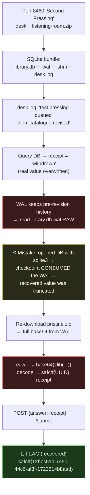

# SECOND PRESSING / LISTENING ROOM, SQLite-WAL Forensics, My Writeup

| | |
|---|---|
| **Platform** | pwnzone (hosted CTF event) |
| **Target** | SECOND PRESSING ("Collection desk") + a SQLite DB bundle |
| **Service** | Flask on **Werkzeug/3.1.9**, Python 3.11.16, HTTP, TCP/8460 (EC2) |
| **IP:Port** | `54.72.82.22:8460` |
| **Artifacts** | `resources/listening-room/`, `library.db`, `library.db-wal`, `library.db-shm`, `desk.log` |
| **Flag format** | `safctf{...}` |
| **Author** | lacmyst |
| **Date** | 2026-10-02 |
| **Outcome** | Recovered a "withdrawn" receipt from the SQLite **WAL**, decoded it (base64+zlib), and submitted it to the desk for the flag. |
| **Honesty note** | I worked the target (port 8460 + the `listening-room` folder) and drove the forensics. I'm logging a real mistake I made and fixed: **opening the DB live checkpointed and destroyed the original WAL**, I had to re-download the pristine zip to recover the full value. |

---

## 1. The Short Version

Port 8460 ("Second Pressing") is another **Collection desk**: submit a receipt to `/submit`, get the flag. The materials are a **SQLite database with its WAL** (`library.db` + `library.db-wal` + `library.db-shm`) and a `desk.log`. The log tells the story: a *"test pressing queued"*, then the *"catalogue revised"*. Translation: a row was inserted (with the real receipt), then **updated** to hide it.

Querying the DB shows the current value: `receipt = "withdrawn"`, the revision overwrote it. But SQLite's **Write-Ahead Log** keeps the *pre-revision* history, and reading `library.db-wal` as raw bytes recovered the original receipt: a base64 blob `eJwr…A==`. `eJw` is the base64 signature of a **zlib stream**, so base64-decode → zlib-inflate gave the receipt:

```
safctf{12bbc51d-7450-44c6-af3f-1723514b8aad}
```

The recovered value **is the flag**, the receipt I carved out of the WAL was itself the `safctf{…}` I needed. (Feeding it to the desk's `/submit` just returns an acknowledgement token; the challenge flag is the value recovered from the database.)

**What I walked away with**

| | Value |
|---|---|
| **Flag** (recovered from the WAL) | `safctf{12bbc51d-7450-44c6-af3f-1723514b8aad}` |
| Desk `/submit` ack token (not the flag) | `safctf{34a793a0d11032abb97236fafc9b30c4}` |

---

## 1.1 Attack Chain



---

## 2. Recon

The desk page offers `listening-room.zip`; unzipped:
```
library.db       SQLite 3.x database
library.db-wal   SQLite Write-Ahead Log      <-- the important one
library.db-shm   WAL shared-memory index
desk.log         ASCII
```
`desk.log`:
```
16:41 test pressing queued
16:42 catalogue revised
16:43 counter closed
```
"Queued" then "revised" is the whole hint, **something was written, then changed.** The presence of a **`-wal`** file is the tell that recoverable history exists.

Schema:
```sql
CREATE TABLE pressings(id INTEGER PRIMARY KEY, title TEXT, receipt TEXT);
```

---

## 3. The Current (Scrubbed) State

The live view shows the revised row, the receipt is gone:
```
id | title         | receipt
1  | Test pressing | withdrawn
```
So the answer isn't in the current table; it's in what the WAL still remembers from **before** the `UPDATE … SET receipt='withdrawn'`.

---

## 4. The Mistake (and the lesson)

My first instinct was to just query with `sqlite3 library.db`. **That was a mistake.** Opening a WAL-mode database with the live engine triggers a **checkpoint** on close, SQLite folds the WAL into the main DB and truncates/removes `-wal`. When I then carved the old value, the base64 was **truncated**, and it only partially decoded to `safctf{12bbc51d-7450-44c6-af3f` (no closing of the UUID).

The fix: treat the files as **evidence**. I re-downloaded the pristine `listening-room.zip` from the server and this time **never pointed `sqlite3` at it**, I read `library.db-wal` as raw bytes. (General rule: copy first, read journals/WAL with `strings`/hexdump, not the live tool.)

---

## 5. Carving the Receipt from the WAL

Raw strings of the pristine WAL show the record's history, the original value, a truncated copy, and the revision:
```bash
strings -n 6 library.db-wal | grep -E 'eJw|withdrawn|Test pressing'
# Test pressing
# eJwrTkxLLkmrNjRKSko2NUzRNTcxNdA1MUk2001MM07TNTQ3MjY1NEmySExMqQUALKEM0A==   <-- full original
# Test pressing
# eJwrTkxLLkmrNjRKSko2NUzRNTcxNdA1MUk2001MM07T                              <-- truncated
# Test pressing
# withdrawn                                                                 <-- revision
```
The first `eJw…A==` is the complete original receipt. `eJw` = base64 of a zlib header (`0x78 0x9c`), so:
```python
import base64, zlib
s = "eJwrTkxLLkmrNjRKSko2NUzRNTcxNdA1MUk2001MM07TNTQ3MjY1NEmySExMqQUALKEM0A=="
print(zlib.decompress(base64.b64decode(s)).decode())
# safctf{12bbc51d-7450-44c6-af3f-1723514b8aad}
```

> **Flag (the recovered value itself):** `safctf{12bbc51d-7450-44c6-af3f-1723514b8aad}`

The `safctf{…UUID…}` carved out of the WAL **is the flag**, no further step needed.

---

## 6. The Desk `/submit` (optional, not the flag)

The "Collection desk" has a `/submit` like the OSINT boxes, so I fed it the recovered value out of habit:
```bash
curl -s -X POST http://54.72.82.22:8460/submit -H 'Content-Type: application/json' \
  --data '{"answer":"safctf{12bbc51d-7450-44c6-af3f-1723514b8aad}"}'
# {"message":"safctf{34a793a0d11032abb97236fafc9b30c4}","ok":true}
```
It returns a *different* `safctf{…}`, but that's just a desk **acknowledgement token**. The challenge flag is the one I recovered from the database (the dashes UUID above). Lesson: don't assume a desk's `/submit` response is the flag, here the artifact *was* the answer.

---

## 7. Why It Worked & The Lesson

- *What this is:* a **data-recovery / forensics** challenge. An `UPDATE` "removed" the secret from the table, but SQLite's **WAL** (and freed B-tree cells) still hold the prior value until a checkpoint/vacuum overwrites them.
- *The forensics principle:* "deleted" in a database rarely means "gone." WAL frames, freelist pages, and unvacuumed slack retain old rows. Reading those raw is standard DB forensics.
- *Operational lesson (the one I'll actually remember):* **never open evidence with the live engine.** `sqlite3 file.db` checkpoints a WAL on close and can erase exactly what you're after. Copy first; read `-wal`/`-journal` as bytes.

---

## 8. Timeline

- 8460 desk → `listening-room.zip` → SQLite DB + **WAL** + `desk.log`.
- `desk.log` = "queued → revised" → a row was written then changed.
- Live query → `receipt = 'withdrawn'` (scrubbed).
- **Mistake:** `sqlite3 library.db` checkpointed/consumed the WAL → truncated recovery (`…af3f`).
- Re-downloaded pristine zip → `strings` the WAL → full base64 `eJw…A==`.
- base64 → zlib → **`safctf{12bbc51d-7450-44c6-af3f-1723514b8aad}`**, the recovered value **is the flag**.
- (`/submit` returns a separate ack token `safctf{34a793…}`, not the flag.)

---

## 9. References

- SQLite **Write-Ahead Logging** (WAL) format and checkpointing, sqlite.org
- DB forensics: recovering rows from WAL frames / freelist / slack
- `strings`, `xxd`/hexdump for raw carving; base64 + zlib (`eJw` signature)
- Lesson: never open evidence databases with the live engine (checkpoint destroys WAL)

---

## 10. Appendix, Clean Method (no evidence destroyed)

```bash
cp -r listening-room /tmp/work && cd /tmp/work        # 1) work on a COPY
strings -n 6 library.db-wal | grep -oE 'eJw[A-Za-z0-9+/=]+' | sort -u   # 2) carve raw, don't open live
python3 -c "import base64,zlib;print(zlib.decompress(base64.b64decode('eJwrTkxLLkmrNjRKSko2NUzRNTcxNdA1MUk2001MM07TNTQ3MjY1NEmySExMqQUALKEM0A==')).decode())"
curl -s -X POST http://54.72.82.22:8460/submit -H 'Content-Type: application/json' \
  --data '{"answer":"safctf{12bbc51d-7450-44c6-af3f-1723514b8aad}"}'
```
Two lessons I'm keeping: **a `-wal` file means recoverable history, "withdrawn"/"deleted" values still live there**; and **copy evidence and read WAL/journals as raw bytes, opening with the live tool checkpoints and can destroy the very data you need.**
