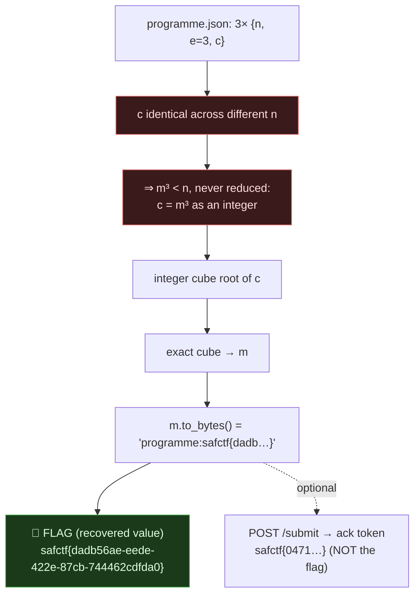

# THREE ENCORES, RSA e=3 With an Un-reduced Cube (plain cube root), My Writeup

| | |
|---|---|
| **Platform** | pwnzone (hosted CTF event) |
| **Target** | THREE ENCORES ("Collection desk", jazz theme) |
| **Service** | Flask on **Werkzeug/3.1.9**, Python 3.11.16, HTTP, TCP/8420 (EC2) |
| **IP:Port** | `54.72.82.22:8420` |
| **Flag format** | `safctf{...}` |
| **Date** | 2026-10-03 |
| **Outcome** | The `programme.json` is an RSA "broadcast": three recipients, `e=3`, same message. The ciphertext is identical across all three because `m³ < n`, it was never reduced mod `n`. So `c` **is** `m³` as an integer, and a plain integer cube root recovers the plaintext `programme:safctf{dadb…}`. **The recovered `safctf{…}` is the flag**, the same pattern as SECOND PRESSING, where the desk `/submit` just returns an ack token, not the flag. |
| **Honesty note** | OSINT-desk-block sweep; I flip-flopped on this one: first reported the recovered value (right), then wrongly "corrected" it to the `/submit` response. Per the dojo's own [listening-room precedent](listening-room-sqlite-wal-writeup.md), the **recovered value is the flag** and `/submit` returns an ack token. Settled. |

---

## 1. The Short Version

The page ("A familiar melody in three different rooms", "Three Encores") hands you one file, `programme.json`, and says *"keep your collection receipt."* No API console. The file is three RSA "deliveries":

```json
{"deliveries":[
  {"n":"0x600db7...", "e":3, "c":"0x15b1f932...deaddd65"},
  {"n":"0xb3e72b...", "e":3, "c":"0x15b1f932...deaddd65"},
  {"n":"0x8069dc...", "e":3, "c":"0x15b1f932...deaddd65"}
]}
```

Three different moduli `n`, exponent `e=3`, and, the giveaway, the **same ciphertext `c`** in all three. With small `e` the classic trap is Håstad's broadcast (same `m` to several recipients → CRT → cube root). But here `c` is *identical* across different moduli, which only happens if no modular reduction ever took place: `m³ < min(n)`, so `c = m³ mod n = m³` as a plain integer. So I don't even need CRT, just take the integer cube root of `c`.

```python
# icbrt(c) where c = m^3
m = icbrt(0x15b1f932...deaddd65)      # exact cube root
m.to_bytes(...) → b'programme:safctf{dadb56ae-eede-422e-87cb-744462cdfda0}'   # the RECEIPT
```

That recovered `safctf{dadb…}` **is the flag**. The desk also has a `/submit`, and feeding the recovered value in just returns a *different* `safctf{…}`, but that's an **acknowledgement token, not the flag**, exactly as in SECOND PRESSING / listening-room:

```bash
curl -s -X POST http://54.72.82.22:8420/submit -H 'Content-Type: application/json' \
  --data '{"answer":"safctf{dadb56ae-eede-422e-87cb-744462cdfda0}"}'
# {"message":"safctf{0471ad15e84bb9f630e394e49dde85a9}","ok":true}   ← desk ack token, NOT the flag
```

**What I walked away with**

| | Value | How |
|---|---|---|
| **Flag** (the recovered value) | `safctf{dadb56ae-eede-422e-87cb-744462cdfda0}` | integer cube root of `c` (= `m³`, never reduced); plaintext `programme:safctf{…}` |
| Desk `/submit` ack token (not the flag) | `safctf{0471ad15e84bb9f630e394e49dde85a9}` | POST the recovered value → desk returns a separate ack |

The three moduli are flavor ("three rooms"), a nudge toward Håstad, but unnecessary once you notice `c` is un-reduced. And the recovered `safctf{…}` **is** the answer: don't assume the desk's `/submit` response is the flag (the `programme:` prefix and "keep your collection receipt" point at the recovered value being what you keep).

---

## 1.1 Attack Chain



---

## 2. Weakness I Used

| # | What | Class | Where | Severity |
|---|---|---|---|---|
| 1 | RSA with `e=3` and a message so short `m³ < n` (no padding) → ciphertext is a perfect cube | **Low-exponent RSA / no padding** (CWE-780, RSA without OAEP) | `programme.json` | High (plaintext recovery) |

---

## 3. Recon

```bash
T=54.72.82.22:8420
# every shared-desk op 404s — this isn't an API challenge
for op in parcel receipt sync dispatch import round orders members profile; do
  echo "$op [$(curl -s -o/dev/null -w '%{http_code}' http://$T/api/$op)]"; done   # all 404
curl -s "http://$T/downloads/programme.json" -o prog.json
```

So the challenge is entirely the file. Three entries, `e=3`, and `c` byte-for-byte identical across three different `n`, that identical-`c`-across-different-`n` is the whole tell.

---

## 4. The Exploit

```python
import json
d=json.load(open('prog.json'))['deliveries']
cs=[int(x['c'],16) for x in d]
assert len(set(cs))==1                 # same ciphertext everywhere

def icbrt(n):                          # integer cube root by binary search
    lo,hi=0,1<<((n.bit_length()//3)+2)
    while lo<hi:
        mid=(lo+hi)//2
        if mid**3<n: lo=mid+1
        else: hi=mid
    return lo

c=cs[0]
m=icbrt(c)
assert m**3==c                         # exact cube → no reduction happened
print(m.to_bytes((m.bit_length()+7)//8,'big'))
# b'programme:safctf{dadb56ae-eede-422e-87cb-744462cdfda0}'
```

`m**3 == c` confirms the cube is exact, `c` really is `m³` with no modulus in play. Decode the integer to bytes and the plaintext is `programme:safctf{dadb…}`. **That recovered `safctf{…}` is the flag.** The desk's `/submit` is optional and returns a separate ack token, not the flag:

```bash
curl -s -X POST http://54.72.82.22:8420/submit -H 'Content-Type: application/json' \
  --data '{"answer":"safctf{dadb56ae-eede-422e-87cb-744462cdfda0}"}'
# {"message":"safctf{0471ad15e84bb9f630e394e49dde85a9}","ok":true}   ← ack, NOT the flag
```

(If `c` had *differed* across the three `n`, this would be textbook **Håstad**: CRT-combine `c1,c2,c3` modulo `n1·n2·n3` to get `m³`, then the same cube root. Identical `c` just means the CRT step collapses to `c` itself.)

---

## 5. Why It Worked & How I'd Fix It

- **Root cause:** `e=3` plus an unpadded message short enough that `m³` never exceeds the modulus. RSA "encryption" that doesn't reduce isn't encryption, the ciphertext is a plain cube, trivially inverted. Even when it *does* reduce, broadcasting the same unpadded `m` to `e` recipients (Håstad) recovers it.
- **The fix:** always use **OAEP padding** (never textbook/raw RSA), and use a sane public exponent (65537, not 3). Padding randomizes the message so `m³` is huge and broadcast/cube-root attacks die. Also never encrypt the *same* plaintext to multiple recipients with low `e`.

---

## 6. Timeline

- Homepage → `programme.json` download; all `/api/*` 404 → it's a file challenge.
- Saw three `{n, e:3, c}` with identical `c` across different `n` → un-reduced cube.
- Integer cube root of `c` → exact → decode → `programme:safctf{dadb56ae-eede-422e-87cb-744462cdfda0}`, **the recovered value is the flag**.
- `/submit` (optional) returns a separate ack token `safctf{0471…}`, not the flag, same as SECOND PRESSING.

---

## 7. References

- Håstad's broadcast attack; low public-exponent RSA; "textbook RSA" pitfalls
- CWE-780 (Use of RSA Without OAEP)
- `RsaCtfTool` / SageMath for the general low-`e` / broadcast cases

**Lesson I'm keeping:** `e=3` plus a short message means check for a perfect cube *first*, if `c` is identical across different moduli, it was never reduced and the answer is one integer cube root away. And on these desks, the **recovered artifact is the flag**; the `/submit` response is just an ack token (same trap as SECOND PRESSING). Don't mistake the desk's acknowledgement for the flag.
