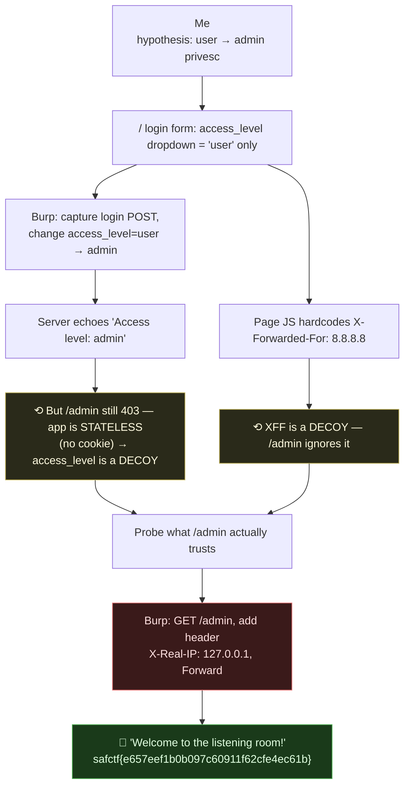
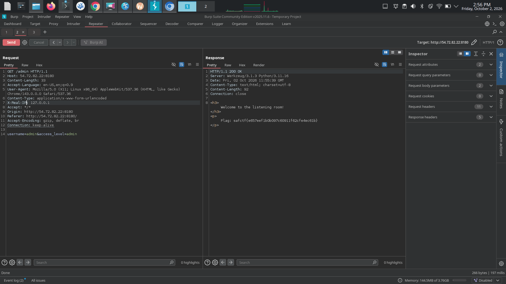

# VINYL VAULT, Admin Access via Spoofed `X-Real-IP`, My Writeup

| | |
|---|---|
| **Platform** | pwnzone (hosted CTF event) |
| **Target** | VINYL VAULT ("record store" / login + admin listening room) |
| **Service** | Flask on **Werkzeug/3.1.3**, Python 3.11.16, HTTP, TCP/8180 (EC2 instance) |
| **IP:Port** | `54.72.82.22:8180` |
| **Flag format** | `safctf{...}` |
| **Author** | lacmyst |
| **Date** | 2026-10-02 |
| **Outcome** | Escalated from a normal `user` to the admin-only `/admin` by spoofing a trusted client-IP header (`X-Real-IP: 127.0.0.1`) in **Burp Suite**. Two decoys on the way. |
| **Tooling** | Burp Suite (intercept → modify → forward), confirmed with `curl`. |

---

## 1. The Short Version

My read going in was a **privilege escalation**: a normal user is shown a path to an admin resource (`/admin`, "the listening room"), and I need to go from `user` → `admin` to open it. That was exactly the shape, but the box throws two decoys to send you the wrong way.

The login form has an **`access_level` dropdown that only offers `user`**, which screams "just send `access_level=admin`." So I did, in **Burp**, I captured the login POST and changed `access_level=user` → `admin`. The server happily echoed *"Access level: admin"*... and `/admin` still slammed the door: `403 — Access denied: Admins only....try harder!`. Decoy #1: the app is **stateless** (no session cookie), so that value changes the greeting and nothing else.

The second decoy is in the page's own JavaScript: it hardcodes **`X-Forwarded-For: 8.8.8.8`** on every request, baiting you into thinking `/admin` is gated on `X-Forwarded-For`. It isn't. The real check trusts a **different** proxy header, **`X-Real-IP`**, and wants an internal address. In Burp I captured the `GET /admin` request, added **`X-Real-IP: 127.0.0.1`**, forwarded it, and the listening room opened with the flag.

**What I walked away with**

| Flag | Value | How |
|---|---|---|
| Flag | `safctf{e657eef1b0b097c60911f62cfe4ec61b}` | `GET /admin` with a spoofed `X-Real-IP: 127.0.0.1` header |

---

## 1.1 Attack Chain (with the decoys)



---

## 2. Weaknesses I Used

| # | What | Class | Where | Severity |
|---|---|---|---|---|
| 1 | `/admin` grants access based on a **client-settable** IP header (`X-Real-IP`) | **Auth Bypass by Spoofing / Trust of Client-Controlled Header** (CWE-290 / CWE-348) | `GET /admin` | High |
| 2 | Privilege (`access_level`) accepted from the client | Mass-assignment-style trust (decoy here, stateless, no effect) | `POST /` | Low (bait) |

The real bug is **#1**: trusting a spoofable header as proof you're a localhost/internal admin.

---

## 3. Recon

`GET /` is the **VINYL VAULT** login:
```html
<form id="login-form">
  Username: <input name="username">
  Access Level: <select name="access_level"><option value="user">User</option></select>
  <button type="submit">Login</button>
</form>
```
And the JS that submits it (the important part):
```js
const res = await fetch("/", {
  method: "POST",
  headers: {
    "Content-Type": "application/x-www-form-urlencoded",
    "X-Forwarded-For": "8.8.8.8"          // <- hardcoded; this is bait
  },
  body: `username=${username}&access_level=${accessLevel}`
});
```
Two things jump out: an **`access_level`** field the client controls, and a **hardcoded `X-Forwarded-For`**. Both look like the way in. Both are traps.

Logging in as `user` returns a greeting and a link:
```
<h2>Hello, bob</h2>
<p>Access level: user</p>
<a href="/admin">Open the listening room</a>
```
So `/admin` is the admin resource dangled in front of the user, the privesc target.

---

## 4. Decoy #1, `access_level=admin` (Burp)

The obvious move. In Burp I intercepted the login POST and edited the body:
```
username=bob&access_level=admin
```
Response: `<p>Access level: admin</p>`, it *accepted* it. But:
- **No `Set-Cookie`** anywhere → the app keeps **no session**. Nothing about "I'm admin" is remembered.
- Hitting `/admin` afterwards → still `403 Access denied`.

So `access_level` only changes the greeting text. It's a dead end, the classic "obvious privesc that does nothing." On to what `/admin` *actually* checks.

---

## 5. Decoy #2, `X-Forwarded-For` (and the real header)

`/admin` on its own:
```
HTTP/1.1 403 FORBIDDEN
Access denied: Admins only....try harder!
```
The hardcoded `X-Forwarded-For: 8.8.8.8` in the JS is a loud hint, "this app cares about your source IP." The natural test is to spoof `X-Forwarded-For` to an internal IP... which **does nothing** (I tried `127.0.0.1`, `::1`, chains, all still `403`). That's decoy #2: it points at XFF, but the server reads a *different* header.

Admin resources tied to "internal/localhost only" are commonly checked via one of: `X-Forwarded-For`, **`X-Real-IP`**, `True-Client-IP`, etc. Since XFF was explicitly dangled (and failed), I tried its sibling, **`X-Real-IP`**.

---

## 6. The Exploit (Burp)

In Burp: capture `GET /admin`, add a header, Forward.

```
GET /admin HTTP/1.1
Host: 54.72.82.22:8180
X-Real-IP: 127.0.0.1
```



Response:
```
<h3>Welcome to the listening room!</h3>
safctf{e657eef1b0b097c60911f62cfe4ec61b}
```

Confirmed with `curl`:
```bash
curl -s http://54.72.82.22:8180/admin -H "X-Real-IP: 127.0.0.1"
# safctf{e657eef1b0b097c60911f62cfe4ec61b}
```

> **Flag:** `safctf{e657eef1b0b097c60911f62cfe4ec61b}`

The server trusts `X-Real-IP` as proof the request came from `127.0.0.1` (a local/internal admin). But that header is just text **I** set, so I "became" localhost and walked into the admin room.

---

## 7. Why It Worked & How I'd Fix It

- *Cause:* `/admin` authorises based on `X-Real-IP`, a header the client fully controls. There's no real proxy validating it here, so a claimed internal IP = instant admin.
- *Fix:* never derive trust from `X-Forwarded-For`/`X-Real-IP` unless they're stamped by a reverse proxy **you** control, and then only read the specific hop you trust (strip inbound copies at the edge). Gate admin features on real **authentication/authorization**, not a claimed source IP. If something must be localhost-only, check the actual socket peer (`request.remote_addr` from a trusted server), not a spoofable header.

---

## 8. Timeline

- `GET /` → VINYL VAULT login with an `access_level=user` dropdown; JS hardcodes `X-Forwarded-For: 8.8.8.8`.
- Logged in as `user` → greeting + link to `/admin` ("listening room").
- **Burp:** changed `access_level`→`admin` → accepted but useless (stateless, no cookie); `/admin` still `403`. *(decoy #1)*
- Spoofed `X-Forwarded-For` internal IPs on `/admin` → still `403`. *(decoy #2)*
- Tried the sibling header **`X-Real-IP: 127.0.0.1`** on `/admin` → **flag**.

---

## 9. References

- CWE-290 (Authentication Bypass by Spoofing), CWE-348 (Use of Less-Trusted Source), CWE-639 (Authorization Bypass)
- `X-Forwarded-For` / `X-Real-IP` / `True-Client-IP`, proxy headers and why they're not trustworthy from the client
- Burp Suite, Proxy intercept & Repeater (capture → modify header → forward)
- OWASP: Access Control / IP-based access control pitfalls

---

## 10. Appendix, The Clean Path

```bash
# the whole box in one request — spoof the trusted internal-IP header
curl -s http://54.72.82.22:8180/admin -H "X-Real-IP: 127.0.0.1"
# → safctf{e657eef1b0b097c60911f62cfe4ec61b}
```
Two lessons I'm keeping: **the loudest "clue" is often the decoy**, `access_level=admin` and `X-Forwarded-For: 8.8.8.8` were both planted to waste my time; and **when an app gates on your IP, it's usually reading a spoofable header**, try the whole family (`X-Forwarded-For`, `X-Real-IP`, `True-Client-IP`), not just the one they wave at you.
